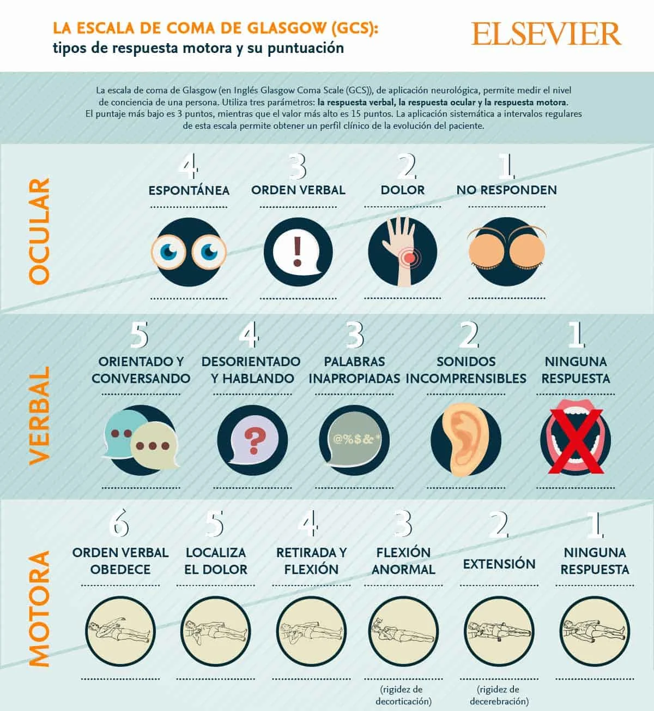

#GES N°49: Traumatismo Craneoencefálico (Moderado o Grave).
##Generalidades y Definición

El Traumatismo Craneoencefálico (TEC) se define como **cualquier lesión física o alteración funcional del contenido craneal 2ria a un impacto o fuerza externa, que puede causar un estado de conciencia alterado.**

* El TEC es una de las principales causas de muerte y discapacidad en el mundo, especialmente en población joven (adultos <45 años y niños).

A diferencia del TEC Leve, el TEC Moderado/Grave implica un alto riesgo de presentar lesiones intracraneales visibles en la TC, como hematomas o contusiones.

##Garantías GES

Cubre a todo beneficiario con sospecha de TEC Moderado o Grave.

**Acceso:**

* A confirmación diagnóstica (con especialista, TC).

* A tratamiento (médico, quirúrgico, hospitalización en UCI).

* A seguimiento y rehabilitación. 

**Oportunidad:**

1. Diagnóstico→ Atención por especialista y realización de TC dentro de 12h desde la sospecha.

2. Tratamiento:

	* Inicio de tratamiento dentro de 24h desde la confirmación diagnóstica.
	
	* Ingreso a UCI dentro de 24h desde la indicación.

3. Rehabilitación: Inicio dentro de 30 días desde la indicación.

**Protección Financiera→** El copago máximo es del 20% del arancel de referencia para Fonasa B, C, D e ISAPRE.

##Fisiopatología

1. Lesión Primaria→ Es el daño mecánico directo e irreversible que ocurre en el momento del impacto. Incluye:

	* Fracturas de Cráneo.
	
	* Contusiones Cerebrales→ "Golpe-Contragolpe".
	
	* Laceraciones de vasos sanguíneos y tejido cerebral.
	
	* Daño Axonal Difuso (DAD)→ Lesión por cizallamiento de las fibras nerviosas (axones) debido a fuerzas de aceleración y desaceleración rotacional, común en accidentes de alta velocidad.
	
2. Lesión Secundaria→ Es el daño progresivo que ocurre en las horas/días posteriores al trauma. Es una fase prevenible y tratable, siendo sus principales causas:

	* Hipotensión Arterial (Presión Arterial Sistólica <90 mmHg) y Hipoxia (SatO2 <90%): Estos "insultos secundarios" privan al cerebro lesionado del oxígeno y flujo sanguíneo necesarios, empeorando drásticamente el pronóstico.

	* Hipertensión Intracraneana (HIC)→ El cráneo es una bóveda ósea cerrada e inextensible:
	
		* Un hematoma/edema aumentan el Volumen dentro del cráneo, elevando la Presión Intracraneana (PIC).
		
	* Baja Presión de Perfusión Cerebral (PPC):
	
		* PPC = PAM - PIC.
		
		* Si la PIC sube (por edema) o la PAM baja (por hipotensión/shock), la PPC colapsa, causando isquemia cerebral y más edema.
		
##Manifestaciones Clínicas

1. Alteración del Estado de Conciencia→ Síntoma Cardinal.

2. Amnesia del evento (lacunar) o Amnesia post-traumática.

3. Cefalea intensa y progresiva.

4. Vómitos→ A menudo, de caracter explosivo por irritación meníngea o HIC.

5. Convulsiones post-traumáticas.

##Evaluación Diagnóstica en SU

1. Escala de Coma de Glasgow (GCS).

	

2. Evaluación Pupilar→ Se busca tamaño, simetría y reactividad a la luz:

	* La **Anisocoria** es un signo de alarma crítico que sugiere compresión del III par craneal, generalmente por una herniación cerebral.

3. TC de Cerebro s/c→ Es el examen de elección, rápido y preciso.

	* Posibles Hallazgos: Hematomas, fracturas, edema cerebral, desviación de la línea media y colapso de ventrículos (signos de HIC).

##Clasificaciones

El TEC se clasifica de múltiples formas que permiten definir el manejo y pronóstico:

1. Según Gravedad→ GCS:

	* TEC leve→ GCS 14-15 pts.
	
	* TEC moderado→ GCS 9-13 pts.
	
	* TEC grave→ GCS 3-8 pts: Un GCS ≤8 pts requiere intubación y manejo avanzado de la V.A.

2. Según Morfología→ Hallazgos en TC:

	* Hematoma Epidural→ Sangre en el cráneo y la duramadre: Clásicamente Arterial (Arteria Meníngea Media).
		
		* Tiene forma de "lente biconvexo" en la TC.
		
	* Hematoma Subdural→ Sangre entre la duramadre y el cerebro: Clásicamente Venoso (Venas puente).
	
		* Tiene forma de "semiluna" en la TC, adaptándose a la forma del cerebro.
	
	* Hemorragia Subaracnoídea (HSA) Traumática→ Sangre en el espacio subaracnoídeo.
	
	* Contusión/Hematoma Intraparenquimatoso→ Sangrado dentro del tejido cerebral.

3. Clasificación de Marshall→ Pronóstica en TC.
	
	

##Tratamiento y manejo

El objetivo es prevenir la lesión secundaria.

**Manejo Inicial (ATLS-ABCDE):**

* A→ Intubación si GCS ≤8, con estricto control cervical.

* B→ Asegurar Normoxia.

* C→ Asegurar Normotensión.

**Manejo Neurocrítico→** El manejo del TEC Grave se basa en la monitorización y tratamiento de la HIC.

1. Monitorización de la PIC→ Se instala un catéter, generalmente intraventricular, para medir la PIC (Normal <10-15 mmHg).

	* El tratamiento se inicia si la PIC >20-22 mmHg.

2. Manejo Escalonado de la HIC:

	* Nivel 0→ Medidas Generales: Cabecera a 30°, sedación y analgesia, mantener normotermia y normoglicemia.
	
	* Nivel 1→ Terapia Hiperosmolar: Se busca "deshidratar" el cerebro.
	
		* Se usa Manitol (bolo) o Soluciones Salinas Hipertónicas.
		
		* Si hay un catéter ventrícular, se puede drenar LCR.
		
	* Nivel 2→ Medidas Refractarias: Sedación profunda (coma barbitúrico) o Hiperventilación Controlada (como medida temporal de rescate).
	
	* Nivel 3→ Cirugía Descompresiva: 
	
		* Craniectomía Descompresiva: Se retira una parte del cráneo para permitir que el cerebro hinchado se expanda sin comprimirse.

**Tratamiento Quirúrgico de la lesión primaria:**

1. Drenaje de urgencias de hematomas que causen "efecto masa" (Desviación de la línea media >5 mm) o HIC.

2. Reparación de Fracturas de cráneo hundidas o expuestas.