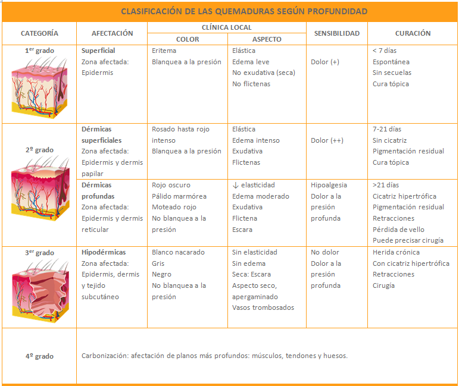

#GES N°55: Gran Quemados.
##Generalidades y Definición

El Gran Quemado (GQ) es un paciente que sufre lesiones térmicas, químicas, eléctricas o radiactivas de tal extensión y profundidad que provocan una respuesta sistémica significativa, poniendo en riesgo la vida.

* Es una de las lesiones traumáticas más graves y metabólicamente demandantes, superando incluso al politrauma grave y a la sepsis severa, en términos de estrés catabólico sostenido.

* El GQ desarrolla un shock hipovolémico/distributivo y un SIRS masivo, que lleva a la falla multiorgánica si no se maneja de forma agresiva.

##Garantías GES

El GES ofrece cobertura a todo paciente que cumpla con el criterio de GQ.

**Acceso:**

* A atención de urgencia y estabilización.

* A hospitalización en UPC o Unidad de Quemados.

* A tratamiento médico, quirúrgico, rehabilitación y seguimiento.

**Oportunidad:**

1. Diagnóstico: Atención de Urgencia inmediata en  SU (tiempo cero es la llegada al centro).

2. Tratamiento:

	* Escarotomía→ Inmediata si existe riesgo vital o de extremidad.
	
	* Ingreso a UPC/Unidad de Quemados: Dentro de 6h desde la indicación médica de hospitalización.
	
	* Tratamiento Quirúrgico→ Escarectomía/Injertos: Primera cirugía dentro de 7 días desde la hospitalización.
	
3. Rehabilitación: Inicio durante la hospitalización y continuidad ambulatoria.

##Fisiopatología

Se caracteriza por ser bifásica: Una respuesta local a nivel cutáneo y otra respuesta sistémica devastadora.

**Respuesta Local→** Zonas de Jackson: La lesión térmica en los tejidos se describe en 3 zonas concéntricas:

* Zona de Coagulación (Centro)→ Necrosis tisular irreversible: Es la escara, un tejido avascular, seco y duro, que actúa como foco séptico y debe de retirarse quirúrgicamente.

* Zona de Estasis (Alrededor)→ Tejido viable pero con perfusión disminuida: La microcirculación está comprometida.

	* Es una zona "salvable" y el objetivo principal de la resucitación con fluidos.
	
	* Si el paciente entra en shock o sufre hipotermia, esta zona se necrosa en 24-48h y se suma a la Zona de Coagulación, profundizando y extendiendo la quemadura.

* Zona de Hiperemia (Periferia)→ Vasodilatación e Inflamación, similar a una quemadura solar: Es dolorosa pero se recuperará espontáneamente si la perfusión general del paciente es adecuada.

**Respuesta Sistémica→** Ocurre cuando la quemadura supera el 15-20% de la Superficie Corporal Total (TBSA), donde se desencadena una tormenta inflamatoria:

1. Pérdida de Integridad Capilar→ El tejido quemado libera mediadores proinflamatorios, los cuales causan vasodilatación masiva y un aumento drástico de la permeabilidad capilar en todo el cuerpo.

	* Esto alcanza un peak en las primeras 8-12h y dura hasta 24-48h.

2. Shock Hipovolémico/Distributivo→ Ocurre una fuga masiva de fluido rico en plasma y proteínas desde el espacio IV hacia el intersticio, formando un 3er espacio> Edema masivo.

	* Se genera una hipovolemia relativa severa y hemoconcentración, lo que disminuye el retorno venoso y el GC.
	
3. Estado Hipermetabólico→ Se produce una liberación masiva de catecolaminas y cortisol que duplica o triplica el gasto energético basal.

	* Esto lleva a un hipercatabolismo extremo, resistencia a la insulina y pérdida acelerada de masa muscular para generar energía, dificultando la cicatrización.
	
4. Inmunosupresión→ La pérdida de la barrera cutánea junto a una disfunción inmunológica severa (linfopenia, disfunción de neutrófilos), deja al paciente vulnerable frente a bacterias oportunistas, como P. aeruginosa o Acinetobacter baumannii.

5. Riesgo de Falla Renal→ Por la hipovolemia (NTA) y, en quemaduras profundas o eléctricas, por la rabdomiólisis.

##Mecanismos

* Fuego/llamas→ A menudo asociado a lesiones por inhalación, especialmente si ocurren en espacio cerrados.

* Líquidos calientes (escaldadura)→ La más común en niños: La viscosidad del líquido puede prolongar el tiempo de contacto y profundizar la lesión.

* Quemaduras eléctrica→ La lesión cutánea suele ser pequeña, pero el daño interno por el paso de la corriente es masivo.

	* Alto riesgo de rabdomiólisis y Arritmias cardíacas.
	
* Quemaduras Químicas:

	* Álcalis→ Producen necrosis licuefactiva: Saponifican las grasas de las membranas celulares, permitiendo que el químico penetre profundamente en los tejidos.
	
		* Son más graves y el lavado debe ser más prolongado.
		
	* Ácidos→ Producen necrosis coagulativa: Coagulan las proteínas superficiales, creando una escara que, a veces, limita su propia penetración.
	
##Manifestaciones Clínicas
	
1. Paciente con signos evidentes de quemaduras.
	
2. Signos de Shock→ Taquicardia, hipotensión, palidez, frialdad distal, llenado capilar lento, oliguria.
	
3. Signos de lesión por Inhalación:
	
	* Quemaduras en cara, cuello o tórax anterior.
		
	* Vibrisas nasales o cejas quemadas.
		
	* Esputo carbonáceo (con hollín).
		
	* Disfonía (voz ronca) o estridor laríngeo (ruido agudo al respirar)→ Son signos tardíos y ominosos que indican edema crítico de la glotis y cierre inminente de la V.A.

##Profundidad de las quemaduras

##Extensión de las quemaduras

##Criterios GES de GQ

Se considera a un paciente como GQ si cumple con cualquiera de estos criterios:

* Índice de Gravedad (Garcés) >70 puntos (índice que suma edad + %TBSA Tipo A + 2 * %TBSA Tipo AB + 3 * %TBSA Tipo B).

* TBSA quemada (Tipo AB o B) > 10% en niños y ancianos (>65 años). (Tienen menor reserva fisiológica y una relación superficie/volumen desfavorable).

* TBSA quemada (Tipo AB o B) > 20% en adultos. (Umbral en el que se desencadena la respuesta sistémica masiva).

* Quemadura Tipo AB o B > 5% en niños < 2 años. (Altísimo riesgo de hipotermia y deshidratación).

* Sospecha de Lesión por Inhalación. (Aumenta drásticamente la mortalidad por el edema pulmonar, la neumonitis química y la posterior neumonía).

* Quemaduras Eléctricas (por alto voltaje / "rayo"). (El daño visible es mínimo, pero el daño muscular interno es masivo, con alto riesgo de rabdomiólisis y arritmias).

* Quemaduras Químicas graves (ej. por álcalis). (El daño puede seguir progresando si el químico no es neutralizado).

* Quemaduras en Zonas Especiales: Cara, manos, pies, genitales, periné o pliegues articulares mayores (cuello, axilas, codos, rodillas). (Se consideran graves por el altísimo riesgo de secuelas funcionales, retracciones y desfiguración, independientemente de la extensión).

* Quemaduras asociadas a Politraumatismo (GES 48).

* Pacientes con comorbilidades graves (diabetes, insuficiencia renal, cardíaca, inmunosupresión).

##Tratamiento y Manejo

1. Manejo Prehospitalario y en Urgencia:

	* A→ Buscar signos de lesión por inhalación: Si hay sospecha, se requiere intubar.
	
	* B→ Administrar O2 al 100% con mascarilla de alto flujo.
	
		* Descartar quemaduras circunferenciales en el tórax que restrinjan la respiración.
	
	* C→ Resucitación con Fluidos:
	
		* Fórmula de Parkland→ Volumen (24h) = 4 ml x Kg x %TBSA quemada AB o B.
		
		* Usar Ringer lactato y administrar el 50% durante las primeras 8h y, luego, el otro 50% en las siguientes 16h.
		
		* Monitorización→ Diuresis:
		
			* Diuresis en Adultos→ 0,5-1 ml/kg/h.
			
			* Diuresis en Niños→ 1-1,5 ml/kg/h.
			
			* Diuresis en Quemaduras eléctricas→ 1,5-2 ml/kg/h: Para forzar la diuresis y eliminar mioglobina.
			
	* D→ GCS.
	
	* E→ Retirar toda la ropa y cubrir al paciente con sábanas limpias y secas y mantas térmicas.

2. Manejo Inicial de la Herida→ Enfriar con agua tibia (15-20°C) por no más de 10-15 min.

3. Profilaxis Antitetánica, según esquema.

4. Escarotomía→ Se realiza en quemaduras tipo B que son circunferenciales en una extremidad o en el tórax.

5. Manejo Hospitalario→ En Unidad UPC/Unidad de Quemados:

	* Escarectomía e Injertos→ Pilar del tratamiento, se debe debridar quirúrgicamente de forma precoz durante los primeros 5 días.
		
		* Las heridas se cubren con autoinjertos.
	
	* Soporte nutricional→ Nutrición precoz e, idealmente, enteral para mantener la barrera intestinal y prevenir traslocación bacteriana.
	
		* Hasta 2 g/kg/d de proteína.
		
	* Analgesia→ Opioides EV en infusión continua, AINEs y Bloqueos Regionales.
	
	* Manejo de Infecciones.