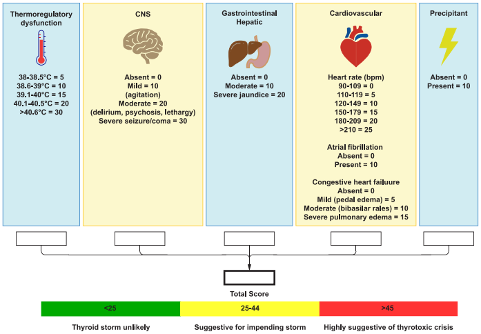
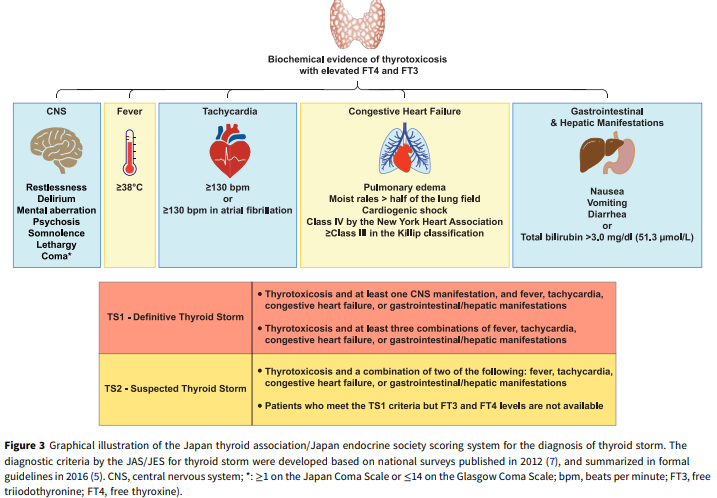
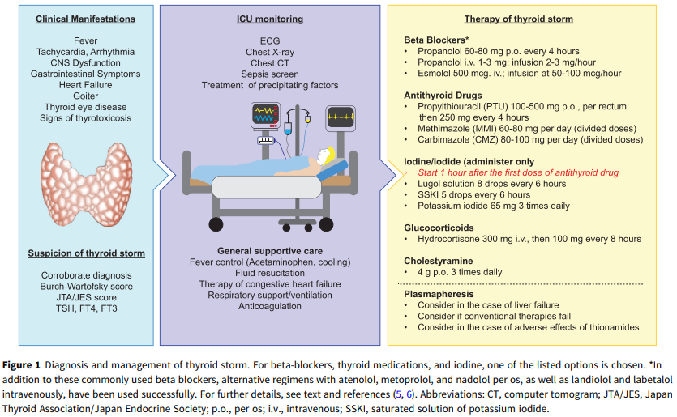

#Aproximación al paciente con Tormenta Tiroidea (2026)

Es una condición hipermetabólica critica y potencialmente mortal causada por manifestaciones severas de tirotoxicosis.

* El diagnóstico requiere la observación de varias y severas manifestaciones clínicas, así como la decompensación de ≥1 órganos/sistemas.
 
* El laboratorio no logra distinguir una crisis tirotoxicosa de una tirotoxicosis no complicada.

La tormenta tiroidea suele ser gatillada por factores precipitantes, principalmente:

* Infecciones/Sepsis.

* Procedimientos quirurgicos.

* Descontinuación de la medicación antitiroidea.

##Presentación Clínica y diagnostico
Síntomas/Signos asociados con la tirotoxicosis:
	
* Gota: Con o sin nódulos.
	
* Oftalmopatía tiroidea--> Pacientes con Enf. Graves.
	
* Fiebre >38,5 °C.
	
* Taquicardia desproporcionada al nivel de la fiebre.
	
* Arritmias--> FA.
	
* Insuf. Cardiaca.
	
* Edema Pulmonar.
	
* Alteración del estado mental--> Desde la agitación hasta el coma.
	
* Gastrointestinal: Náusea, vómitos, diarrea y/o ictericia.
	
* Pacientes jovenes--> Cardiomiopatía dilatada reversible y Takotsubo pueden ser vistas en Crisis tirotoxicosas.

* Adultos mayores--> Síntomas y signos clásicos de tirotoxicosis pueden estar ausentes (Hipertiroidismo apático).
	
Escala Burch-Wartofsky--> Asigna puntos en base a los signos clínicos:

* Criterios: Temperatura, SNC, Frecuencia Cardiaca, Síntomas G.I y Factores precipitantes.
	
* Interpretación:

	* < 25 pts: Poco probable que sea una Tormenta tiroidea.

	* 25 a 44 pts: Sugiere posible crisis.
		
	* > 45: Altas probabilidades de crisis tiroidea.
	

	
Criterios JTA/JES--> Catergoriza pacientes en "Tormenta tiroidea definitiva (TS1)" o "Tormenta tiroidea sospechada (TS2).

##Hallazgos de laboratorio

* T4L y T3: Aumentada--> No necesariamente está muy elevada como para distinguirla de una tirotoxicosis no complicada.

* T3 sérica: Suele estár normal debido a la disminución de conversión periférica.

* Score de APACHE II y SOFA elevados--> Reflejan severidad del cuadro y aumento de la mortalidad.

* T3L y relación T3L/T4L disminuida se asocia con mayor severidad del cuadro--> Sugiere conversión T4-T3 inhibida.

* Parametros comúnmente elevados--> F.Alcalina, Glicemia, Lactato, Leucocitosis (sin infección) y calcemia (leve).

	* Cortisol Sérico Elevado--> De no estarlo, sugiere insuficiencia adrenal o reserva adrenal reducida.	

##Diagnósticos diferenciales

* Tirotoxicosis controlada.

* Sepsis.

* Encefalitis/Meningitis.

* Encefalopatía hipertensiva.

* Golpe de calor.

* Intoxicación por drogas--> Ej.: Cocaina o Amfetaminas.

* Síndrome neurolepileptico maligno.

##Tratamiento

Debido al elevado riesgo de mortalidad, el tratamiento debe empezar antes del resultado de los exámenes. El tratamiento apunta a revertir los efectos sistémicos del exceso de hormonas tiroídeas, así como la manifestaciones multi-órganicas y las falla órganica.

* Tratamiente de soporte--> Debe darse en UCI para monitorización continua.

	* No usar aspirina--> Se une a las globulinas transportadoras de hormona tiroidea y aumenta la concentración de T4L y T3L, empeorando la condición del paciente.
	
	* Uso de PCT y metodos de enfriamiento para tratar la hipertermia.
	
	* Clorpromazina--> Puede usarse para reducir la agitación y la fiebre.
	
	* Corticosterioides--> Reducen la conversión hormonal periférica y mitiga la potencial insuficiencia adrenal.
	
	* Electrolitos--> Las alteraciones electroliticas son varias:
		
		* Hiponatremia: Por hipovolemia producto a la diaforesis, vómitos y/o diarrea.
		
		* Hipomagnesemia: Por pérdidas G.I.
		
		* Hipokalemia: Disminución provocada por aumento de la actividad simpática, produciendo un shift intracelular de potasio mediante estimulación beta-2 adrenergica de la Na+/K+ ATPasa.
		
		* Hiperkalemia: Asociada a Acidosis.

	* Corrección de acidosis metabólica u alcalosis respiratoria.
	
	* Monitoreo de glicemia por riesgo de hipoglicemia.
	
	* Soporte nutricional vitamínico--> Ej.: Tiamina.
	
* Tratamiento de la condición precipitante

	* Betabloqueadores: Bloquean la actividad simpática--> Control de taquicardia, ansiedad y temblores.
	
		* Propanolol VO 60-80 mg c/4hrs.
		
		* Propanolol EV, en bolo lento, 1-3 mg administrados a máximo 1 mg/min. Luego, infusión a 2-3 mg/h. 
		
			* No tan solo controla la taquicardia, también la conversión periférica de T4-T3.
		
		* Otras opciones: 
		
			* Labetalol EV 5-20 mg, en 2 mins. Luego, infusión 0,5 mg/min.
	
		* Se recomienda bloqueo Beta-1 selectivo (landiolol o esmolol EV, Bisoprolol VO) por sobre propanolol debido a recientes análisis retrospectivos que sugieren un aumento de mortalidad en pacientes con falla cardiaca tratados con propanolol.
		
		* Se recomienda uso cuidadoso y con menos dosis inicial en caso de pacientes con sospecha o diagnóstico de insuficiencia cardiaca.
		
			* Esmolol EV 500 mcg/kg en 1 min. Luego, infusión a 50-100 mcg/kg/min.
				
				* Esmolol tiene ~9 min de vida media.
		
		* En caso de contraindicación de betabloqueadores, usar diltiazem.
			
			* Pacientes con asma descompensada o despompensación cardiaca.
			
	* Reducción de producción y secreción de hormonas tiroideas
	
		* Se prefiere Propiltiouracilo (PTU) ya que, además, inhibe la conversión periférica.
			
			* Partir en 500 mg a 1 g VO, por sonda nasogastrica o rectal. Seguido de 250 mg c/4h.
			
			* Se prefieren MMI o CMZ en caso de alteraciones en la función hepática.
			
		* MMI: 60-80 mg/día.

		* CMZ: 80-100 mg/día.
	
	* Iodine/Iodide:

		* Se administran 1h tras la administración de antitiroideos.

			* Solución lugol 8 gotas c/6h.
			
			* SSKI 5 gotas c/6h.
			
			* Iodide de potasio 65 mg 3 veces al día.
			

		
