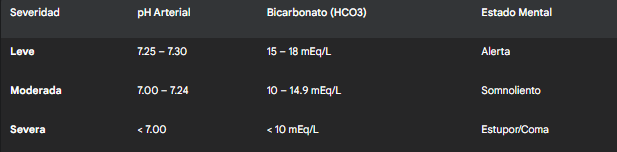

#Crisis Hiperglicémicas (Cetoacidosis Diabética y Estado Hiperglucémico Hiperosmolar)
##Generalidades y Definición

Las Crisis Hiperglicémicas son las emergencias metabólicas agudas más graves de la Diabetes Mellitus (DM) y conllevan una alta morbimortalidad si no se diagnostican y tratan de manera inmediata y protocolizada. Representan dos extremos de un espectro de descontrol metabólico, aunque en ocasiones pueden presentarse estados mixtos (CAD-EHH) que comparten características de ambos.

Estos dos síndromes principales son:

1. Cetoacidosis Diabética (CAD / DKA):

	* Definición: Es un estado de deficiencia de insulina absoluta o casi absoluta. Esta falta total de insulina, combinada con un exceso de hormonas contrarreguladoras (especialmente glucagón), conduce a la tríada bioquímica clásica:

		1. Hiperglicemia (Glucosa > 250 mg/dL).

		2. Cetosis (Cetonemia y/o cetonuria).

		3. Acidosis Metabólica con Anión Gap Elevado (pH < 7.30, Bicarbonato < 18 mEq/L).

	* Población: Es la emergencia hiperglicémica más común. Aunque es el sello distintivo del debut o descompensación de la Diabetes Mellitus tipo 1 (DM1), puede ocurrir en pacientes con DM2 de larga data o bajo estrés fisiológico severo (ej. sepsis, trauma).

	* Variante: Existe la "CAD Euglucémica", una trampa diagnóstica donde la acidosis y la cetosis están presentes, pero la glucosa es < 250 mg/dL. Se asocia clásicamente al uso de inhibidores de SGLT2, embarazo o ayuno prolongado.

2. Estado Hiperglucémico Hiperosmolar (EHH / HHS):

	* Definición: Es un estado de deficiencia de insulina relativa. Hay suficiente insulina para prevenir la lipólisis masiva y la cetogénesis, pero no para controlar la glicemia ni facilitar la entrada de glucosa a las células. Se caracteriza por:

		1. Hiperglicemia Severa (Glucosa > 600 mg/dL, a menudo > 1000).

		2. Hiperosmolaridad Sérica (Osmolaridad efectiva > 320 mOsm/kg).

		3. Deshidratación Profunda (sin cetosis o acidosis significativa).

	* Población: Ocurre típicamente en pacientes con Diabetes Mellitus tipo 2 (DM2), especialmente en adultos mayores con comorbilidades (ej. ERC, IC) y acceso limitado a la hidratación (ej. deterioro cognitivo, institucionalización).
	
##Fisiopatología

El desequilibrio entre la insulina (hormona anabólica) y las hormonas contrarreguladoras (glucagón, cortisol, catecolaminas, hormona del crecimiento) es el motor de ambas crisis.

1. Fisiopatología de la CAD: 

	* Deficiencia Absoluta de Insulina:

		* Hiperglicemia: Falla la captación de glucosa por los tejidos periféricos (músculo, grasa). El hiperglucagonismo (sin el freno inhibitorio de la insulina) estimula potentemente la gluconeogénesis (producción de nueva glucosa) y la glucogenólisis (ruptura de glucógeno) hepática sin control, liberando más glucosa a una sangre ya saturada.

		* Cetogénesis (Punto Clave): La falta de insulina provoca una lipólisis masiva en el tejido adiposo. Los ácidos grasos libres (AGL) inundan el hígado.

		* Normalmente, la insulina inhibiría la entrada de AGL a la mitocondria. Sin insulina, los AGL entran masivamente, sufren beta-oxidación y generan un exceso de Acetil-CoA que sobrepasa la capacidad del Ciclo de Krebs.

		* Este exceso de Acetil-CoA se desvía forzosamente a la vía de la cetogénesis, formando cuerpos cetónicos: Ácido Acetoacético y Ácido β-Hidroxibutírico (el más abundante y principal ácido).

		* Acidosis Metabólica: Estos cetoácidos son ácidos fuertes. Su acumulación consume las reservas de bicarbonato (HCO3-) del cuerpo, provocando una acidosis metabólica con anión gap elevado.

		* Diuresis Osmótica: La hiperglicemia excede el umbral renal de reabsorción (aprox. 180-200 mg/dL), causando glucosuria masiva, que arrastra agua (poliuria) y electrolitos (Na+, K+, Fosfato), llevando a la deshidratación y pérdida de electrolitos.

2. Fisiopatología del EHH:

	* Deficiencia Relativa de Insulina:

		* Existe un nivel de insulina residual. Este nivel es insuficiente para controlar la hiperglicemia hepática, pero es suficiente para suprimir la lipólisis y la cetogénesis. Por eso no hay acidosis.

		* Hiperglicemia Severa: La hiperglicemia se desarrolla de forma más lenta (días a semanas) que en la CAD.

		* Diuresis Osmótica y Círculo Vicioso: La hiperglicemia extrema (>600 mg/dL) provoca una diuresis osmótica profunda. Esto lleva a la deshidratación y hemoconcentración, lo que a su vez reduce la Tasa de Filtración Glomerular (TFG). La falla renal resultante impide que el riñón excrete la glucosa, exacerbando la hiperglicemia y la hiperosmolaridad en un círculo vicioso que culmina en un severo compromiso neurológico.

		* Hiperosmolaridad: La pérdida de agua libre es mucho mayor que la pérdida de solutos, concentrando el plasma y elevando la osmolaridad a niveles extremos (>320 mOsm/kg). Esta hiperosmolaridad extrae agua de las células, incluyendo las neuronas cerebrales, causando disfunción neurológica.	
		
##Factores de Riesgo

Los desencadenantes ("Las 5 Ies") son cruciales de identificar y tratar, ya que el manejo de la crisis no estará completo sin resolver la causa base.

* Infección (30-50%): Es la causa más común. (Ej. Neumonía, Infección del Tracto Urinario - ITU). Las citoquinas inflamatorias (TNF-alfa, IL-1) aumentan la resistencia a la insulina y liberan hormonas contrarreguladoras.

* Incumplimiento/Inadecuación del tratamiento:

	* Omisión de dosis de insulina (la causa más común en DM1, a veces intencional en adolescentes por trastornos de conducta alimentaria o miedo a la hipoglicemia).

	* Falla de una bomba de insulina (obstrucción o desconexión).

	* Inicio de DM1 (debut diabético, el paciente aún no sabe que necesita insulina).

* Infarto: (IAM, ACV). El estrés fisiológico es un potente liberador de catecolaminas y cortisol.

* Inflamación: (Pancreatitis aguda, colecistiits, trauma, cirugía, quemaduras).

* Inducido por Fármacos:
	
	* Corticoides: Potentes inductores de resistencia a la insulina y gluconeogénesis hepática.

	* Diuréticos tiazídicos.

	* Antipsicóticos atípicos.

	* Inhibidores de SGLT2 (iSGLT2): Pueden causar "CAD Euglucémica". El fármaco fuerza la excreción renal de glucosa (glucosuria), "ocultando" la hiperglicemia, mientras que el estado de deficiencia de insulina (relativa) sigue provocando cetogénesis.
	
##Manifestaciones Clínicas

**Cetoacidosis Diabética (CAD):**

* Instauración rápida (horas a 1-2 días).

* Síntomas clásicos de hiperglicemia: Poliuria, polidipsia, polifagia (a veces ausente por las náuseas), pérdida de peso.

* Síntomas de cetosis/acidosis: Náuseas y vómitos (muy frecuentes, perpetúan la deshidratación), dolor abdominal (presente hasta en 50%, puede simular un abdomen agudo quirúrgico, probablemente por íleo paralítico, distensión gástrica o hipoperfusión mesentérica).

* Signos compensatorios: Respiración de Kussmaul (respiración rápida y profunda, es la respuesta del centro respiratorio a la acidosis metabólica, intentando "exhalar" CO2 para compensar), aliento cetónico (olor a frutas/acetona, por la exhalación de acetona).

* Signos de deshidratación: Taquicardia, hipotensión ortostática, sequedad de mucosas.

* Alteración del estado mental (desde confusión a coma, según la severidad de la acidosis y la deshidratación).

**Estado Hiperglucémico Hiperosmolar (EHH):**

* Instauración lenta e insidiosa (días a semanas). El paciente (o la familia) nota "debilidad progresiva" o "confusión".

* Poliuria y polidipsia iniciales, que progresan a oliguria (falla pre-renal) por deshidratación severa.

* Síntomas Neurológicos (Dominantes): Reflejan la hiperosmolaridad y la deshidratación neuronal. Letargo, confusión severa, desorientación, somnolencia. Pueden progresar a focalidad neurológica (hemiparesia, afasia, que pueden simular un ACV), mioclonías, convulsiones o coma.

* Deshidratación severa: Hipotensión marcada, taquicardia, mucosas secas (apergaminadas), pobre turgencia cutánea, llenado capilar enlentecido.

* Ausencia de respiración de Kussmaul y dolor abdominal (no hay acidosis).

##Diagnóstico (Criterios de la ADA)

El diagnóstico se basa en la sospecha clínica y se confirma con exámenes de laboratorio.

**Exámenes y Cálculos Clave:**

* Laboratorio: Glucemia, GSA (Gases Arteriales), Electrolitos (Na+, K+, Cl-, PO4, Mg), BUN, Creatinina, Hemograma, Cetonas séricas (β-hidroxibutirato es el gold standard) u orina, Osmolaridad sérica.

* Cetonas Séricas (β-hidroxibutirato): Es el gold standard para diagnóstico y seguimiento, mucho mejor que las cetonas en orina (nitroprusiato), que solo miden acetoacetato y acetona (y pueden ser falsamente bajas al inicio, cuando domina el β-hidroxibutirato).

* Estudio del Desencadenante: ECG (buscar IAM), Rx Tórax (neumonía), Sedimento de Orina (ITU), amilasa/lipasa (pancreatitis).

* Cálculos Esenciales:

	* Anión Gap: Na+ - (Cl- + HCO3-). (Refleja los aniones no medidos, en este caso, los cetoácidos). Es crucial para monitorizar la resolución de la CAD.

	* Sodio Corregido: La hiperglicemia severa causa una "pseudohiponatremia" dilucional (la glucosa alta jala agua al espacio vascular, diluyendo el Na+). Na+ Corregido = Na+ medido + [1.6 * (Glucosa - 100) / 100] (Usar 2.4 si glucosa > 400 mg/dL). Es vital para elegir el fluido de mantenimiento.

	* Osmolaridad Sérica Efectiva: (2 * Na+ medido) + (Glucosa / 18). Esta es la que dicta el estado neurológico.
	

##Tratamiento y Manejo

El manejo es una emergencia médica que requiere monitorización en una unidad de cuidados intermedios o intensivos (UCI). Los pilares del tratamiento son Fluidos, Insulina y Potasio. El orden y la priorización son clave.

1. Pilar 1: Fluidoterapia (Reanimación Hídrica)

	* Prioridad Absoluta: Corregir la depleción de volumen y mejorar la perfusión tisular.

	* Déficit de agua (promedio): CAD (4-6 Litros); EHH (8-12 Litros).

	* Fase Inicial:

		* Suero Salino 0.9% (Fisiológico): 1.0 – 1.5 Litros en la primera hora. Es la prioridad para restaurar la volemia y perfusión renal.

		* Continuar con SS 0.9% a 250-500 mL/h las siguientes horas, según el estado hemodinámico y la diuresis.

	* Fase de Mantenimiento (Evaluación del Sodio Corregido):

		* Si el Na+ corregido es Alto o Normal (>135): Cambiar a Suero Salino 0.45% (Hipotónico) a 250-500 mL/h. Esto es crucial para reponer el déficit de agua libre y evitar la hipercloremia.
	
		* Si el Na+ corregido es Bajo (<135): Continuar con Suero Salino 0.9%.

2. Pilar 2: Manejo del Potasio (K+)

	* ¡CRÍTICO! Los pacientes tienen un déficit corporal total de K+ (pérdida de 300-600 mEq por diuresis osmótica), aunque el K+ sérico inicial pueda estar normal o alto.

	* Fisiología Falsa: El K+ sérico inicial es falsamente normal/alto debido a: 1) La acidosis (intercambiador H+/K+ celular) y 2) La falta de insulina (la insulina mete K+ a la célula).

	* La insulina EMPEORA la hipokalemia (mete K+ a la célula).

	* Manejo según K+ SÉRICO INICIAL (Antes de dar insulina):

		* K+ < 3.3 mEq/L: PARADA DE SEGURIDAD. NO INICIAR INSULINA. Es una emergencia. Reponer K+ vigorosamente (20-40 mEq/hora) hasta que el K+ sea > 3.3. Iniciar insulina con K+ bajo puede causar arritmias letales (TV/FV).

		* K+ 3.3 – 5.2 mEq/L: INICIAR INSULINA y agregar K+ a los sueros de mantenimiento (ej. 20-30 mEq por cada litro de fluido). Objetivo: mantener K+ sérico 4-5 mEq/L.

		* K+ > 5.2 mEq/L: INICIAR INSULINA. No reponer K+ de inicio, pero vigilarlo estrechamente (cada 2 horas), ya que caerá rápidamente.

3. Pilar 3: Insulinoterapia

	* Gold Standard: Infusión IV continua de Insulina Regular (Cristalina).

	* Dosis: 0.1 U/kg/hora (en bomba de infusión).

	* Bolo: No se recomienda bolo inicial en adultos (como se hacía antes), ya que puede bajar la glucosa y la osmolaridad muy rápido, aumentando el riesgo de edema cerebral.

	* Objetivos Terapéuticos:

		* Reducción de la glucosa de 50-75 mg/dL por hora. (Descensos más rápidos son peligrosos).

		* En CAD (Objetivo principal): Cerrar el Anión Gap (frenar la cetogénesis).

		* En EHH (Objetivo principal): Reducir la osmolaridad (no más de 3 mOsm/kg/h) y la glicemia.

4. El "Switch" (Ajuste de Fluidos y Glucosa)

	* Momento: Cuando la glucosa sérica alcanza ~200-250 mg/dL (en CAD) o ~300 mg/dL (en EHH).

	* Acción: NO SUSPENDER LA INSULINA.

		* Cambiar los fluidos IV a Suero Glucosalino (Dextrosa al 5% en SS 0.45%).

		* Razón: El objetivo de la insulina en CAD no es normalizar la glucosa, sino frenar la cetogénesis (cerrar el anión gap). La glucosa baja antes que la acidosis se resuelva. Se debe continuar la infusión de insulina para terminar de resolver la acidosis, y se añade Dextrosa para evitar la hipoglicemia iatrogénica.

5. Manejo del Bicarbonato

	* No se recomienda de rutina. La acidosis se corrige tratando la causa (insulina y fluidos).

	* Contras: Puede causar hipokalemia, sobrecarga de sodio, acidosis paradójica del LCR y desplazar la curva de disociación de la hemoglobina.

	* Considerar (Controversial): Solo si el pH arterial es < 6.9, por riesgo de disfunción miocárdica severa o vasoplejia refractaria.

6. Criterios de Resolución

	* CAD: Glucosa < 200 mg/dL Y dos de los siguientes:

		* Bicarbonato (HCO3) ≥ 15 mEq/L

		* pH venoso > 7.30

		* Anión Gap ≤ 12 mEq/L (el marcador más fiable).

	* EHH:

		* Osmolaridad < 315 mOsm/kg

		* Estado mental normalizado (puede tardar más que la resolución bioquímica).

7. Transición a Insulina Subcutánea (SC)

	* Paso Crítico: Una vez que el paciente cumple criterios de resolución y puede comer.

	* Solapamiento: Se debe administrar la dosis de insulina basal (lenta, ej. Glargina) 1 a 2 horas ANTES de suspender la infusión IV de insulina.

	* Farmacocinética: La insulina IV tiene una vida media de minutos. La insulina SC basal tarda horas en empezar a actuar. Si la bomba de insulina se suspende antes del solapamiento, se crea un "gap de insulina" y el paciente volverá a la cetoacidosis rápidamente.

##Seguimiento

* Monitorización en UCI/Intermedio: Glicemia capilar cada hora. Electrolitos, BUN, Creatinina y GSA (o venosos para pH/Bicarb) cada 2-4 horas.

* Buscar y tratar agresivamente el factor desencadenante (ej. antibióticos para infección, manejo de IAM).

* Prevención de complicaciones iatrogénicas (Hipoglicemia, Hipokalemia) y del tratamiento (Edema Cerebral - raro en adultos, pero letal; sospechar si hay cefalea y deterioro neurológico pese a mejoría bioquímica).

##Pronóstico

	* CAD: La mortalidad ha disminuido drásticamente. En centros con protocolos, es < 1%.

	* EHH: El pronóstico es mucho peor, con una mortalidad que puede alcanzar el 5% al 20%. Esto se debe a la edad avanzada de los pacientes, la severidad de la hiperosmolaridad, y las comorbilidades subyacentes (IAM, ACV, sepsis) que actúan como desencadenantes y se agravan por la deshidratación y el riesgo de trombosis.

* Post-alta: Educación diabetológica intensiva ("reglas de días de enfermedad": nunca suspender la insulina, medir cetonas, hidratarse), revisión de adherencia al tratamiento, ajuste de esquemas de insulina y seguimiento ambulatorio estricto.

##Citas

1. American Diabetes Association (ADA). (2024). Standards of Care in Diabetes – 2024. Diabetes Care, 47(Supplement 1), S282-S298 (Sección 16: Emergencias Diabéticas).

2. Kitabchi, A. E., et al. (2009). Hyperglycemic crises in adult patients with diabetes. Diabetes Care, 32(7), 1335–1343. (Guía clásica fundamental de la ADA).

3. Joint British Diabetes Societies (JBDS) Inpatient Care Group. (2023). The Management of Diabetic Ketoacidosis in Adults. JBDS Guidelines.

4. Umpierrez, G., & Korytkowski, M. (2016). Diabetic emergencies - ketoacidosis, hyperglycaemic hyperosmolar state and hypoglycaemia. Nature Reviews Endocrinology, 12(4), 222–232.

5. Dhatariya, K., et al. (2024). Hyperosmolar Hyperglycemic State (HHS) in Adults. En: StatPearls. StatPearls Publishing.