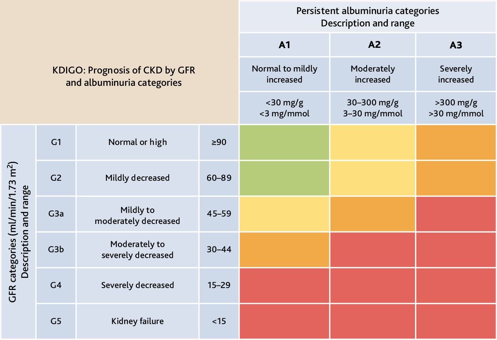

#GES N°1: Insuficiencia Renal Crónica Terminal.
##Generalidades y Definición
 La Enfermedad Renal Crónica (ERC) se define como **la presencia de anomalías estructurales (ej. albuminuria, alteraciones en el sedimento urinario o en imágenes) o funcionales (Tasa de Filtración Glomerular <60 ml/min/1.73m²) del riñón, que persisten por ≥3 meses** y tienen implicaciones significativas para la salud del individuo. 

 La Insuficiencia Renal Crónica Terminal (IRCT), también conocida como Enfermedad Renal en Etapa Terminal (ERET), constituye la etapa final y más grave (Etapa 5) de la ERC: 

 * Se caracteriza por una Tasa de Filtración Glomerular (TFG) críticamente reducida, inferior a 15 ml/min/1.73m².

 * En esta fase, la función renal residual es mínima, lo que resulta en una incapacidad para mantener la homeostasis del medio interno.  

 * Los riñones pierden su capacidad para filtrar productos de desecho nitrogenados (como la urea y la creatinina), regular el equilibrio de líquidos y electrolitos (sodio, potasio, fósforo), y llevar a cabo sus funciones endocrinas (producción de eritropoyetina y activación de la vitamina D). 
 
 * Esta acumulación de toxinas y fluidos, conocida como síndrome urémico, es incompatible con la vida a mediano plazo, haciendo indispensable la instauración de una Terapia de Reemplazo Renal (TRR) —ya sea diálisis (hemodiálisis o diálisis peritoneal) o un trasplante renal— para la supervivencia del paciente. 

 Su creciente prevalencia mundial, impulsada por el envejecimiento de la población y la epidemia de diabetes y HTA, la consolida como un problema de salud pública de primer orden debido a su alta carga de morbimortalidad, su impacto devastador en la calidad de vida y el elevado costo económico que representa para los sistemas sanitarios.
 
 
 
##Garantías AUGE

**Acceso: ¿Quiénes tienen derecho?**

Tienen derecho todas las personas con diagnóstico confirmado de IRCT y que requieran tratamiento de sustitución renal.

Esto Incluye:

* Acceso a tratamiento: Hemodiálisis, Peritoneodiálisis o Trasplante Renal.
* Acceso a estudio pre-trasplante en pacientes con ERC etapa IV, según indicación médica.
* Continuidad del tratamiento para quienes ya están en diálisis o han sido trasplantados.

**Oportunidad: ¿Cuáñes son los plazos máximos de espera?**

La oportunidad se activa desde que se confirma el diagnóstico con indicación de tratamiento:

1. Tratamiento (Diálisis):

	* Inicio de Hemodiálisis: Dentro de 7 días desde la indicación médica.

	* Inicio de Peritoneodiálisis: Dentro de 21 días desde la indicación médica.

	* Creación de Fístula Arteriovenosa (Acceso Vascular): Dentro de 90 días desde la indicación médica.  

2. Tratamiento (Trasplante):

	* Estudio Pre-Trasplante: Inicio de estudio dentro de los 90 días desde la indicación médica. El estudio completo para ingresar a la lista de espera debe realizarse en un plazo máximo de 10 meses.

	* Tratamiento Inmunosupresor (dondante vivo): Inicio 48 horas antes del trasplante.

3. Seguimiento (Post-Trasplante):

	* Primer año post-trasplante: Control con especialista mensual.

	* A partir del 2do año: Control con especialista cada 3 meses.

**Protección Financiera: ¿Cuál es el copago máximo?**

Varía según la previsión y el tramo:

* Beneficiarios FONASA A y B: Copago $0.

* Beneficiarios FONASA C y D: Copago $0.

* Beneficiarios ISAPRE: Copago del 20% del arancel de referencia GES, con un tope máximo anual (deducible).  

##Fisiopatología

 1. La progresión de la ERC hacia la etapa terminal es un proceso multifactorial, progresivo y generalmente irreversible. 

 2. La vía final común, independientemente de la etiología inicial, involucra una reducción en el número de nefronas funcionale:

 * Como mecanismo adaptativo, las nefronas remanentes sufren cambios hemodinámicos y estructurales, principalmente una hiperfiltración glomerular compensatoria.

 3. Esta sobrecarga de trabajo mantenida en el tiempo se vuelve maladaptativa, generando hipertensión intraglomerular, estrés mecánico sobre las células glomerulares y un aumento del paso de proteínas al filtrado (proteinuria).

 4. La proteinuria en sí misma es nefrótica, promoviendo inflamación y fibrosis en el intersticio tubular. 

 5. Procesos como la activación del sistema renina-angiotensina-aldosterona y la liberación de citoquinas pro-fibróticas (ej. TGF-β) perpetúan un círculo vicioso de glomeruloesclerosis y fibrosis tubulointersticial, que conduce a la pérdida progresiva de más nefronas hasta alcanzar la fase terminal.

##Factores de Riesgo

**Modificables:**

 * Diabetes Mellitus: Principal causa global. La hiperglicemia crónica provoca cambios estructurales en el glomérulo (glomeruloesclerosis diabética), llevando a la proteinuria y al deterioro funcional.

 * Hipertensión Arterial: Segunda causa más común. La presión elevada daña los pequeños vasos renales (nefroangioesclerosis), causando isquemia y esclerosis glomerular.

 * Obesidad y Síndrome Metabólico: Contribuyen a través de la inflamación crónica, la resistencia a la insulina y la hipertensión.

 * Tabaquismo: Acelera la progresión de la ERC a través de daño endotelial y estrés oxidativo.

 * Uso indiscriminado de Fármacos Nefrotóxicos: Especialmente los antiinflamatorios no esteroideos (AINEs), que inhiben las prostaglandinas renales, reduciendo el flujo sanguíneo renal.

 * Dislipidemia: Contribuye al daño endotelial y la aterosclerosis a nivel renal.

 * Infecciones urinarias a repetición o mal tratadas: Pueden llevar a cicatrices renales (nefropatía por reflujo).

 **No modificables:**

 * Edad avanzada: Existe una disminución fisiológica de la TFG con el envejecimiento (inmunosenescencia).

 * Antecedentes familiares de enfermedad renal: Sugiere una predisposición genética.

 * Raza/Etnia: Ciertas poblaciones presentan mayor susceptibilidad y una progresión más rápida de la enfermedad.

 * Enfermedades autoinmunes: El Lupus Eritematoso Sistémico (nefritis lúpica) o las vasculitis pueden causar daño renal severo.

 * Enfermedades renales hereditarias: La poliquistosis renal autosómica dominante es un ejemplo paradigmático.

 * Bajo peso al nacer: Se asocia con un menor número de nefronas (menor "reserva renal").
 
##Manifestaciones Clínicas
 
 La ERC es una enfermedad silente en sus primeras etapas. Las manifestaciones clínicas evidentes, que conforman el síndrome urémico, aparecen cuando la TFG cae por debajo de 15-20 ml/min. Estas se deben a la disfunción de prácticamente todos los órganos y sistemas.

**Manifestaciones Clínicas (por sistema):**

* Generales: Fatiga, astenia, debilidad, intolerancia al frío.

* Gastrointestinales: Anorexia, náuseas, vómitos, sabor metálico (disgeusia), aliento urémico (fétor amoniacal).

* Neurológicas: Dificultad para concentrarse, insomnio, síndrome de piernas inquietas.

* En casos avanzados: Asterixis, mioclonías, convulsiones y encefalopatía urémica.

* Cardiovasculares: Hipertensión arterial (generalmente por sobrecarga de volumen), edema, disnea (por insuficiencia cardíaca congestiva o edema pulmonar), pericarditis urémica.

* Hematológicas: Anemia normocítica normocrómica (por déficit de eritropoyetina), diátesis hemorrágica (por disfunción plaquetaria).

* Dermatológicas: Palidez terrosa, prurito intenso y generalizado, piel seca, escarcha urémica (depósito de cristales de urea en la piel tras la evaporación del sudor).

* Óseas y Minerales: Dolor óseo y fracturas patológicas (osteodistrofía renal).

##Diagnóstico

1. **Anamnesis**: Búsqueda dirigida de factores de riesgo, síntomas urémicos y antecedentes familiares.

2. **Examen Físico**: Evaluar la P.A, estado de la volemia, auscultación cardiopulmonar y búsqueda de signos físicos (edema, ingurgitación yugular).

3. **Exámenes de Laboratorio→ Gold Standard:**

	* Creatinina Sérica.

	* Examen de Orina Completa (EOC) y sedimento→ Identificar proteinuria, hematuria, leucocituria o la presencia de cilindros.

	* Cuantificación de Proteinuria: 	

		* Relación Albúmina/Creatinina (RAC) ≥30 mg/g.
	* Hemograma: Posible Anemia.

	* Bioquímica y Electrolitos: Posible HiperK+, Hiperfosfatemia, Hipocalcemia y Acidosis Metabólica (con bicarbonato sérico bajo).

	* Medición de PTHi: Posible Hiperparatiroidismo 2ria.

4.**Imagenología:**

* Ecografía Renal y de las Vías Urinarias→ Examen no invasivo crucial:

	* Hallazgos: Hipoplasia Renal, Hiperecogénico y pérdida de la diferenciación corticomedular.

##Tratamiento y Manejo

1. **Manejo no Farmacológico→ Previo y durante a la terapia de reemplazo renal (TRR):**

	* Planificación y educación para la TRR: Se debe discutir con el paciente y su familia las diferentes modalidades de TRR para una toma de decisiones informada

	* Manejo Nutricional→ Realizado por una nutricionista:

		* Restricción estricta de sodio <2 g/día, potasio y fósforo.

		* Restricción proteica ~0,8 g/kg.
	
			* Preferir proteínas vegetales.
		
	* Ejercicio Físico regular y adaptado→ Evitar Sarcopenia y mejorar la capacidad funcional.

2. **Manejo Farmacológico→ Se centra en controlar y manejar otras patologías y/o complicaciones:**

	* HTA→ Desde la Etapa 3a, se suelen usar ≥2 Hipotensores:
 
		* IECA/ARA II, Diltiazem y Espironolactona→ Además de disminuir la P.A, tienen efecto antiproteinurico.
	
			* Ojo!→ Puede producirse HiperK+ si se usa IECA/ARA II + Espironolactona.
	
		* Meta: P.A <130/80 mmHg.
		
	* Anemia→ Se usan Agentes Estimulantes de la Eritropoyesis (AEE) y suplementos de Hierro.

	* Trastorno Mineral y Óseo→ Utilizar quelantes de fósforos y/o análogos de la VitD o Calcimiméticos para controlar la hiperfosfatemia y el hiperparatiroidismo 2rio.

		* Objetivo: Prevenir osteodistrofia y calcificaciones vasculares.
	
	* Acidosis Metabólica→ Corrección con Bicarbonato de Sodio VO, con el objetivo de mantener un nivel sérico >22 mEq/L.

##TRR

1. **Hemodiálisis (HD):** Es la modalidad más frecuente, se realiza habitualmente 3 veces por semana, en sesiones de 3~4hrs.

2. **Diálisis Peritoneal (DP):** Tiene la particularidad de poder ser manual (ambulatoria) o automatizada (durante la noche).

3. **Trasplante Renal:** Es el tratamiento de elección por ofrecer una mejor supervivencia y calidad de vida que las otras 2 modalidades.

* El pacietne deberá tomar fármacos inmunosupresores de por vida para prevenir el rechazo del injerto.

##Factores de Mal Pronóstico

* Edad avanzada.

* Diabetes.

* Enfermedad Cardiovascular Establecida al inicio de la TRR.

* Malnutrición.

* Inflamación Crónica.
	
##Citas

* Ministerio de Salud (MINSAL). Guía Clínica AUGE: Prevención de la Enfermedad Renal Crónica. Santiago (CL): Ministerio de Salud; 2017. [Consultado el 29 de octubre de 2025]. Disponible en: https://www.google.com/search?q=https://www.minsal.cl/portal/url/item/7e2f5d143bae97e6e04001016501712a.pdf
* Vassalotti JA, Ernst FR. Overview of the management of chronic kidney disease in adults. En: Forman JP, ed. UpToDate. Waltham (MA): UpToDate Inc.; 2025. [Consultado el 29 de octubre de 2025].
* Kidney Disease: Improving Global Outcomes (KDIGO) 2024 Clinical Practice Guideline for the Evaluation and Management of Chronic Kidney Disease. Kidney Int. 2024;105(4S):S117-S314.

