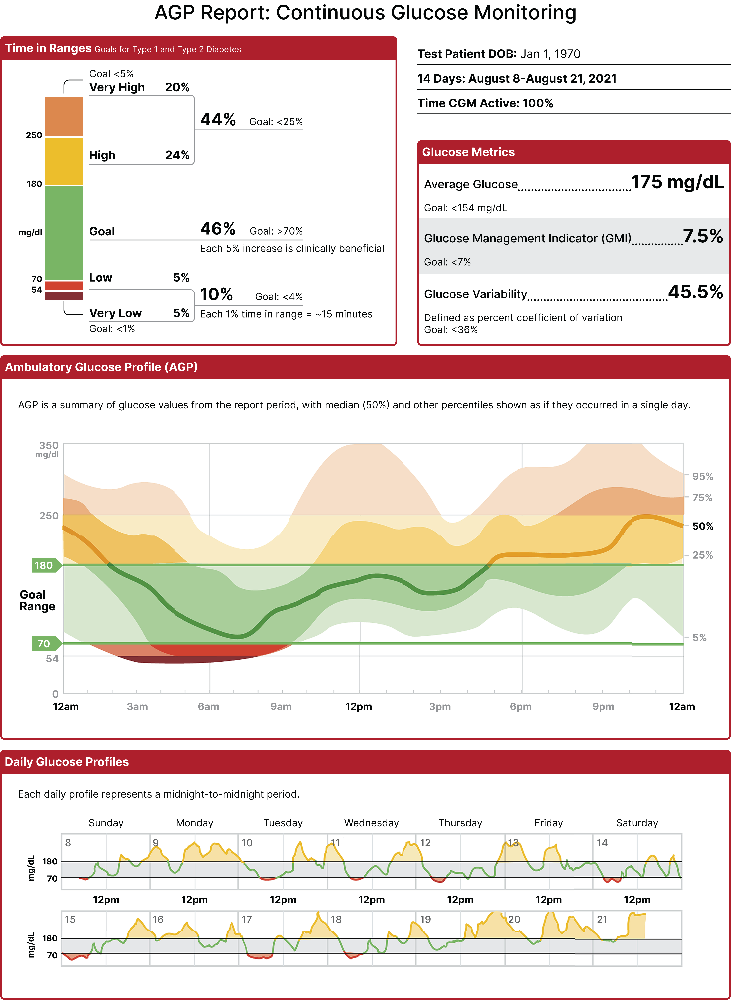
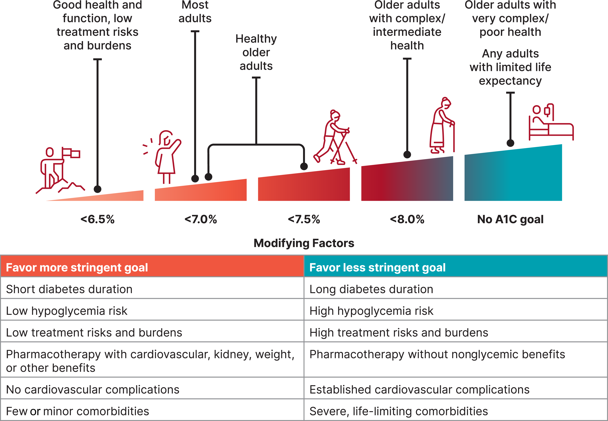

#GES N°6: Diabetes Mellitus Tipo 1.
##Generalidades y Definición

La DM1 es una enfermedad crónica autoinmune, caracterizada por la destrucción selectiva de las células β-pancreaticas , lo que resulta en una deficiencia absoluta de insulina.

* Esta hormona es esencial para que la glucosa ingrese a las células y sea utilizada como energía.

* Sin insulina, la glucosa se acumula en la sangre, provocando el cuadro clínico de la enfermedad.

* La DM1 puede manifestarse a cualquier edad, pero es más frecuente en niños, adolescentes y adultos jóvenes.

##Garantías GES

**Acceso: ¿Quiénes tienen derecho?**

* Toda persona con sospecha de DM1, basada en exámenes alterados o síntoams sugerentes, tendrá acceso a consulta con especialista.

* Toda persona con confirmación diagnóstica de DM1 tendrá acceso a tratamiento.

* Toda persona en tratamiento tendrá acceso a continuarlo, incluyendo el manejo del pie diabético si se presenta.

* Toda persona con DM1 y descompensación (como Cetoacidosis Diabética) tendrá acceso a tratamiento de urgencia y hospitalización según indicación médica.

**Oportunidad: ¿Cuáles son los plazos máximos de espera?**

1. Diagnóstico→ Consulta con especialista: Dentro de 7 días desde la sospecha.

2. Tratamiento:
	
	* Inicio de Tratamiento→ Incluye educación inicial e insumos: Dentro de 24hrs desde la confirmación diagnóstica.

	* Atención en SU→ Dentro de 30 minutos desde la atención médica de urgencia.

3. Seguimiento→ La garantía cubren el acceso a todos los controles, exámenes, medicamentos e insumos necesarios.

**Protección Financiera:**

* Beneficiarios FONASA A y B: Copago $0 (Gratuidad).

* Beneficiarios FONASA C y D: Copago $0 (Gratuidad).

* Beneficiarios ISAPRE: Copago del 20% del Arancel de Referencia GES.
	
##Fisiopatología:

La DM1 es el resultado de una compleja interacción entre factores genéticos y ambientales que desencadenan una respuesta autoinmune.
 
**Mecanismo Fisiopatológico→** El sistema inmunitario del propio individuo ataca y destruye por error las células beta de los islotes de Langerhans en el páncreas. 

	* Este proceso es mediado por linfocitos T y la presencia de autoanticuerpos circulantes contra antígenos de las células beta. 

	* Los anticuerpos más comunes son:

	 * Anticuerpos anti-insulina (IAA).
	 
	 * Anticuerpos anti-descarboxilasa del ácido glutámico (GADA).
	 
	 * Anticuerpos anti-fosfatasa de tirosina (IA-2 y IA-2β).
	 
	 * Anticuerpos anti-transportador de zinc 8 (ZnT8)→ La destrucción es progresiva y los síntomas clínicos de la diabetes (hiperglicemia) aparecen cuando se ha perdido ~80-90% de la masa de células beta.
	 
##Factores de Riesgo:

1. Predisposición Genética→ Es el factor de riesgo más importante:

	* Existe una fuerte asociación con ciertos genes del sistema HLA (antígeno leucocitario humano), específicamente los alelos DR3-DQ2 y DR4-DQ8.
 
2. Factores Ambientales (desencadenantes): Se postula que ciertos factores pueden iniciar la respuesta autoinmune en individuos genéticamente susceptibles→ Entre ellos se incluyen:
		
	* Infecciones virales (ej. enterovirus, virus Coxsackie B).
		
	*Factores dietéticos en la infancia temprana (introducción precoz de leche de vaca).
 
	* Exposición a ciertas toxinas.

3. Historia Familiar: Tener un familiar de primer grado con DM1 aumenta el riesgo, aunque ≥85% de los nuevos diagnósticos ocurren en personas sin antecedentes familiares. 

##Manifestaciones Clínicas

El inicio suele ser agudo, especialmente en niños. Los síntomas cardinales derivan de la hiperglicemia y la glucosuria (glucosa en la orina):
 
1. Poliuria: Aumento de la frecuencia y volumen de la orina.
 
2. Polidipsia: Sed intensa.

3. Polifagia: Aumento del apetito.
 
4. Pérdida de peso inexplicable: A pesar del aumento del apetito, el cuerpo no puede utilizar la glucosa y recurre a grasas y proteínas como fuente de energía.

5. Astenia y fatiga.

En casos graves o de diagnóstico tardío, puede debutar con una cetoacidosis diabética (CAD), una emergencia médica que presenta dolor abdominal, náuseas, vómitos, respiración rápida y profunda (respiración de Kussmaul), aliento con olor a frutas (cetónico) y alteración del estado de conciencia.

##Criterios ADA Diagnósticos

 

##Estadios de la DM1

##Screening

##Insulinoterapia

El objetivo es imitar la secreción fisiológica de insulina.

1. Esquema de Múltiples Dosis Diarias (MDI)→ Es el tratamiento estándar y combina:
 
	* Insulina Basal→ ≥1 inyecciones diarias de una insulina de acción prolongada (ej. Glargina, Degludec) o intermedia (NPH) para cubrir las necesidades de insulina entre comidas y durante la noche.

	* Insulina Prandial (o Bolos)→ Inyecciones de una insulina de acción rápida (ej. Lispro, Aspart, Glulisina) antes de cada comida, cuya dosis se calcula según los carbohidratos a consumir y la glicemia pre-comida.

2. Infusión SC Continua de Insulina ("Bomba" de Insulina)→ Es una alternativa al MDI:

	* Un dispositivo administra de forma continua insulina rápida como basal y el paciente se administra bolos antes de las comidas. 

	* Los sistemas modernos se integran con monitores continuos de glucosa (sistemas de asa cerrada o páncreas artificial) que ajustan automáticamente la infusión basal para mejorar el control y reducir las hipoglicemias.
	
##Manejo no Farmacológico

El pilar del tratamiento es el reemplazo de la insulina de por vida, junto con educación, monitoreo y un estilo de vida saludable.

1. Educación en Diabetes→ Es fundamental: El paciente y su familia deben aprender sobre el monitoreo de glucosa, administración de insulina, conteo de carbohidratos, manejo de hipoglicemia e hiperglicemia, y ajuste de dosis en situaciones especiales (ejercicio, enfermedad).
 
2. Nutrición→ No existe una "dieta para diabéticos": 

	* El plan de alimentación debe ser individualizado, enfocado en el conteo de carbohidratos para ajustar las dosis de insulina prandial (con las comidas). 
	* Se promueve un patrón de alimentación saludable y equilibrado.
3. Actividad Física→ Se recomienda ejercicio aeróbico y de resistencia regular: Los pacientes deben aprender a ajustar la ingesta de carbohidratos y/o las dosis de insulina para prevenir la hipoglicemia durante y después del ejercicio.

4. Apoyo Psicosocial→ El manejo de una enfermedad crónica puede generar estrés y "distrés por diabetes":

	* El apoyo de salud mental es una parte integral del cuidado.

##Monitoreo de Glucosa

* Monitoreo Continuo de Glucosa (MCG)→ Es el estándar de cuidado actual para la mayoría de los pacientes con DM1. 

	* Un sensor subcutáneo mide la glucosa en el líquido intersticial continuamente, mostrando no solo el valor actual sino también la tendencia (si sube o baja), lo que permite tomar decisiones más informadas.
 
* Automonitoreo de Glicemia Capilar (AMG)→ Con glucómetro:

	* Sigue siendo necesario, aunque con menor frecuencia si se usa MCG. 
	
	* Es indispensable si los síntomas no coinciden con la lectura del MCG.
	

#Metas

#Algoritmo

