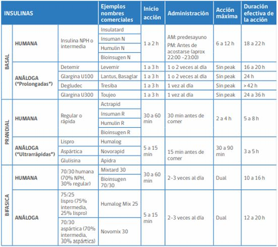

#GES N°7: Diabetes Mellitus Tipo 2.
##Generalidades y Definición

La Diabetes Mellitus Tipo 2 (DM2) es una enfermedad metabólica crónica y progresiva que se ha convertido en una epidemia global, constituyendo un importante problema de salud pública. 

* Representa ≥90% de todos los casos de diabetes y su prevalencia está en alarmante aumento, estrechamente ligada al incremento de la obesidad, el envejecimiento de la población y el sedentarismo.

Se define por la **presencia de hiperglicemia (niveles elevados de glucosa en sangre) que resulta de una combinación de dos defectos fisiopatológicos interrelacionados y progresivos:**
 
1. Resistencia a la insulina:

	* Las células del cuerpo, especialmente en el músculo esquelético, el tejido adiposo y el hígado, pierden su capacidad de responder eficazmente a la acción de la insulina. 

	* Esto significa que se necesita más insulina para lograr el mismo efecto de captación de glucosa.

2. Disfunción progresiva de la célula beta pancreática: 

	* Con el tiempo, el páncreas no logra producir suficiente insulina para compensar la resistencia periférica, llevando a un déficit relativo y, en etapas avanzadas, casi absoluto de la hormona.
 
A diferencia de la DM1, donde hay una destrucción autoinmune de las células productoras de insulina, en la DM2 la producción de insulina no está ausente al inicio, sino que es inadecuada para las necesidades aumentadas del organismo.

##Garantías GES

**Acceso: ¿Quiénes tienen derecho?**

* Toda persona con sospecha de DM2, basada en exámenes alterados o síntoams sugerentes, tendrá acceso a comfirmación diagnóstica.

* Toda persona con confirmación diagnóstica de DM2 tendrá acceso a tratamiento.

* Toda persona en tratamiento tendrá acceso a continuarlo, incluyendo el manejo del pie diabético y el acceso a curaciones.

* Toda persona con DM2 y descompensación tendrá acceso a tratamiento de urgencia y hospitalización según indicación médica.

**Oportunidad: ¿Cuáles son los plazos máximos de espera?**

1. Diagnóstico→ Confirmación Diagnóstica: Dentro de 30 días desde la primera consulta por sospecha.

2. Tratamiento→ Inicio del tratamiento: Dentro de 24hrs desde la confirmación diagnóstica.

	* Incluye educación inicial y fármacos.

3. Seguimiento: 

	* Atención por Médico Especialista: Dentro de 60 días desde la derivación.
	
	* Evaluación de Fondo de Ojo (por Oftalmólogo): Dentro de 90 días desde la indicación del equipo tratante (generalmente al diagnóstico y luego anualmente).

**Protección Financiera:**

* Beneficiarios FONASA A y B: Copago $0 (Gratuidad).

* Beneficiarios FONASA C y D: Copago $0 (Gratuidad).

* Beneficiarios ISAPRE: Copago del 20% del Arancel de Referencia GES.

##Fisiopatología

La DM2 es una enfermedad compleja y heterogénea donde interactúan una fuerte predisposición genética y determinantes factores ambientales y de estilo de vida.
1. El desarrollo de la DM2 es un proceso gradual que puede durar años. 

2. Inicialmente, la resistencia a la insulina obliga a las células beta del páncreas a hipertrofiarse y secretar cantidades cada vez mayores de insulina para mantener la glucosa en sangre en rangos normales (hiperinsulinemia compensatoria). 

3. Sin embargo, esta sobrecarga funcional, sumada a factores como la glucotoxicidad (el efecto dañino de la propia hiperglicemia) y la lipotoxicidad (el efecto de los ácidos grasos libres elevados), lleva al agotamiento y disfunción progresiva de las células beta. 

4. Cuando la producción de insulina ya no es suficiente para vencer la resistencia periférica, los niveles de glucosa en sangre comienzan a elevarse, primero después de las comidas (hiperglicemia postprandial) y luego en ayunas, llevando finalmente al diagnóstico. 

La obesidad, especialmente la visceral (abdominal), juega un papel central en este proceso, ya que el tejido adiposo disfuncional libera citoquinas proinflamatorias y ácidos grasos libres que exacerban la resistencia a la insulina a nivel sistémico.

##Factores de Riesgo

**No Modificables:**

* Antecedentes familiares de DM2: Tener un familiar de primer grado (padre, madre, hermano) aumenta significativamente el riesgo, reflejando el fuerte componente genético.

* Edad: El riesgo aumenta progresivamente a partir de los 35-45 años, debido a cambios metabólicos y un posible aumento de la adiposidad.
 
* Etnia: Ciertas etnias (latinos, afroamericanos, nativos americanos, asiáticos e isleños del Pacífico) tienen una mayor predisposición genética a desarrollar resistencia a la insulina.
 
* Historia de DMG o haber dado a luz a un bebé de >4 kg, lo que indica una predisposición a la disfunción de las células beta bajo estrés metabólico.

**Modificables:**

* Sobrepeso u obesidad (IMC ≥25 kg/m²): Es el factor de riesgo más importante y potente.
 
* Sedentarismo y un estilo de vida con baja actividad física.
 
* Dieta inadecuada: Caracterizada por un alto consumo de grasas saturadas y trans, bebidas azucaradas, alimentos ultraprocesados y baja ingesta de fibra, frutas y verduras.
 
* Hipertensión Arterial (HTA ≥140/90 mmHg o en tratamiento).
 
* Dislipidemia: Niveles de colesterol HDL bajos (<35 mg/dL) y/o triglicéridos elevados (>250 mg/dL).

* Síndrome de Ovario Poliquístico (SOP): Una condición hormonal fuertemente asociada con la resistencia a la insulina.

* Condiciones asociadas con resistencia a la insulina (ej. acantosis nigricans, una condición de la piel que se manifiesta con parches oscuros y aterciopelados).

*  Prediabetes: Tener glicemia en ayunas alterada o intolerancia a la glucosa, lo que indica que el proceso patológico ya está en marcha. 

##Manifestaciones Clínicas

El inicio de la DM2 es a menudo insidioso, y se estima que muchos pacientes pueden permanecer asintomáticos y sin diagnosticar durante varios años. 

1. Esta fase silente es peligrosa, ya que el daño micro y macrovascular puede comenzar antes del diagnóstico formal.
 
2. Los síntomas clásicos, que suelen aparecer cuando la hiperglicemia ya es significativa, son el resultado de la diuresis osmótica inducida por la glucosa elevada:

	* Poliuria (orinar con frecuencia), polidipsia (sed excesiva) y, a veces, polifagia (aumento del hambre).
	
	* Fatiga, letargo y debilidad generalizada.
 
	* Visión borrosa, causada por cambios osmóticos en el cristalino.
 
	* Infecciones recurrentes, como candidiasis genital, infecciones del tracto urinario o infecciones de la piel.

	* Cicatrización lenta de heridas.

A diferencia de la DM1, la pérdida de peso es infrecuente al inicio (el sobrepeso es la norma) y no suele debutar con cetoacidosis diabética (CAD), aunque puede presentarse un estado hiperosmolar hiperglicémico o una CAD en situaciones de estrés agudo severo (infecciones graves, cirugías, infartos).

##Criterios ADA Diagnósticos

 

##Progresión Natural de la DM2

Su progresión natural se puede entender en fases, lo que ayuda a guiar el tratamiento:

1. Prediabetes→ Un estado de alto riesgo para el desarrollo de diabetes y enfermedad
 cardiovascular: 

	* Incluye la glicemia en ayunas alterada (100-125 mg/dL) y/o la intolerancia a la glucosa (glicemia de 140-199 mg/dL en la PTGO). 

	* Es una ventana crítica para la intervención intensiva en el estilo de vida.
	
2. DM2 de reciente diagnóstico: Generalmente se puede manejar eficazmente con cambios en el estilo de vida y/o monoterapia farmacológica (usualmente metformina).

3. DM2 con necesidad de múltiples fármacos→ A medida que la función de las células beta disminuye con el tiempo, se requiere la combinación de varios agentes orales y/o inyectables (como los agonistas del receptor de GLP-1) para mantener el control glicémico.

4. DM2 con insulinodeficiencia→ Es una etapa avanzada de la enfermedad donde la producción endógena de insulina es muy baja. 

	* En esta fase, la terapia con insulina exógena se vuelve indispensable para un control adecuado, y el manejo puede volverse tan complejo como el de la DM1.
	
##Manejo No Farmacológico

El manejo es multifactorial, crónico y centrado en el paciente:

* El objetivo ha evolucionado de un enfoque puramente "glucocéntrico" a uno integral que busca no solo controlar la glicemia, sino también reducir el riesgo cardiovascular y renal y prevenir las complicaciones a largo plazo.
 
**Manejo no Farmacológico (Piedra angular del tratamiento en todas las etapas):**
 
1. Cambios en el estilo de vida (CEV):

	* Alimentación saludable: Se recomienda un patrón de dieta mediterránea, DASH o basada en plantas, rica en fibra, vegetales, frutas y granos integrales, y baja en grasas saturadas, azúcares añadidos y alimentos ultraprocesados. 
	
		* El control de las porciones y la calidad de los carbohidratos son clave.
		
	* Pérdida de peso→ Es la intervención más efectiva:

		* Una pérdida de peso modesta (5-7% del peso corporal) puede mejorar drásticamente la sensibilidad a la insulina y el control glicémico. 

		* Una pérdida de peso más sustancial (>10-15%), especialmente en etapas tempranas, puede incluso inducir la remisión de la DM2.

	* Actividad física→ Se recomiendan ≥150 minutos por semana de ejercicio aeróbico de intensidad moderada (ej. caminata rápida), distribuidos en ≥3 días, más 2-3 sesiones por semana de entrenamiento de resistencia (pesas, bandas elásticas).
 
2. Educación en Diabetes: Es un proceso continuo y fundamental para el automanejo, la toma de decisiones informada y la adherencia al tratamiento a largo plazo.

##Manejo Farmacológico

 

La elección del tratamiento se personaliza y prioriza la protección cardiorrenal:
 
1. Primera Línea:
	* Metformina→ Actúa principalmente reduciendo la producción hepática de glucosa y mejorando la sensibilidad a la insulina en los tejidos periféricos. 
	
2. Selección de Fármacos de Segunda Línea (basado en comorbilidades): Si no se alcanzan las metas de HbA1c o, crucialmente, si existen comorbilidades de alto riesgo, se debe añadir un segundo agente→ Las guías de la ADA 2025 establecen un algoritmo claro basado en el perfil del paciente:

	* Pacientes con Enfermedad Cardiovascular Aterosclerótica (ECVA) establecida o alto riesgo cardiovascular: 
	
		* Se debe añadir, independientemente de la HbA1c basal o el objetivo, un agonista del receptor de GLP-1 (ej. Liraglutida, Semaglutida, Dulaglutida) o un inhibidor de SGLT2 (ej. Empagliflozina, Canagliflozina, Dapagliflozina), ya que estos fármacos han demostrado en grandes ensayos clínicos reducir eventos cardiovasculares mayores (infartos, ACV, muerte CV).
 
	* Pacientes con Insuficiencia Cardíaca (IC), especialmente con fracción de eyección reducida:
	
		* Se debe añadir un iSGLT2, ya que han demostrado de forma consistente reducir las hospitalizaciones por IC y la mortalidad cardiovascular en esta población, con o sin diabetes.
		
	* Pacientes con Enfermedad Renal Crónica (ERC) y albuminuria: 

		* La primera opción es un inhibidor de SGLT2 (si la TFG lo permite) por su robusto beneficio en la ralentización de la progresión de la enfermedad renal. 

		* Los agonistas del receptor de GLP-1 son una alternativa o un complemento valioso.
		
3. Otras clases de fármacos: 

	* Inhibidores de la DPP-4, sulfonilureas y tiazolidinedionas: Se considera su uso cuando los agentes con beneficio cardiorrenal no están disponibles, están contraindicados o se necesita una mayor potencia para reducir la glicemia, pero no son de primera elección en pacientes de alto riesgo.
	
4. Insulinoterapia→ Se considera su uso cuando: 

	* HbA1c ≥10% al diagnóstico. 
	
	* Si hay síntomas de catabolismo (pérdida de peso).
	
	* Cuando no se logran las metas con múltiples agentes no insulínicos. 
	
5. Generalmente se inicia con una insulina basal para controlar la glicemia en ayunas.

 

 

  