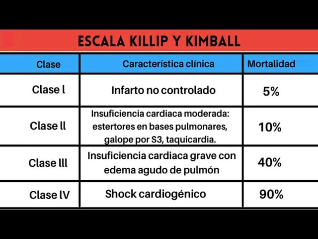

#GES N°5: IAMCEST.
##Generalidades y Definición

El IAM con elevación del Segmento ST (IAMCEST), también conocido como STEMI, es una emergencia médica que representa la manifestación más aguda de la cardiopatía Isquémica y constituye una de las principales causas de muertes a nivel global.

* Se define como **la necrosis del tejido miocárdico causada por una isquemia severa y prolongada**.

* Su característica distintiva es que resulta de la oclusión total y abrupta de una Arteria Coronaria Epicárdica.

El manejo se centra en el Concepto de **"tiempo es músculo"**, donde la prioridad absoluta es la reperfusión coronaria lo más rápido posible para salvar la mayor cantidad de miocardio viable.

##Garantías GES

**Acceso:¿Quiénes tienen derecho?**

* Todo beneficiario con **sospecha** de IAM tendrá acceso a atención de urgencia y confirma diagnóstica inmediata.

* Todo beneficiario con confirmación diagnóstica de IAMCEST tendrá acceso inmediato al tratamiento de reperfusión y al manejo médico posterior.

* Todo beneficiario post-IAMCEST tendrá acceso a seguimiento y rehabilitación cardíaca.

**Oportunidad: ¿Cuáles son los plazos máximos de espera?**

1. Diagnóstico:

	* Atención inmediata de Urgencia.
	
	* Confirmación Diagnóstica (ECG con informe): Dentro de 10 min desde el primer contacto médico en el servicio de urgencias.
	
2. Tratamiento (Reperfusión)→ El tratamiento debe iniciarse inmediatamente después de la confirmación diagnóstica, según la estrategia disponible en el centro:

	* Terapia de Trombólisis→ Fibrinólisis: Inicio del tratamiento (Tiempo "puerta-aguja") dentro de 30 min desde la confirmación diagnóstica.
	
	* Terapia de Angioplastia Primaria (PCI):
		
		* Si el paciente llega a un centro con capacidad de angioplastia→ Inicio del procedimiento (tiempo "puerta-balón") dentro de 90 min desde la confirmación diagnóstica.
		
		* Si el pacietne debe ser trasladado a un centro con capacidad→ Tiempo "pueta-balón" dentro de 120 min desde la confirmación diagnóstica.
		
3. Seguimiento→ Primer control por Cardiólogo: Dentro de 30 días después del alta hospitalaria.

**Protección Financiera:**

* Beneficiarios FONASA A y B: Copago $0 (Gratuidad).

* Beneficiarios FONASA C y D: Copago $0 (Gratuidad).

* Beneficiarios ISAPRE: Copago del 20% del Arancel de Referencia GES.

##Fisiopatología

El evento subyacente en la mayoría (~90%) de los IAMCEST es la Aterotrombosis. El proceso generalmente sigue esta secuencia:

1. Placa de Ateroma→ Existe de una placa aterosclerótica en la pared de una arteria coronaria.

	* Las placas consideradas "vulnerables" suelen tener un casquete fibroso fino y un gran núcleo lipídico inflamado.
	
2. Ruptura/Erosión→ La placa vulnerable se rompe, fisura o erosiona, exponiendo su contenido a la sangre.

3. Trombosis→ Se desencadena una respuesta hemostática exagerada.

	* Las plaquetas se activan y agregan en el sitio, y se activa la cascada de coagulación (Vía Factor Tisular), formando un trombo oclusivo rico en plaquetas y fibrina.
	
4. Oclusión Total→ El trombo bloquea completamente el flujo sanguíneo distal a la lesión.

5. Isquemia y Necrosis→ La falta de O2 y nutrientes provoca isquemia transmural.

	* La necrosis progresa "en oleada" desde el subendocardio (más sensible) hacia el epicardio en el transcurso de las primeras horas.
	
En la minoría de los casos, el IAMCEST puede ser causado por otros mecanismos, como el vasoespasmo coronario severo (Angina de Prinzmetal), la disección espontánea de Arteria Coronaria (DEAC) o embolias coronarias.

##Factores de Riesgo

**No Modificables:**

* Edad Avanzada

* Sexo Masculino→ Los hombres tienen mayor riesgo a edad temprana, mientras que las mujeres tienden a igualar/superar este riesgo tras la menopausia.

* Historia Familia→ Antecedentes de Enfermedad Coronaria Prematura (Padre <55 años, Madre <65 años).

**Modificables**

* Tabaquismo→ Induce disfunción Endotelial, es protrombótico y proinflamatorio.

* HTA→ Aumenta la tensión parietal, promueve la hipertrofía ventrícular y acelera el daño endotelial.

* DM→ Aumenta drásticamente el riesgo y empeora el pronóstico, ya que promueve u nestado proinflamatorio y protrombótico crónico.

* Obesidad→ Especialmente la obesidad visceral, ligada a la resistencia a la insulina y la inflamación sistémica.

* Dislipidemia→ Principalmente niveles elevados de C-LDL y bajos niveles de C-HDL.

* Sedentarismo.

##Manifestaciones Clínicas

La presentación clásica es el dolor torácico, aunque el índice de sospecha debe ser alto ante presentaciones atípicas:

1. Dolor torácico:

	* Carácter→ Opresivo, aplastante, "como un peso", urente o "sensación de muerte inminente".
	
	* Localización→ Típicamente retroesternal o precordial.
	
	* Irradiación→ Frecuente en el borde cubital del brazo izquierdo, ambos brazos, cuello, mandíbula o interescapular.
	
	* Duración→ Típicamente ≥20-30 min, de carácter continuo.
	
	* Gatillantes→ Suelen ocurrir en reposo y no cede al mismo ni, usualmente, con nitratos SL.

2. Síntomas Neurovegetativos→ Son comunes y reflejan la activación del sistema nervioso autónomo: Incluyen diaforesis, náuseas, vómitos y palidez.

3. Otros síntomas→ Disnea, síncope o presíncope, debilidad extrema.

4. Presentaciones Atípicas→ Frecuente en ancianos, mujeres y en pacientes diabéticos.

	* Pueden manifestarse como dolor epigástrico ("Indigestión") Disnea súbita, Fatiga extrema, o CEG, sin dolor torácico claro.
	
##Diagnóstico

El diagnóstico de IAMCEST es una emergencia y debe hacerse en minutos. Se basa en 3 pilares:

1. ECG de 12 derivaciones:

	* Debe realizarse e interpretarse en los primeros 10 min desde el Primer Contacto Médico.
	
	* Criterios Diagnóstico: Nueva elevación del Segmento ST en el punto J, en ≥2 derivaciones contiguas.
	
	* Bloqueo Completa de Rama Izquierda (BCRI) nuevo, en contexto clínico sugerente se considera un equivalente de IAMCEST.
	
2. Biomarcadores de Necrosis Cardíaca→ Troponinas:

	* Las troponinas Cardíacas (T o I) ultrasensibles son el Gold Standard para confirmar la necrosis miocárdica debido a su altísima sensibilidad y especifícidad.
	
	* Se requiere una curva de troponinas (medición basal y seriada) que muestre un ascenso y/o descenso característico para confirmar infarto.
	
		* La magnitud del peak de troponinas se correlaciona con el tamaño del infarto.
		
	* Crítico→ En el IAMCEST NO SE DEBE ESPERAR EL RESULTADO DE LAS TROPONINAS para iniciar la terapia de reperfusión.
	
3. Anamnesis y Examen Físico.

#Clasificación 

##Manejo Inicial (Prehospitalario y en SU)

1. Monitorización→ ECG Continuo, Oximetría de Pulso, P.A no Invasiva.

2. Oxígeno→ Suplementar solo si la SatO2 es <90% o hay dificultad respiratoria.

3. Aspirina→ Dosis de carga de 150-300 mg masticable.

4. Manejo del Dolor:

	* Nitroglicerina SL 04 mg→ Si PAS es >90 mmHg.
		
		* Produce Venodilatación y Vasodilatación Coronaria.
		
		* Contraindicada→ Frente a sospecha de Infarto de VD o uso recietne de inhibidores de fosfodiesterasa-5.
		
##Terapia de Reperfusión

El objetivo es abrir la arteria ocluida lo antes posible, idealmente en las primeras 12hrs desde el inicio de los síntomas.

1. Intervención Coronaria Percutánea (ICP) Primaria (Angioplastia):

	* Consiste en realizar una angiografía para identificar la oclusión y desobstruirla mecánicamente con un balón, seguido generalmente de la implantación de un Stent para mantener la arteria abierta y lograr un glujo distal nomal (Flujo TIMI 3).

2. Fibrinólisis→ Indicada si no se puede realizar una ICP primaria dentro de los 120 min recomendados.

	* Consiste en administrar un fármaco (ej.: Tenecteplasa, Alteplasa) que disuelve el trombo activando el plasminógeno.
	
	* Tiempo Objetivo (desde Primer Contacto)→ Iniciar la Infusión en <30 min.
	
	*Después de la fibrinólisis (exitosa o no), todos los pacientes deben ser trasladados a un centro con capacidad de ICP para realizar una coronariografía de rutina (entre 2 y 24hrs después).

##Manejo Farmacológico Adyuvante

1. Doble Antiagregación Plaquetaria (DAPT)→ Fundamental para prevenir la trombosis del stent y la recurrencia:

	* Aspirina en dosis de carga, seguida de dosis de mantención (81-100 mg/d) de por vida.
	
	* Inhibidor del Receptor P2Y12→ Dosis de carga lo antes posible, se prefiere Ticagrelor o Prasugrel sobre Clopidogrel, y se suelen mantener por ~12 meses.
	
2. Anticoagulación→ Se administra en el momento agudo para prevenir la retrombosis y la formación de trombos en el catéter.

	* HNF→ Generalmente usada durante la ICP.
	
	* HBPM→ Opción preferida en pacientes que van a fibrinólisis.

3. Terapia de Soporte (Post-Reperfusión)→ Debe iniciarse precozmente:

	* Estatinas de Alta Intensidad→ Atorvastatina 80 mg.
	
	* Beta Bloqueadores→ Iniciar V.O en las primeras 24hrs si no hay contraindicaciones.
		
		* Reducen la mortalidad al disminuir la demanda de O2 del miocardio, reducir el riesgo de arritmias y prevenir el remodelado adverso.
		
	*IECA/ARA II→ Iniciar precozmente, especialmente en pacientes con FEVI ≤40%, ICC, HTA o DM.
		
		* Previenen el remodelado ventrícular adverso y reducen la mortalidad.
		
	* Antagonistas de Aldosterona→ Espironolactona/Eplerona: Indicados si la FEVI permanece reducida y tienen DM o signos de IC.

##Factores de mal pronóstico

* Tiempo de isquemia→ Retraso en la reperfusión.

* Edad avanzada.

* Gravedad de la IC al ingreso.

* FEVI baja post-IAM.

* Presencia de DM.

* Enfermedad coronaria multivaso.

* Desarrollo de Shock Cardiogénico.

