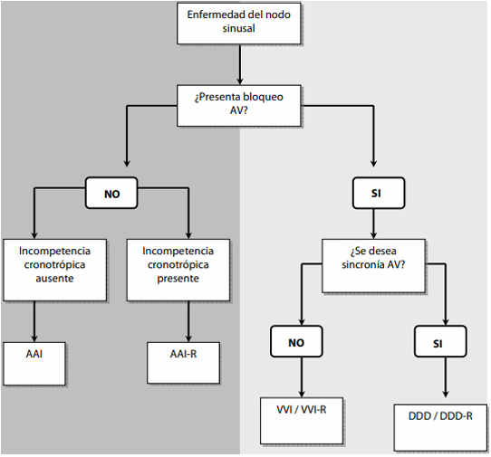
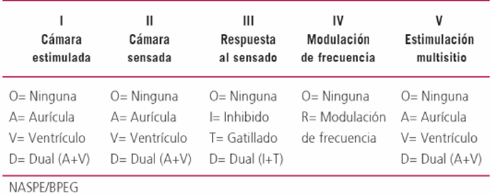

#GES N°25: Trastornos de la Generación y Conducción del Impulso Cardíaco que Requieren Marcapaso.
##Generalidades y Definición

Los trastornos de la generación y conducción del impulso cardíaco son un grupo de arritmias caracterizadas por bradicardia.

* Son causadas por una falla en el nodo sinusal o por un bloqueo en algún punto del sistema de conducción de los impulsos.

* Cuando estas bradiarritmias producen síntomas o ponen en riesgo la vida del paciente, el tratamiento de elección es el implante de un marcapasos cardiíaco (MPC) definitivo.

##Fisiopatología y Etiología

Las 2 causas principales de bradicardia que requieren MPC son:

1. Disfunción del nodo sinusal (DNS) o Enfermedad del seno:

	* Es un proceso degenerativo y fibrótico del nodo sinusal que disminuye su capacidad de generar impulsos de forma automática y regular.

	* Se manifesta como una bradicardia sinusal persistente, pausas o arrestos sinusales, incompetencia cronotrópica y se puede presentar como un síndrome de taquicardia-bradicardia.
	
		* Síndrome de Taquicardia-Bradicardia: Alternancia de ritmos lentos con arritmias auriculares rápidas, como la FA.
		
2. Bloqueos Auriculoventriculares (BAV):

	* Son interrupciones o retraso en la conducción del impulso entre las aurículas y los ventrículos, generalmente por fibrosis idiopática, cardiopatía isquémica o daño en el nodo AV o el sistema de His-Purkinje.
	
	* Se manifiesta como:
	
		* BAV de 1er grado→ Retraso en la conducción, intervalo PR >200 ms.
		
		* BAV de 2do grado→ Algunas ondas P no conducen, puede ser Mobitz I o Mobitz II:
		
			* Mobitz I→ Alargamiento progresivo del intervalo PR hasta que una onda P no conduce.
			
			* Mobitz II→ Más grave, se caracteriza por Ondas P intermitentes que no conducen e intervalos PR constantes y de similar duración.
			
		* BAV de 3er grado o bloqueo completo→ Es la disociación completa entre la actividad auricular y ventricular.
		
			* Los ventrículos laten a un ritmo de escape lento e inestable.
		
##Manifestaciones Clínicas

Los síntomas son producto de la hipoperfusión cerebral y el GC:

1. Síncope/Presíncope.

2. Mareos y vértico.

3. Astenia, Fatiga y Letargo.

4. Disnea de esfuerzo e intolerancia al ejercicio.

5. Empeoramiento de IC.

##Proceso Diagnóstico

1. Anamnesis y Examen Físico→ Se debe caracterizar los síntomas y su contexto.

2. ECG de 12 derivaciones.

3. Monitoreo Holter de 24-48h→ Esencial para diagnosticar arritmias intermitentes.

4. Loop Recorder→ En casos de síncope de origen desconocido y muy infrecuente.

5. Test de Esfuerzo→ Para evaluar la incompetencia cronotrópica.

##Indicaciones de MCP

Las guías internacionales (ACC/AGA/hrs y ESC) establecen las siguientes indicaciones para el implante de MCP:

**Indicaciones por DNS:**

1. Bradicardia Sinusal sintomática documentada.

2. Pausas sinusales sintomáticas.

3. Incompetencia Cronotrópica sintomática.

4. Síndrome taquicardia-bradicardia que requiera fármacos bradicardizantes para controlar la taquicardia.

**Indicaciones por BAV:**

1. BAV de 3er grado o BAV Mobitz II→ Se implanta un MPC independiente de los síntomas, debido a que existe un alto riesgo de asistolía.

2. BAV Mobitz I→ Se indica MPC solo si produce síntomas.

3. BAV asociado a IAM o post-cirugía cardíaca que no se resuelve.

##Algoritmos de Estudio y Manejo

