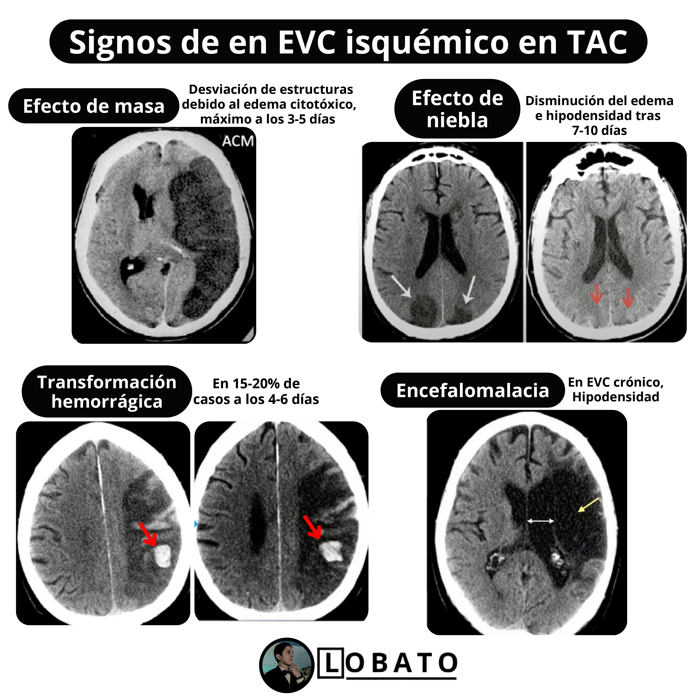
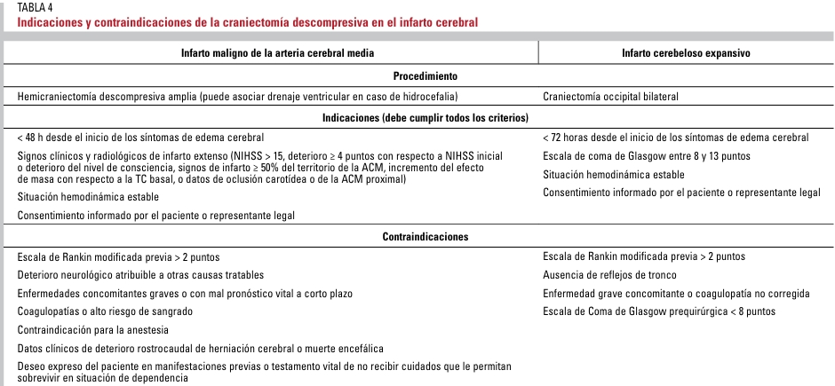

#GES N°37: ACV Isquémico en personas de 15 años o más.
##Generalidades y Definición

Se define como un **déficit neurológico focal 2rio a una reducción/interrupción del flujo sanguíneo cerebreal (FSC), que ocasiona necrosis tisular, y del cual se distinguen 2 cuadros:

1. Infarto Cerebral: Daño irreversible tisular.

2. Ataque Isquémico Transitorio (AIT): Episodio transitorio de disfunción neurológica causada por isquemia focal, sin evidencia de infarto agudo en neuroimagen.

##Fisiopatología

Cuando el FSC cae por debajo de los 20 ml/100g/min, las neuronas dejan de recibir O2 y glucosa, lo que provoca una disminución del ATP intracelular, lo que lleva a:

* Disfunción de la bomba Na+-K+, con entrada de sodio y agua→ Edema Citotóxico.

* Despolarización celular y liberación masiva de glutamato→ Activación de Receptores NMDA y AMPA.

* Entrada masiva de Calcio intracelular→ Activación de cascada de muerte celular programada.

* Disfunción mitocondrial + Aumento de ROS agravan el daño lo que, junto a la activación de proteasas, fosfolipasas y endonucleasas→ Alteración de membrana celular, citoesqueleto y BHE.

1. Inflamación e inmunidad innata en la fase aguda:

	* Tras la lesión inicial, se activa la microglía y se liberan citoquinas proinflamatorias, amplificando el daño. 
	
	* Este proceso puede perpetuar el daño durante horas/días, afectando zonas inicialmente viables.
	
2. Conceptos "Core" y "Penumbra Isquémica"→ Distinciones del tejido afectado:

	* Core Isquémico→ Región con FSC <10-12 ml/100g/min: La necrosis neuronal es irreversible en minutos, aunque se restaure la circulación.

	* Penumbra Isquémica→ Tejido cerebran con FSC entre 12-20 ml/100g/min: Son zonas funcionalmente alteradas, pero potencialmente recuperable si se restituye la perfusión precozmente.
	
	* La identificación de la penumbra mediante neuroimagen es mundamental para la selección de pacientes candidatos a trombólisis o trombectomía, incluso tras las 4,5h.
	
##Etiología

La clasificación etiológica permite guiar el tratamiento, definir pronóstico y establecer estrategis de prevención 2ria:

1. Infarto Aterotrombótico→ Ateroesclerosis de Grandes Vasos: Se produce una estenosis/oclusión ateroesclerótica en las arterias grandes (carótidas, vertebrales o sus ramas intracraneales).

	* Es responsable del 20-25% de los ACV isquémicos.
	
	* Son infartos de mediano/gran tamaño, con topografía cortical o subcortical.
	
	* Se asocia a factores como HTA, DLP, DM, TBQ y edad >50 años.
	
2. Infarto Cardioembólico→ Causado por émbolos provenientes del corazón en el contexto de cardiopatías embolígenas:

	* Es responsable del 20-30% de los ACV isquémicos.
	
	* Son infartos típicamente corticales y de gran tamaño.
	
	* Las fuentes más comunes son: FA, Prótesis valvulares, Estenosis Mitral.
	
3. Infarto Lacunar→ Es causado por oclusión de arterias perforantes profundas:

	* Es responsable del 20-25% de los ACV isquémicos.
	
	* Son infartos <15 mm de tamaño, localizado en ganglios basales, cápsula interna, tálamo o tronco.
	
	* Se asocia a HTA crónica y DM.
	
	* Produce los síndromes lacunares clásicos→ Hemiparesia motora pura, síndrome sensitivo puro, disartria, mano torpe, otros.
	
4. Infartos de causa inhabitual→ Esto incluye entidades infrecuentes, como:

	* Disección arterial, vasculitis, enfermedades hematológicas, trombosis venosa cerebral, síndromes genéticos y estados protrombóticos.}
	
	* Es frecuente en pacientes jóvenes y sin factores de riesgo.
	
5. Infarto de causa indeterminada→ Criptogénico:

	* Es responsable del 30-40% de los ACV isquémicos.
	
	* Es imprescindible la monitorización cardíaca prolongada para descartar FA paroxística.
	
##Manifestaciones Clínicas

Es un cuadro de aparición súbita con síntomas neurológicos focales, lo que le confiere el caracter de urgencia "tiempo-dependiente". 

Su sintomatología depende del territorio vascular afectado, el tamaño del vaso comprometido y la duración de la isquemia:

1. Arteria Cerebral Media (ACM):

	* Hemiparesia y Hemihipoestesia contralateral, más marcada en cara y brazo.
	
	* Afasia→ Afección de hemisferio dominante.
	
	* Negligencia espacial→ Afección del hemisferio no dominante.
	
	* Hemianopsia homónima.
	
2. Arteria Cerebral Anterior (ACM):

	* Debilidad en EEII.
	
	* Incontinencia urinaria.
	
	* Mutismo acinético o abulia→ Afección de zonas frontales mediales.
	
3. Arteria Cerebral Posterior (ACP):

	* Hemianopsia Homónima, sin afectación motora.
	
	* Déficit sensitivo talámico.
	
	* Agnosia visual, alexia sin agrafia→ Infartos de hemisferio dominante.
	
4. Tronco encefálico y cerebelo→ Territorio Vertebrobasilar:

	* Diplopia, Disartria, Disfagia, Vértigo, Ataxia, Nistagmo.
	
	* Síndromes Cruzados→ Déficit motor/sensitivo facial ipsilateral con hemiparesia contralateral.
	
	* Coma o Alteración del Nivel de Conciencia→ Afección mesencefálica o bulbar severa.
	
	* Infartos Cerebelosos→ Desequilibrio, náuseas, vómitos, disartria.

	
##F.A.S.T

El acrónimo F.A.S.T hace referencia a los signos de alarma prehospitalarios:

* F→ Face Drooping.

* A→ Arm Weakness.

* S→ Speech Difficulty.

* T→ Time to Call Emergency.

##Evaluación Clínica Inicial en SU

1. Anamnesis:

	* Indagar por la hora exacta del inicio de síntomas.

	* Presencia de Factores de Riesgo.
	
	* Medicación habitual→ TACO, Antiagregantes, Insulina, etc.
	
	* Enfermedades asociadas→ Cáncer, Autoinmune, Infecciones, Consumo de Drogas.
	
	* Eventos Previos→ AIT, Trombosis, Abortos Espontáneos.
	
2. Exploración Física y Neurológica

	* GCS.

	* Examen Neurológico Completo→ Aplicar escala NIHSS:
	
		* NIHSS→ Leve (≤4 pts), Moderado (5-15 pts), Moderado a Grave (16-20 pts) y Grave (≥21 pts).
		
			
	
	* Examen Oftalmológico y Exploración de cuello (Soplos Carotideos).
	
3. Laboratorio:

	* ECG de 12 derivaciones→ Descarte de FA, Bradicardia, Isquemia.
	
	* Glicemia Capilar→ Descartar Hipoglicemia.
	
	* SatO2 y Frecuencia Respiratoria→ Descartar hipoxia.
	
	* Hemograma, Perfil BQ, Coagulación, Troponinas, Dímero D y NT-proBNP.
	
4. Imagenología→ INMEDIATA: 

	* TC cerebral s/c→ Signos precoces de isquemia:
	
		* Pérdida de la diferenciación cortico-subcortical.
		
		* Borramiento de surcos en las regiones frontal, opercular y temporal del hemisferio comprometido.
		
	* AngioTC de los troncos supraaórticos y arterias cerebrales.
	

##Importancia del Tiempo

* El tratamiento trombolitico con rt-PA está indicado solo dentro de las 4,5h desde el inicio de síntomas.

* La trombectomía mecánica es posible hasta las 24h, en casos seleccionados.

* Por c/min de retraso, se estima una perdida de ~2 millones de neuronas.

##Código Ictus

Es un protocolo de urgencias que busca garantizar una respuesta rápida, organizada y eficaz ante la sospecha de un Ictus agudo:

1. Objetivos:

	* Optimizar el tiempo puerta-aguja (para trombólisis EV) y el tiempo puerta-punción (para trombectomía).
	
	* Coordinar desde la fase prehospitalaria hasta la hospitalización en Unidades Especializadas.
	
	* Disminuir complicaciones y secuelas neurológicas mediante la intervención en la fase más temprana del evento.

2. Criterios para la activación del código ictus→ Se deben cumplir todos los siguientes:

	* Inicio súbito de síntomas neurológicos focales persistentes.
	
	* Hora de inicio conocida→ Dentro de las últimas 24h o inicio desconocido.
	
	* Situación funcional previa adecuada→ Definida como:
	
		* Escala de Rankin modificada (mRS) ≤2.
		
		* Independencia para las actividades básicas de la vida diaria antes del evento.
		
	* Ausencia de comorbilidades terminal o condición médica grave que limite la expectativa de vida a <6 meses o contraindique tratamiento activo.
	
##Craniectomía Descompresiva

Es el tratamiento quirúrgico usado en los infartos hemisféricos malignos (Edema masivo, herniación inminente).

##Manejo del ACV isquémico agudo

