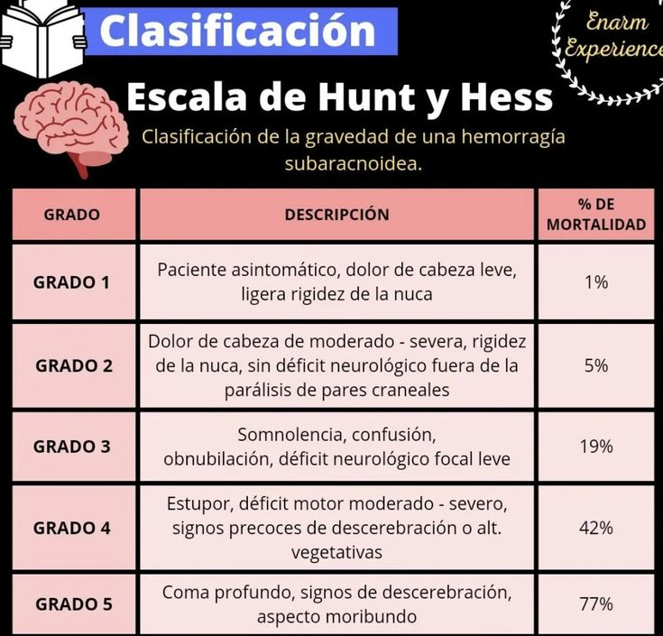
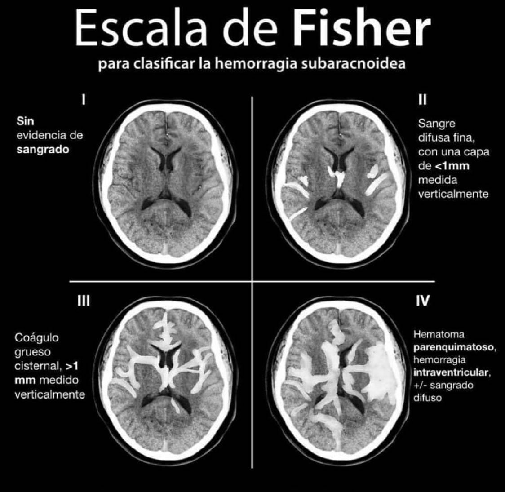

#GES N°42: Hemorragia Subaracnoídea a Rotura de Aneurismas Cerebrales.
##Generalidades y Definición

La Hemorragia Subaracnoídea (HSA) **es la extravasación de sangre en el espacio subaracnoideo, el área entre las membranas aracnoides y piamadre que rodean el cerebro, un espacio vital por donde circula el LCR.**

Por otro lado, un aneurisma **es una dilatación patológica de la pared de una arteria, en este caso, cerebral**. Su rotura provoca un sangrado súbito y de alta presión directamente en el LCR, cubriendo la base del cerebro y los grandes vasos.

##Fisiopatología

Los aneurismas intracraneales, generalmente "saculares" o tipo "berry", no suelen ser congénitos en su totalidad, sino que se desarrollan a lo largo de la vida.

* Se forman puntos de debilidad hemodinámica de la pared arterial, casi siempre en las bifurcaciones de las grandes arterias del Polígono de Willis, en la base del cerebro.

* En las bifurcaciones, el estrés del flujo sanguíneo pulsátil impacta la pared, y en personas susceptibles, la capa muscular media y la lámina elástica interna de la arteria se fragmentan.

* Con el tiempo, la pared se debilita y dilata, formando el saco aneurismático, cuya pared carece de la estructura normal y es solo una delgada capa de adventicia.

La rotura ocurre cuando la tensión sobre la pared del aneurisma supera su resistencia elástica, lo cual puede ocurrir por una alza súbita de la P.A. La sangre irrumpe a P.A sistémica en el espacio subaracnoideo, lo que provoca:

1. Aumento súbito de la PIC: La PIC se iguala momentáneamente con la P.A, deteniendo la perfusión cerebral y causando un síncope inicial en la mayoría de los pacientes.

2. Irritación Meníngea: Los productos de la hemolísis (metahemoglobina]) en el LCR irritan químicamente las meninges, causando la cefalea intensa, fotofobia y rigidez de nuca.

3. Hidrocefalia Aguda: Los coágulos de sangre pueden obstruir la circulación normal del LCR o el drenaje en las vellosidades aracnoideas, causando acumulación de líquido y aumento de la PIC.

4. Lesión Cerebral Temprana: El evento inicial causa una cascada de isquemia global transitoria, edema cerebral y disfunción neuronal, incluso antes de que aparezca el vasoespasmo.

##Factores de Riesgo

**Modificables:**

* Tabaquismo→ Multiplica el riesgo x3-x7 veces: las toxinas del humo debilitan el endotelio vascular y promueven la inflamación, acelerando la formación y crecimiento del aneurisma.

* HTA: Aumenta la tensión mecánica constante sobre la pared del aneurisma, promoviendo su crecimiento y rotura.

* Consumo excesivo de alcohol y uso de drogas estimulantes.

**No Modificables:**

* Edad→ Peak de incidencia entre los 50-60 años.

* Sexo femenino→ Mayor riesgo, sobre todo postmenopáusico.

* Genética: Antecedentes de familiares de 1°grado con Aneurismas.

* Enfermedad del tejido conectivo→ La asociación más fuerte es con la Poliquistosis Renal Autosómica Dominante.

	* También, se asocia al síndrome de Ehlers-Danlos Tipo IV y Síndrome de Marfan.

##Manifestaciones Clínicas

El síntoma cardinal es la "cefalea en trueno":

* Es un dolor de cabeza súbito, explosivo, de intensidad máxima→ "El peor dolor de cabeza de mi vida".

* Alcanza su máxima intensidad en <1h.

* A menudo se acompaña de:

	* Compromiso de Conciencia.
	
	* Síntomas Neurovegetativos→ Náuseas y Vómitos (a menudo explosivos) por irritación meníngea e HIC.
	
	* Signos Meníngeos→ Fotofobia y rigidez de nuca: Aparecen tras 3-6h, cuando hay irritación química establecida.
	
* Cefalea Centinela→ Un 10-40% de los pacientes presenta una cefalea súbita, menos intensa, días/semanas antes:

	* Se cree que es por una "micro-filtración" el aneurisma.
	
	* Suele ser mal diagnosticada como migraña o cefalea tensional.

##Diagnóstico

1. TC de Cerebro s/c→ Examen inicial de elección ante toda cefalea en trueno.

	* Muestra la sangre hiperdensa (blanca) en el espacio subaracnoideo.
	
	* Se debe realizar dentro de 24h desde la sospecha, según GES.
	
2. Punción Lumbar (PL)→ Se realiza solo si la TC es negativa o dudosa, pero la sospecha clínica de HSA es alta.

* Hallazgo Clave→ Xantocromía: Es el color amarillento/rosado del sobrenadante del LCR (después de centrifugarlo).

	* Demuestra que la sangre ha estado en el LCR por ~2-4h , por lo que la sangre se degrado a bilirrubina.
	
3. Estudio Vascular→ Angiografía:

	* Una vez confirmada la HSA, es mandatorio encontrar el aneurisma.
	
	* AngioTC→ Es el método de elección actual para el diagnóstico.
	
	* Arteriografía→ Gold Standard para la detección de aneurismas y para evaluar el flujo dinámico.
	
		* Es invasiva, pero tiene la ventaja de permitir el tratamiento endovascular (coils) en el mismo acto.
	
	* Se debe realizar dentro de 48h desde la confirmación de HSA.

##Clasificación

Se usan 2 escalas pronósticas al ingreso, las cuales definen el manejo y el pronóstico:

1. Escala de Hunt y Hess→ Clasifica la gravedad clínica del paciente al ingreso.

	
	
2. Escala de Fisher Modificada→ Clasifica la cantidad y distribución de la sangre vista en la TC, siendo el principal predictor de riesgo de **vasoespasmo**.

	
	
#Tratamiento y Manejo:

El manejo debe ser en una UPC neurológica o neuroquirúrgica:

1. Manejo Inicial→ Soporte en UCI:

	* ABC (Soporte Vital)→ Intubación y VM si el Glasgow es ≤8 (HH III-V) para proteger la vía aérea y controlar el CO2 (previniendo aumentos de PIC).
	
	* Control Estricto de P.A→ Se debe mantener una PAS <160 mmHg para reducir el riesgo de resangrado.

	* Prevemción del Vasoespasmo:
	
		* Nimodipino 60 mg c/4h VO (o por SNG) para todos los pacientes con HSA aneurismática, mantenido por 21 días.
		
			* Es un calcioantagonista→ Mejora la microcirculación colateral y tiene un efecto neuroprotector, disminuyendo el déficit neurológico isquémico que el vasoespasmo provoca.
			
	* Analgesia y Sedación→ Se suelen usar el Fentanilo y Propofol: Esto previene los picos de P.A que pueden causar resangrado.
	
	* Prevención de Convulsiones: Se puede usar profilaxis anticonvulsivante de forma precoz, especialmente en pacientes con hematomas o HIC.

2. Tratamiento de Exclusión del Aneurisma (Definitivo):

* Es el tratamiento definitivo para **prevenir el resangrado**. 

* GES: Inicio del tratamiento en centro con capacidad resolutiva dentro de 24h desde la confirmación del aneurisma.

* Existen 2 técnicas:

	* Embolización Endovascular (Coils)→ Terapia de 1ra línea en la mayoría de centros, pues, es mínimamente invasiva.
	
		* Se accede por cateterismo femoral y, bajo visión de rayos X, se navega un microcatéter hasta el aneurisma y se "rellena" con espirales de platino (coils).
		
		* Es mejor tolerado en pacientes graves (HH IV-V) y es preferido en aneurismas de circulación posterior.
		
	* Clipaje Quirúrgico→ Es preferido en aneurismas de cuello ancho o anatomía compleja.
		
		* El neurocirujano accede al cerebro, diseca los vasos y coloca un clip de titanio permanente en el "cuello" del aneurisma, excluyéndolo de la circulación.
		
		* Es más invasivo, pero ofrece una exclusión más definitiva y duradera.