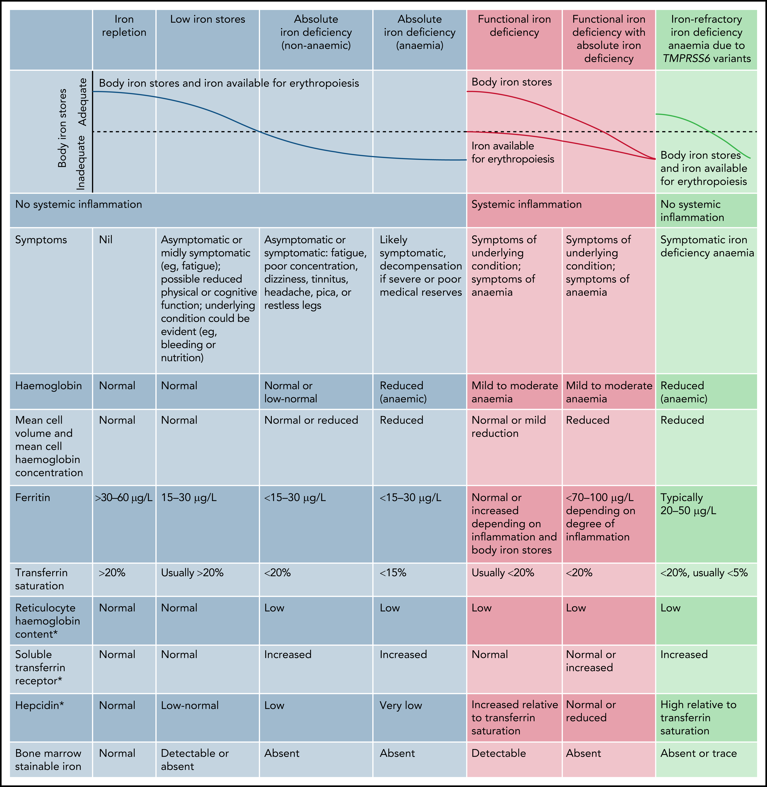
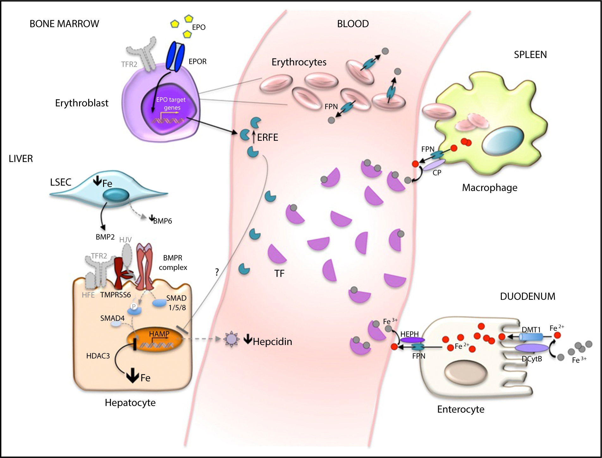
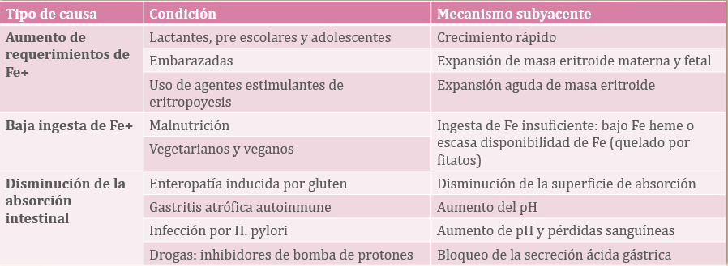

#GES-EX: Anemia Ferropénica en Pediatría.
##Definiciones y Generalidades 

La Anemia Ferropénica (AF) es la manifestación final de la deficiencia de hierro (DH), siendo el trastorno nutricional más común a nivel mundial.

Se debe distinguir 2 tipos de ferropenia:

1. Ferropenia Absoluta (Déficit Total)→ Es la causa más común en pediatría:

	* Definición: **Agotamiento total de los depósitos corporales de hierro..**
	
	* El organismo no tiene reservas de hiero para movilizar.
	
	*Diagnóstico→ Basado en una concentración baja de Ferritina sérica (<15-30 mcg/L).
	
2. Ferropenia Funcional (Déficit Relativo):
	
	* Definición: **Incapacidad de usar y/o movilizar los depósitos de hierro.**
	
	* Esto se debe comúnmente a un bloqueo inflamatorio (Anemia de Enfermedad Crónica), donde las citoquinas (ej.: IL-6) estimulan la producción elevada de hepcidina.
	
		* La hepcidina bloquea a la ferroportina, impidiendo la liberación de hierro de los macrófagos y enterocitos. 
	
	* Laboratorio→ Ferritina normal/alta, con una Saturación de Transferrina (TSAT) baja (<20%).

		* Refleja la presencia de eritropoyesis restringida en hierro (ERH), a pesar de depósitos llenos del mismo.
		

##Estadísticas Chilenas y Rol de las Políticas de Salud

Chile ha sido un caso de éxito en la reducción de la AF gracias a políticas de salud pública sostenidas desde hace décadas:

* Prevalencia: Gracias a los programas de fortificación de alimentos y profilaxis, la prevalencia de anemia en lactantes chilenos ha disminuido drásticamente. Se sitúa en <10% (similar a países desarrollados) y en <5% en escolares, cifras muy inferiores al promedio de Latinoamérica. Un estudio de 2012 (Brito A. et al) citado en los documentos, mostró una prevalencia de anemia del 5.4% en menores de 5 años.

* Fortificación de Fórmulas: El Programa Nacional de Alimentación Complementaria (PNAC) ha sido clave. Estudios clásicos en Chile (Walter et al.) demostraron que la fortificación de la leche (con 15 mg de Fe/100g) reduce drásticamente la prevalencia de anemia (7% en grupo fortificado vs. 35.3% en grupo control) y mejora los depósitos de hierro.

* Profilaxis Universal: La guía de la Sociedad Chilena de Hematología (SOCHIHEM) establece la suplementación profiláctica como el estándar de cuidado en lactantes:

	* RNT (Término) y LME: 1 mg/kg/día de hierro elemental desde los 4 meses.

	* RNPT (Pretérmino): 2-4 mg/kg/día, iniciando precozmente (entre los 15-30 días de vida) y manteniéndose de forma continua hasta el año de edad.
	
##Fisiopatología en el Recién Nacido (RNT vs. RNPT)

Las reservas de hierro del recién nacido (el "capital inicial") dependen críticamente de la edad gestacional, el peso al nacer y factores perinatales:

* Recién Nacido de Término (RNT): Nace con depósitos de hierro adecuados (aprox. 7.5 mg/kg), los cuales son transferidos activamente desde la madre al feto, especialmente durante el tercer trimestre de gestación. Estas reservas, sumadas al hierro altamente biodisponible de la lactancia materna, son suficientes para sostener el crecimiento de los primeros 4 a 6 meses de vida.

* Recién Nacido de Pretérmino (RNPT): Nace con depósitos de hierro mínimos, ya que se perdió la transferencia masiva del tercer trimestre. Sus reservas (aprox. 7 mg/kg pero sobre un peso total mucho menor) se agotan mucho más rápido, a menudo a los 2 o 3 meses de vida.

* Factores Adicionales: La anemia materna severa durante el embarazo reduce el hierro disponible para el feto. El pinzamiento tardío del cordón umbilical (>1 min) es crucial, ya que permite una transfusión placentaria que puede aportar hasta un 30% adicional al volumen sanguíneo y a las reservas de hierro del neonato.

##Fisiopatología de la DH

La deficiencia de hierro es un proceso progresivo que ocurre en tres etapas claras:

1. Ferropenia Latente (Depleción de depósitos): Se agotan las reservas de hierro en el sistema reticuloendotelial (hígado, bazo). La Ferritina sérica es la primera en caer (<15 µg/L). En esta etapa, el hierro circulante (Ferremia, TSAT) y la hemoglobina son normales. El paciente es asintomático.

2. Eritropoyesis Ferropénica (Ferropenia sin anemia): Los depósitos están vacíos. El hierro sérico (Ferremia) disminuye y la Saturación de Transferrina cae (<16-20%). La médula ósea comienza a resentir la falta de materia prima; se eleva la protoporfirina eritrocitaria libre (PEL) y los receptores solubles de transferrina (RsTf). La Hb aún se mantiene normal o en el límite bajo.

3. Anemia Ferropénica: La falta de hierro es severa y la síntesis de hemoglobina se ve comprometida. Aparece la anemia (Hb baja), microcitosis (VCM bajo), hipocromía (HCM bajo) y anisocitosis (RDW alto).

Regulación Hormonal (Hepcidina)→ El regulador maestro es la hormona hepática Hepcidina. La hepcidina actúa como un "guardia" que bloquea la Ferroportina (la "puerta" de salida del hierro del enterocito y el macrófago).

* En la Anemia Ferropénica, el cuerpo necesita hierro urgentemente. La médula ósea (vía ERFE) y los depósitos bajos suprimen la producción de Hepcidina. Esta Hepcidina baja "abre las puertas": permite que la Ferroportina absorba al máximo el hierro de la dieta y que los macrófagos liberen todo el hierro reciclado al plasma.

* Esta supresión es compleja: la hepcidina es sensible al hierro plasmático a través del complejo HFE/TfR2. En ferropenia, este complejo se inactiva. Además, la proteasa TMPRSS6 se activa y corta a la Hemojuvelina (HJV), un co-receptor clave, inhibiendo aún más la señal de producción de hepcidina.

**Fuentes→ Camaschella C. Blood. 2019; Kumar A et al. BMJ Open Gastro. 2022**

##Etiologías Principales

Las causas de la AF se agrupan en cuatro categorías principales:

1. Aumento de Requerimientos (Causa más común en pediatría):

	* Crecimiento acelerado (lactantes de 6 a 24 meses y adolescentes en el "estirón").

	* Tratamiento con agentes estimulantes de la eritropoyesis (EPO).

	* Atletas de élite (por micro-pérdidas GI e inflamación).

2. Ingesta Inadecuada o Insuficiente:

	* Lactancia materna exclusiva prolongada (>6 meses sin suplementación).

	* Dietas restrictivas (veganas/vegetarianas) mal planificadas.

	* Ingesta excesiva de leche de vaca (>500-700 mL/día), que es baja en hierro e inhibe su absorción.

3. Disminución de la Absorción:

	* Enfermedad Celíaca: Una causa clásica de AF refractaria al tratamiento oral.

	* Gastritis atrófica o infección por Helicobacter pylori (por gastritis y competencia por el hierro).

	* Uso crónico de inhibidores de bomba de protones (IBP) o antiácidos.

	* Cirugía bariátrica o resección gástrica/duodenal (pérdida del sitio de absorción).

4. Pérdidas Crónicas de Sangre:

	* Gastrointestinal (GI): Alergia a la proteína de leche de vaca (APLV) en lactantes, pólipos, divertículo de Meckel, uso de AINEs, parasitosis (uncinarias).

	* Genitourinario: Menstruación abundante (causa principal en mujeres adolescentes).

	* Donaciones de sangre frecuentes.
	

**Fuentes: Camaschella C. Blood. 2019; Al-Naseem A et al. Clin Med. 2021**

##Alimentación y Biodisponibilidad del Hierro

El hierro dietético se presenta en dos formas con vías de absorción completamente diferentes:

* Hierro Hemo:

	* Fuente: Origen animal (carnes rojas, hígado, aves, pescado, ostras).

	* Absorción: Alta biodisponibilidad (15-35%). Se absorbe directamente por el transportador HCP1 y es mínimamente afectado por otros componentes de la dieta.

* Hierro No Hemo:

	* Fuente: Origen vegetal (lentejas, soya, tofu, espinaca) y alimentos fortificados (cereales, fórmulas lácteas).

	* Absorción: Baja biodisponibilidad (2-10%). Su absorción es altamente sensible a otros componentes de la dieta:

		* Facilitadores (Aumentan la absorción): Vitamina C (ácido ascórbico), ácido cítrico, ambiente gástrico ácido.

		* Inhibidores (Disminuyen la absorción): Calcio (productos lácteos), Fitatos (cereales integrales, legumbres, soya), Polifenoles/Taninos (té, café, vino tinto).

Implicancia Práctica: Los suplementos de hierro (que son No-Hemo) deben administrarse en ayunas o con jugo de naranja, y lejos de las comidas, especialmente de la leche, para maximizar su absorción.

##Manifestaciones Clínicas (Sistémicas y Oculares)

Un hallazgo clave de la literatura reciente es que la mayoría de los síntomas de la deficiencia de hierro son muy prevalentes incluso en ausencia de anemia (Ferropenia No Anémica, NAID). El hierro tisular es necesario para funciones celulares, independientemente de la hemoglobina.

**Síntomas Sistémicos Clásicos:**

* Palidez de piel y mucosas (signo tardío, aparece con la anemia).

* Fatiga, debilidad, fatigabilidad fácil (cansancio al esfuerzo).

* Pica: Deseo compulsivo de ingerir sustancias no nutritivas (tierra -geofagia-, hielo -pagofagia-, tiza, papel).

* Alteraciones epiteliales (crónicas): Coiloniquia (uñas en cuchara), glositis atrófica (lengua lisa y roja), queilitis angular (fisuras en comisuras).

* Alopecia (caída de cabello).

**Síntomas Neurocognitivos y Conductuales (Frecuentes en NAID):**

* Impacto Neurológico: El hierro es un cofactor esencial para enzimas cerebrales, incluyendo la síntesis del neurotransmisor dopamina y la mielinización de las neuronas. Su déficit en los primeros años de vida puede tener secuelas a largo plazo.

* SNC: Cefalea, amnesia (mala memoria) (72% en estudios), baja función cognitiva, depresión, falta de voluntad, nerviosismo (63%).

* Sueño: Trastornos del sueño (insomnio o somnolencia).

* Neurológico: Síndrome de piernas inquietas (SPI).

* Otros: Sensación de frío o intolerancia al frío (71%), mialgias.

**Manifestaciones Oculares (Por hipoxia y déficit tisular de colágeno):**

* Palidez conjuntival (signo clásico de anemia).

* Escleras azules (en casos severos y crónicos, por adelgazamiento del colágeno escleral, que depende del hierro para su síntesis).

* Retinopatía Anémica: En casos severos (Hb < 8-9 g/dL), la hipoxia puede causar manchas algodonosas, hemorragias retinianas y edema de papila.

* Riesgo Trombótico: La trombocitosis reactiva (plaquetas altas) común en la AF puede aumentar la hipercoagulabilidad y se ha asociado con eventos oclusivos como la Oclusión de Vena Central de la Retina (CRVO).

**Fuentes: Özbilen M et al. BMC Women's Health. 2025; Al-Naseem A et al. Clin Med. 2021; Naquin ER et al. Nutrients. 2025**

##Diagnóstico

El diagnóstico se basa en la sospecha clínica y se confirma por laboratorio, siguiendo una secuencia lógica:

1. Historia Clínica: Buscar factores de riesgo (dieta baja en hierro, LME >6m, alto consumo de lácteos, prematurez, sangrado menstrual, crecimiento acelerado).

2. Examen Físico: Buscar signos clínicos (palidez de mucosas, taquicardia, soplo sistólico funcional, queilitis, coiloniquia, glositis).

3. Laboratorio (Hemograma): Es el examen inicial. Muestra:

	* Hb, VCM y HCM: Disminuidos (Anemia microcítica e hipocrómica).

	* RDW (ADE): Elevado. Es uno de los primeros indicadores en alterarse (anisocitosis).

	* Plaquetas: Frecuentemente elevadas (trombocitosis reactiva).

	* Reticulocitos: Normales o bajos (anemia arregenerativa).

4. Estudio del Hierro (Confirmatorio):

	* Ferritina Sérica: Es el examen clave. Mide los depósitos de hierro. Un valor bajo (<15-30 µg/L) es diagnóstico de ferropenia absoluta.

	* Precaución: La ferritina es un reactante de fase aguda. En un paciente con inflamación (ej. PCR alta), una ferritina de 80 µg/L puede coexistir con depósitos de hierro vacíos. En estos casos, una TSAT <20% es más fidedigna.

	* Saturación de Transferrina (TSAT): Baja (<16%). Indica poco hierro circulante disponible.

	* Ferremia (Hierro sérico): Baja.

	* Capacidad Total de Unión al Hierro (TIBC): Alta. El cuerpo produce más transferrina "vacía" para intentar captar el poco hierro disponible.

5. Prueba Terapéutica: En lactantes con alta sospecha clínica y hemograma compatible, la Guía SOCHIHEM avala iniciar tratamiento y confirmar el diagnóstico si se observa una respuesta hematológica clara (aumento de la Hb > 1 g/dL en 4-6 semanas).

##Diagnóstico Diferencial de Anemia microcítica

La AF debe diferenciarse de otras anemias microcíticas. El estudio de hierro (especialmente Ferritina y RDW) es fundamental.

**Tips Clínicos:**

* Índice de Mentzer (VCM / Recuento de Glóbulos Rojos): Si es > 13, sugiere fuertemente AF. Si es < 13, es característico de Rasgo Talasémico (muchos glóbulos rojos, pero muy pequeños).

* En la Talasemia, el frotis muestra marcada microcitosis, pero el RDW es normal (son todos pequeños y uniformes). En la AF, el RDW es alto (hay glóbulos rojos de muchos tamaños diferentes).

**(Fuente: Gallagher PG. Blood. 2022; Figura 6)**

##Tratamiento

El objetivo es doble: 

1. Normalizar la hemoglobina para resolver los síntomas.

2. Repletar los depósitos de hierro (ferritina) para prevenir recaídas.

**Elección del Preparado (Hierro Oral):**

* Las sales ferrosas (Sulfato Ferroso, Fe+2) son el tratamiento de primera línea, más económicas y con mayor biodisponibilidad.

* Estudios comparativos (Powers JM et al. 2017; Tosyalı M et al. 2024) han demostrado que el sulfato ferroso (Fe+2) es superior al hierro polimaltosado (Fe+3) y a las preparaciones sucrosomiales.

* El estudio de Powers (JAMA 2017) mostró que dosis bajas (3 mg/kg/día) de sulfato ferroso lograron una corrección de Hb significativamente mayor (1.0 g/dL de diferencia) que el complejo de hierro polisacárido (Fe+3) a las 12 semanas.

* El estudio de Tosyalı (Healthcare 2024) encontró que los grupos que usaron hierro sucrosomial y microencapsulado en profilaxis tuvieron las tasas más altas de deficiencia de hierro, mientras que el Fe+2 tuvo la más baja.

**Dosis Terapéutica (Guía SOCHIHEM):**

* 3 a 6 mg/kg/día de hierro elemental, fraccionado en 1-3 tomas.

**Administración y Manejo de Efectos Adversos:**

* Administración: Idealmente en ayunas para maximizar absorción, lejos de lácteos (inhibidores).

* Efectos Adversos: La intolerancia GI (constipación, dolor abdominal, sabor metálico, náuseas, heces negras) es la principal causa de falla terapéutica.

* Manejo de Efectos Adversos: Se pueden manejar fraccionando la dosis, o evidencia emergente (Camaschella 2019) sugiere que la dosificación en días alternos (ej. 6 mg/kg cada 48h) podría mejorar la absorción neta (al evitar el alza de hepcidina inducida por el hierro) y disminuir los efectos GI.

**Duración del Tratamiento (Clave):**

* El tratamiento debe mantenerse durante 3 meses después de que la hemoglobina se haya normalizado. El objetivo es repletar los depósitos (normalizar la ferritina).

**Causas de Falla Terapéutica (Guía SOCHIHEM):**

1. Error diagnóstico (ej. es una Talasemia, no una AF).

2. Incumplimiento o mala adherencia (por sabor o efectos adversos).

3. Prescripción inadecuada (dosis baja, tipo de hierro incorrecto como sucrosomial).

4. Falta de resolución de la causa primaria (persistencia del sangrado o dieta inadecuada).

5. Malabsorción oculta (sospechar Enfermedad Celíaca si el paciente no responde al hierro oral).

**Transfusión de Glóbulos Rojos:**

* Es una medida de emergencia, no un tratamiento para la ferropenia.

* Reservada solo para casos de descompensación hemodinámica, anemia severa sintomática (Hb < 7 g/dL con falla cardíaca o dificultad respiratoria severa), o Hb < 5 g/dL (Guía SOCHIHEM).

**Fuentes: Guía SOCHIHEM 2016; Powers JM et al. JAMA. 2017; Tosyalı M et al. Healthcare. 2024; Camaschella C. Blood. 2019**