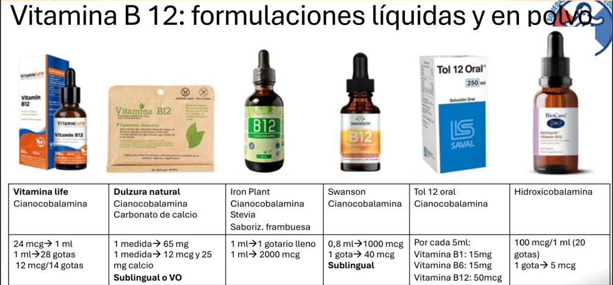

#Anemias Megaloblástica en Pediatría
##Definición y Clasificación  

La anemia megaloblástica es un tipo de anemia macrocítica (Volumen Corpuscular Medio [VCM] elevado) que resulta de una síntesis defectuosa del ADN en los precursores eritroides. Esta alteración provoca un asincronismo madurativo núcleo-citoplasma: el núcleo permanece inmaduro mientras que el citoplasma madura normalmente.

El término "megaloblástico" describe los cambios morfológicos característicos en la médula ósea, donde se observan precursores de gran tamaño (megaloblastos). En sangre periférica, esto se traduce en macro-ovalocitos (eritrocitos grandes y ovalados) y, frecuentemente, neutrófilos hipersegmentados.

En pediatría, aunque es menos común que la anemia ferropénica, su diagnóstico es crucial, ya que la causa subyacente (principalmente deficiencia de vitamina B12 o folato) puede provocar secuelas neurológicas y del desarrollo graves e irreversibles si no se trata a tiempo.
		
##Fisiopatología

La fisiopatología central es la interrupción de la síntesis de ADN. Tanto la Vitamina B12 (Cobalamina) como el Folato (Vitamina B9) son coenzimas esenciales en el metabolismo de un carbono, necesario para la síntesis de timidina, un nucleótido exclusivo del ADN.

* Deficiencia de Folato: Conduce a una "trampa de metilo", donde el folato queda atrapado como metiltetrahidrofolato, impidiendo la síntesis de timidina.

* Deficiencia de Vitamina B12: Impide la conversión de homocisteína en metionina (liberando tetrahidrofolato) y la conversión de Metilmalonil-CoA en Succinil-CoA. El acúmulo de ácido metilmalónico (MMA) y homocisteína es tóxico, especialmente para el sistema nervioso.

##Factores de Riesgo

1. Deficiencia de Vitamina B12:

	* Lactantes: Hijos de madres veganas o vegetarianas estrictas no suplementadas (la B12 pasa por la leche materna), madres con anemia perniciosa o cirugía bariátrica previa.

	* Malabsorción: Enfermedad de Crohn, celiaquía, resección ileal (íleon terminal es donde se absorbe la B12), gastritis atrófica autoinmune (Anemia Perniciosa Juvenil, rara).

	* Infecciones: Infestación por Diphyllobothrium latum (tenia del pescado).

	* Errores innatos del metabolismo: Defectos en el transporte o metabolismo de la cobalamina.

2. Deficiencia de Folato:

	* Ingesta inadecuada: Dietas sin vegetales de hoja verde. Muy raro en países con fortificación de alimentos.

	* Aumento de requerimientos: Anemias hemolíticas crónicas (ej. esferocitosis, drepanocitosis), prematuridad.

	* Malabsorción: Enfermedad celíaca, enfermedad inflamatoria intestinal.

	* Fármacos: Metotrexato, trimetoprima, antiepilépticos (ej. fenitoína).
	
##Manifestaciones Clínicas

La presentación puede ser insidiosa. La tríada clásica incluye síntomas anémicos, gastrointestinales y neurológicos (estos últimos casi exclusivos de la deficiencia de B12).

* Clínica General (Anemia): Palidez, fatiga, irritabilidad, taquicardia, soplo sistólico, insuficiencia cardíaca en casos severos.

* Clínica Gastrointestinal: Glositis (lengua lisa, roja y dolorosa), queilosis angular, anorexia, diarrea leve o constipación.

* Clínica Neurológica (Déficit de B12): ¡Urgencia diagnóstica!

	* Lactantes: Regresión o estancamiento del desarrollo psicomotor, hipotonía, temblores finos, apatía, irritabilidad.

	* Niños mayores: Parestesias (hormigueo) en manos y pies, alteración de la propiocepción y vibración (por desmielinización de cordones posteriores), ataxia, signo de Romberg y Babinski positivos.
	
##Diagnóstico

1. Anamnesis y Examen Físico: Énfasis en la dieta (madre y niño), antecedentes maternos, síntomas neurológicos y del desarrollo.

2. Estudios de Primera Línea:

	* Hemograma completo:

		* Anemia con VCM elevado (Macrocitosis), típicamente > 100 fL.

		* Puede presentarse como pancitopenia (anemia, leucopenia, trombocitopenia) en casos severos, simulando un fallo medular.

	* Frotis de Sangre Periférica: Esencial.

		* Macro-ovalocitos (patognomónico).

		* Neutrófilos hipersegmentados (6 o más lóbulos, o >5% con 5 lóbulos).

		* Anisopoiquilocitosis (diferentes formas y tamaños).

	* Índice de Reticulocitos: Bajo (Hiporregenerativa), indicando fallo en la producción medular.

3. Estudios de Segunda Línea (Confirmatorios):

	* Niveles Séricos de Vitamina B12 y Folato:

		* Limitación: Los niveles de B12 pueden estar en rangos "normales-bajos" (zona gris) y no reflejar el estatus funcional. El folato sérico es muy lábil a la ingesta reciente (se prefiere folato intraeritrocitario, aunque es menos disponible).

	* Metabolitos (Gold Standard Funcional):

		* Ácido Metilmalónico (MMA) y Homocisteína:

			* Déficit de B12: Ambos elevados (MMA y Homocisteína).

			* Déficit de Folato: Solo Homocisteína elevada (MMA normal).

	*Perfil de Hemólisis (LDH y Bilirrubina): Suelen estar elevados (LDH marcadamente alta) debido a eritropoyesis ineficaz (destrucción de precursores dentro de la médula ósea).

	* Aspirado de Médula Ósea: No se realiza de rutina. Se reserva si el diagnóstico es incierto o se sospecha fallo medular. Muestra la hipercelularidad y los megaloblastos (asincronía núcleo-citoplasma).
	
##Tratamiento y Manejo

El manejo se centra en repletar las reservas y tratar la causa subyacente.

1. Manejo No Farmacológico:

	* Modificación dietética: Educar a madres veganas sobre la necesidad de suplementación de B12. Introducción de alimentos ricos en folato (vegetales verdes) o B12 (carnes, lácteos, huevos) según la edad del niño.

	* Manejo de la enfermedad de base (ej. dieta sin gluten en celiaquía).

2. Manejo Farmacológico:

	* ¡Regla Crítica!: Si la causa no está clara o hay sospecha de déficit mixto, SIEMPRE tratar primero la Vitamina B12. Administrar folato solo a un paciente con déficit de B12 puede mejorar la anemia (vía hematológica), pero precipita o empeora dramáticamente el daño neurológico (Degeneración Combinada Subaguda).

	* Tratamiento Déficit de Vitamina B12:

		* Con síntomas neurológicos o anemia severa: Hidroxocobalamina o Cianocobalamina 1000 mcg IM (dosis pediátrica ajustada por peso si es lactante, ej. 250-1000 mcg). Se administra diario por 1 semana, luego semanal por 1 mes, y luego mensual de por vida si la causa es irreversible (ej. anemia perniciosa).

		* Sin síntomas neurológicos / Casos leves: Se puede usar terapia oral a altas dosis (1000-2000 mcg/día), aunque la vía IM asegura la repleción.

	* Tratamiento Déficit de Folato:

		* Ácido fólico oral (0.5 a 1 mg/día en niños). La respuesta es rápida. Se mantiene por 1 a 4 meses o de forma crónica si la causa persiste (ej. hemólisis crónica).

	* Transfusión de Glóbulos Rojos:

		* Reservada solo para inestabilidad hemodinámica o insuficiencia cardíaca congestiva. Debe administrarse lentamente y con precaución (posiblemente con diurético) para evitar la sobrecarga de volumen en un corazón crónicamente adaptado a la anemia.
		
