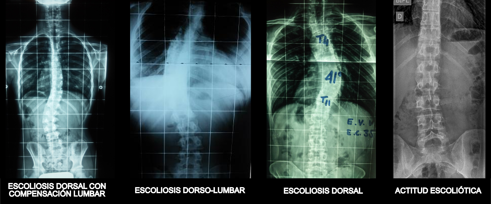
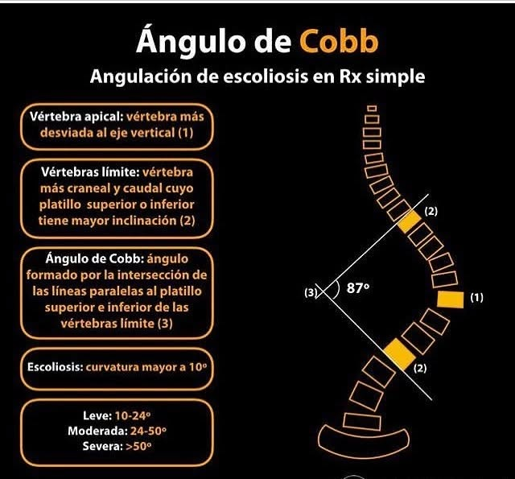
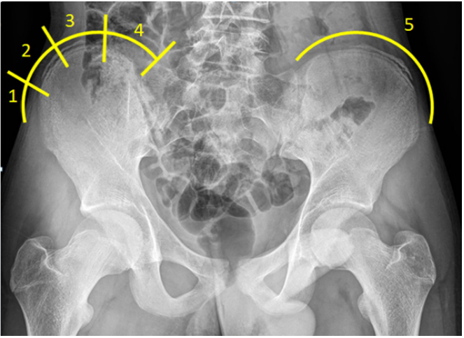

#GES N°10: Escoliosis.
##Generalidades y Definición

La escoliosis se define como una deformidad tridimensional compleja de la columna vertebral. 

* Su característica principal es una curvatura lateral en el plano coronal (frontal) mayor de 10 grados, que se mide mediante el método de Cobb en una radiografía. 

* Sin embargo, esta definición es incompleta, ya que la deformidad siempre implica un componente de rotación vertebral en el plano axial (transversal). 

* Esta rotación es la que causa el desplazamiento de las costillas y la musculatura paravertebral, dando lugar a la deformidad costal (giba o joroba) que se hace evidente clínicamente. 

* Además, suele haber una alteración en el plano sagital, afectando las curvas naturales de la espalda (cifosis y lordosis).

* La forma más común, representando ~80% de los casos, es la Escoliosis Idiopática del Adolescente (EIA). 

Esta condición aparece en niños sanos, sin una causa aparente, y afecta predominantemente a niñas durante el estirón de crecimiento puberal, un período de máxima vulnerabilidad para la progresión de la curva.

##Garantías GES

**Acceso: ¿Quiénes tienen derecho?**

* Todo beneficiario menor de 25 años que tenga una confirmación diagnóstica y que, además, cuente con una indicación de tratamiento quirúrgico.

**Oportunidad: ¿Cuáles son los plazos máximos de espera?**

1. Tratamiento→ Cirugía: El tratamiento quirúrgico debe iniciarse dentro de 270 días (~9 meses) desde la confirmación diagnóstica con indicación quirúrgica.

3. Seguimiento→ Primer control post-operatorio: Dentro de 10 días tras el alta hospitalaria.

**Protección Financiera:**

* Beneficiarios FONASA A y B: Copago $0 (Gratuidad).

* Beneficiarios FONASA C y D: Copago $0 (Gratuidad).

* Beneficiarios ISAPRE: Copago del 20% del Arancel de Referencia GES.

##Etiología

1. Idiopática (~80%)→ Se subclasifica por edad de aparición:

	* Infantil→ ≤3 años.
	
	* Juvenil→ Desde los 4 hasta los 9 años.
	
	* Adolescente→ ≥10 años. 

2. Congénita→ Causada por malformaciones vertebrales presentes al nacer.

3. Neuromuscular→ 2ria a una patología neurológica o muscular que causa un desequilibrio del tronco.

	* Estas curvas suelen ser más largas, rígidas y progresivas.

##Fisiopatología

La teoría más aceptada es que se trata de una enfermedad multifactorial con una fuerte predisposición genética. 

* No se hereda la escoliosis en sí, sino una susceptibilidad a desarrollarla. 

* Se cree que alteraciones en el crecimiento neuro-óseo, factores biomecánicos y posibles anomalías en el tejido conectivo (colágeno, elastina) o en el control neuromuscular del tronco contribuyen a un crecimiento asimétrico de las vértebras. 

* Una vez que se establece una curva inicial, las fuerzas de carga asimétricas sobre la columna durante los períodos de crecimiento rápido pueden perpetuar un "círculo vicioso" biomecánico que acelera la progresión de la deformidad.

##Factores de Riesgo

No todas las curvas progresan:

1. Sexo gemenino→ Riesgo de progresión hasta 10 veces mayor que en los niños.

	* Se postulan teorias hormonales asociadas a melatonina o leptina.

2. Potencial de Crecimiento Restante→ El riesgo es mayor si ocurre durante el estirón puberal.

	* Edad ósea y Signo de Risser→ Risser bajo (0 a 2 pts), que indica que la cresta ilíaca a penas ha comenzado a osificarse.

	* Menarquia→ La progresión se la curva se acelera justo antes de la primera menstruación y se realiza significativamente 1-2 años después de esta.
	
3. Magnitud de la curva en el momento diagnóstico→ Curvas grandes (>25-30°) al momento de detección tienen una probabilidad mucho mayor de progresar que las curvas más pequeñas.

4. Patrón de Curva→ Las curvas torácicas y las curvas dobles (una torácica y una lumbar) tienen un potencial de progresión mayor que las curvas lumbares únicas.

##Manifestaciones Clínicas

El dolor de espalda significativo es una "red flag" que obliga a descartar otras causas:

**La deformidad suele ser sutil al inicio→** Los signos a buscar son:

* Asimetría del Tronco→ Hombros a diferente altura, una escápula más prominente que otra, asimetría de los triángulos del talle o una cadera más prominente.
	
* Test de Adams→ Maniobra para el Screening:
		
	* Se pide al paciente que se incline hacia adelante desde la cintura, con las rodillas extendidas y los brazos colgando libremente.
		
	* En el paciente con escoliosis, la rotación vertebral provoca una giba/prominencia paravertebral en un lado de la espalda, que refleja la rotación de las costillas o de la musculatura lumbar.
		
	* La altura de la giba se puede medir con un escoliómetro, y una medición >5-7° suele ser indicación de derivación para estudio radiológico.

##Diagnóstico	

1. Rx de Columna Total Panorámica (telecolumna)→ Es el examen confirmatorio e indispensable:

	* Proyección PA→ Para minimizar la radiación en tejidos sensibles como las mamas y la tiroides.
	
	* Proyección Lateral→ Para evaluar las curvas sagitales (Cifosis torácica y Lordosis lumbar).
	
		
	
2. Método de Cobb→ En la Rx PA, se trazan líneas en el platillo superior de la vértebra más inclinada en el extremo superior de la curva, y en el platillo inferior de la vértebra más inclenada en el extremo inferior.

	* El ángulo formado por las perpendiculares a estas líneas es el ángulo de Cobb.
	
	* Un ángulo de Cobb >10° confirma el diagnóstico de Escoliosis.
		
		

3. La Rx también permite evaluar la madurez esquelética y el balance global de la columna→ Signo de Risser en la cresta ilíaca.

##Clasificaciones

**Según Magnitud de la Curva:**

1. Leve→ Ángulo de Cobb entre 10°-25°.

2. Moderada→ Ángulo de Cobb entre 25°-45°.

3. Severa→ Ángulo de Cobb >45°-50°. 

**Por localización:**

1. Torácica→ La más común en EIA.

2. Toracolumbar.

3. Lumbar.

4. Doble curva mayor→ Una curva torácica y otra lumbar.

**Signo de Risser→** Madurez Esquelética:

* Mide la osificación progresiva de la apófisis de la cresta ilíaca en una escada de "0" (Inmadurez total) a 5 (fusión completa).

	

##Tratamiento y Manejo no Quirúrgico

El objetivo del tratamiento en niños y adolescentes es frenar o detener la progresión de la curva durante el crecimiento para evitar que alcance una magnitud que requiera cirugía. En adultos, el objetivo es manejar el dolor, la función y prevenir la progresión tardía.

1. Observación→ Es el manejo indicado para curvas leves (<25°) en pacientes en crecimiento:

	* Se realizan controles clínicos y radiográficos cada 6-12 meses. 

	* Se opta por esta conducta porque muchas de estas curvas nunca progresarán a un grado que requiera intervención, evitando así el sobretratamiento.

2. Corsé (Tratamiento Ortopédico)→ Es el tratamiento estándar de oro para curvas moderadas (25°-45°) en pacientes con potencial de crecimiento significativo (Risser 0, 1 o 2):

	* El corsé (ej. tipo Boston, Chêneau) aplica fuerzas externas y constantes sobre el tronco para guiar el crecimiento de la columna y detener la progresión de la curva. 

	* Su objetivo no es corregir la deformidad, sino evitar que empeore hasta alcanzar la madurez esquelética. 

	* El éxito del tratamiento depende directamente de la cantidad de horas de uso, requiriéndose un mínimo de 16 a 23 horas al día.
 
3. Kinesiterapia y Ejercicios Específicos para la Escoliosis (PSSE)→ Terapias como el método Schroth se recomiendan como un complemento importante a la observación o al tratamiento con corsé. 

	* Estos programas de ejercicios se enfocan en la autocorrección postural tridimensional, el fortalecimiento de la musculatura del tronco de manera asimétrica y la respiración rotacional. 

	* Aunque no han demostrado corregir la curva de forma aislada, son cruciales para mejorar la postura, la fuerza del core, la conciencia corporal y la calidad de vida.
	
##Tratamiento y Manejo Quirúrgico
		
1. Indicaciones→ La cirugía se considera en los siguientes escenarios:

	* Curvas severas (>45°-50°) en adolescentes, ya que probablemente seguirán progresando incluso después de la madurez esquelética.

	* Curvas que han demostrado una progresión significativa a pesar del uso correcto y diligente del corsé.
 
	* Curvas >50°-55° en pacientes esqueléticamente maduros, debido al alto riesgo de progresión lenta pero continua durante la vida adulta.
 
2. Procedimiento (Gold Standard)→ La artrodesis vertebral posterior con instrumentación:

	* Es una cirugía mayor que consiste en fusionar las vértebras involucradas en la curva. 

	* Se utiliza injerto óseo (del propio paciente o de banco) para crear un puente óseo entre las vértebras. 

	* La deformidad se corrige mediante un sistema de implantes (tornillos pediculares y barras metálicas de titanio o cromo-cobalto) que actúan como un "tutor interno", manteniendo la columna en la posición corregida mientras se produce la consolidación de la fusión ósea (generalmente en 6-12 meses). 

	* Los objetivos son lograr una columna balanceada en los tres planos y detener la progresión de forma definitiva.