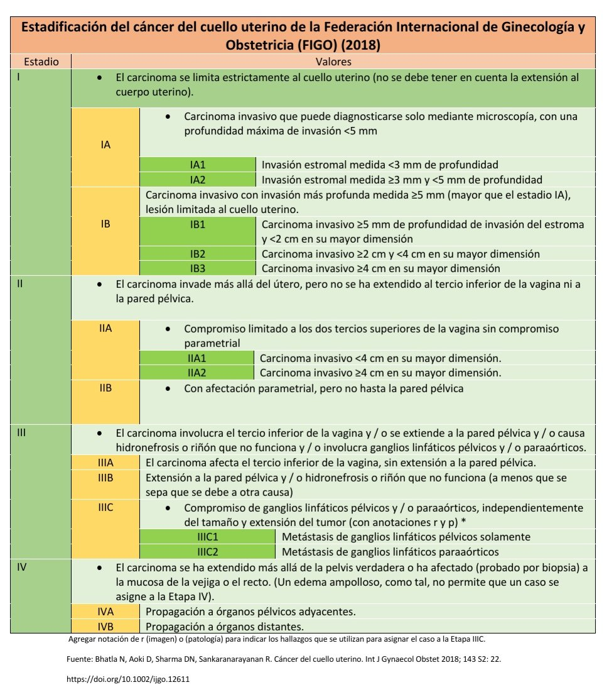
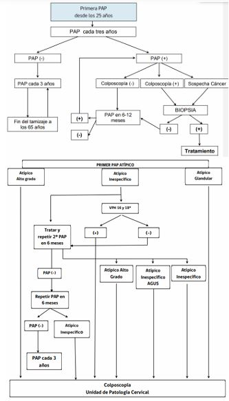
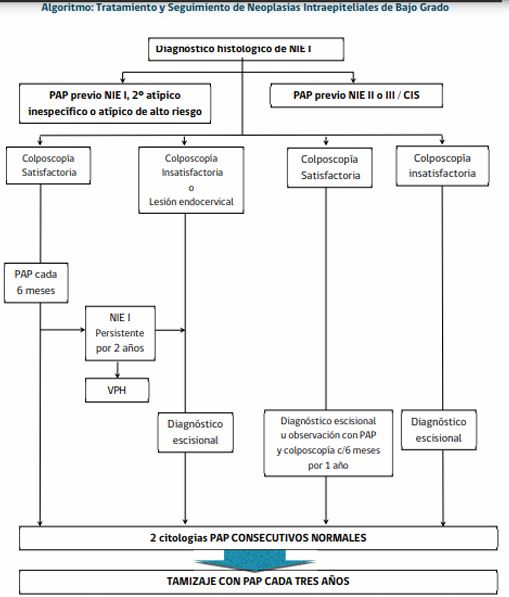
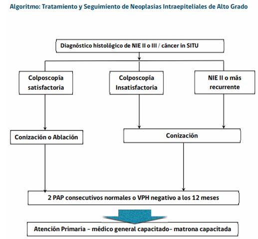

#GES N°3: Cáncer Cervicouterino.
##Generalidades y Definición  
El Cáncer Cervicouterino (CaCu) es una neoplasia maligna que se origina en las células del cuello del útero o cérvix.

* Representa un importante problema de salud pública, siendo una de las principales causas de muerte por cáncer en mujeres, especialmente en países en vías de desarrollo.

* La mayoría de los casos (>99%) están etiológicamente ligados a la infección persistente por serotipos de alto riesgo del VPH.

Su relevancioa radica en que es un cáncer altamente prevenible a través de 2 estrategias fundamentales:

* Prevención Primaria: Vacunación contra el VPH.

* Prevención Secundaria: Programas de Screening (PAP) y la detección de VPH.

Los tipos histológicos más frecuentes son el carcinoma de células escamosas (~80-90%) y el adenocarcinoma (10-20%).

##Garantías AUGE:

**Acceso: ¿Quiénes tienen derecho?**

* Toda beneficiaria con **sospecha** de CaCu (PAP alterado o hallazgos clínicos sugerentes) tendrá acceso a confirmación diagnósitca.

* Toda beneficiaria con **confirmación diagnóstica** tendrá acceso a la etapificación y al tratamiento correspondiente.

* Toda beneficiaria en tratamiento tendrá acceso a seguimiento.

**Oportunidad: ¿Cuáles son los plazos máximos de espera?:**

Depende de la etapa de la enfermedad:

1. Diagnóstico:

	* Confirmación diagnóstica→ Mediante colposcopia y/o biopsia: Dentro de 40 días desde la sospecha, es decir, desde el resultado PAP alterado o la sospecha clínica.
	
2. Etapificación (Staging):

	* Parfa el CaCu invasor→ Realizar etapificación completa (estudio clínico y de imágenes): Dentro de 40 días desde la confirmación diagnóstica, es decir, desde el resultado de la biopsia.
	
3. Tratamiento: 

	* CaCu Preinvasor→ NIE II, NIE III o Cáncer in situ: Inicio del tratamiento dentro de 60 días desde la confirmación diagnóstica.
	
	* CaCu Invasor→ Ya etapificado: Inicio de tratamiento dentro de 30 días desde la etapificación completa.
	
	* Tratamiento Adyuvante: Iniciar dentro de 20 días desde la indicación médica.
	
	* Tratamiento por Recidiva (recaída): Inicio dentro de 30 días desde la confirmación de la recidiva.
	
4. Seguimiento→ Primer control con especialista: Dentro de 30 días desde el alta hospitalaria o fin del tratamiento.

**Protección Financiera:**

* Beneficiarios FONASA A y B: Copago $0.

* Beneficiarios FONASA C y D: Copago $0.

* Beneficiarios ISAPRE: Copago del 20% del Arancel de Referencia GES.

##Fisiopatología

La carcinogénesis del CaCu es un proceso multifactorial y de larga evolución, cuyo iniciador casi indispensable es la infección persistente por VPH de alto riesgo oncogénico, principalmente los serotipos 16 y 18, responsables de ~70% de los casos.

La mayoría de las infecciones por VPH son transitorias y eliminadas por el sistema inmune. Sin embargo, cuando la infección persiste, el ADN viral puede integrarse en el genoma de las células epiteliales del cérvix.

Las oncoproteínas virales E6 y E7 son cruciales en este proceso, ya que inactivan a 2 de los principales genes supresores de tumores del huésped:

* E6 se une y promueve la degradación de la proteína p53.

* E7 se une y promueve la degradación de la proteína del retinoblastoma (pRb).
La pérdida de estas proteínas conduce a una proliferación celular descontrolada, inestabilidad genómica y la acumulación de mutaciones, lo que permite la progresión de una lesión intraepitelial de bajo grado (LIE-BG/NIE I), a una de alto grado (LIE-AG/NIE II-III) y, finalmente, a un carcinoma invasor.

##Factores de Riesgo

* Infección persistente por VPH de alto riesgo→ Factor necesario.

* Inicio temprano de la actividad sexual.

* Múltiples parejas sexuales.

* Tabaquismo→ Aumenta al doble el riesgo, ya que los metabolitos producidos se concentran en el moco cervical y actúan como co-carcinógenos.

* Inmunosupresión: Especialmente el VIH.

* Multiparidad→ Múltiples embarazos a término.

* Uso prolongado de ACO (>5 años).

* Coinfección con otras ETS.

##Manifestaciones Clínicas

En sus etapas iniciales, tanto las lesiones preinvasoras, como el CaCu microinvasor, son generalmente asintomáticos. Los síntomas suelen aparecer en etapas más avanzadas de la enfermedad.

**Síntomas y Signos Característicos:**

1. Sangrado Genital Anormal→ Es el síntoma más frecuente, puede presentarse como:

	* Metrorragia postcoital: Síntoma clásico.
	
	* Sangrado intermenstrual.
	
	* Sangrado postmenopáusico.
	
2. Leucorrea→ Puede ser acuoso, mucoso o purulento y, a menudo, acompañado de mal olor.

3. Dolor pélvico/lumbar→ Generalmente indica enfermedad avanzada con extensión a los parametrios o a la pared pélvica.

4. Síntomas de enfermedad avanzada→ Edema de EEII (por compresión linfática), síntomas urinarios (hematuria, disuria) o rectales (rectorragia), y fístulas.

##Diagnóstico

1. Screening:

	* Citología Cervical (PAP)→ Método tradicional para detectar células anormales. 
	
	* Test de VPH-ADN→ Se recomienda en mujeres mayores de 30-35 años, solo o en cotesting con el PAP.
	
2. Anamnesis y Examen Físico→ 

	* Especuloscopía→ Visualización directa del cuello uterino: Puede revelar una lesión exofítica (similar a un hongo), ulcerada o un cérvix de aspecto normal pero indurado.

	* Tacto bimanual y rectovaginal→ Evalúa la extensión local de la enfermedad.
	
3. Confirmación Diagnóstica:

	* Colposcopía→ Permite identificar áreas anormales del cérvix mediante la microscopía.
	
	* Biopsia dirigida→ Se toma una muestra de tejido de las áreas sospechosas visualizadas en la colposcopia.
		
		* El estudio histopatológico de está muestra confirma el diagnóstico y define el tipo histológico.
		
##Etapificación

Se realiza mediante el sistema de la Federación de Ginecología y Obstetricia (FIGO), que se basa en la evaluación clínica y se apoya en estudios de imagen para planificar el tratamiento.

**Estadios FIGO:**

##Tratamiento y Manejo

1. **Manejo de Lesiones Preinvasoras→** LIE-AG/NIE II-III:
	
	* Procedimientos escisionales→ Son el tratamiento de elección, son métodos tanto diagnósticos como terapéuticos:
		
		* Incluye la escición electroquirúrgica con asa LEEP o la conización con bisturí frío.
		
2. **Manejo del Cáncer Invasor Temprano→** Estadios IA-IB1, IIA1:

	* Cirugía→ Es el tratamiento de 1ra línea:
		
		* La histerectomía radical tipo Wertheim-Meigs con linfadenectomía pélvica es el estándar.
		
	* Opciones de preservación de la fertilidad→ En caso muy seleccionados, por ejemplo, en tumores pequeños en mujeres jovenes, se puede ofrecer una traquelectomía radical que es la extirpación del cérvix y parametrios, conservando el cuerpo uterino.
	
3. **Manejo del Cáncer Localmente Avanzado→** Estadios IB2-IVA:

	* Quimiorradioterapia Concomitante (QRT-C)→ Es el Gold standard, consiste en RT externa a la pelvis + QT semanal basada en Cisplatino, seguida de braquiterapia (RT omterma).
	
4. **Manejo del Cáncer Avanzado, Metastásico o Recurrente→** Estadio IVB:

	* Este tratamiento es paliativo y se basa en la terapia sistémica.
	
	* Primera Línea: QT (Platino + Paclitaxel), a menudo asociado con Bevacizumab.
	
	* Segunda Línea: En pacietnes cuyos tumores expresan PD-L1, la inmunoterapia (Ej.: Pembrolizumab) ha demostrado mejorar la supervivencia.
	
##Algoritmos

	

