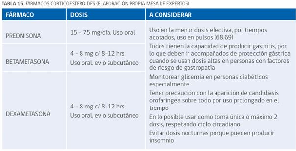

#GES N°4: Cuidados Paliativos.
##Generalidades y Definición

Los Cuidados Paliativos (CP) son un enfoque activo y total para la calidad de vida de los pacientes y sus familias que enfrentan los problemas asociados con una enfermedad potencialmente mortal, como el cáncer avanzado.

* Según la OMS, el objetivo principal es la prevención y el alivio del sufrimiento a través de la identificación temprana, la evaluación impecable y el tratamiento del dolor y otros problemas físicos, psicosociales y espirituales.

* Este enfoque no busca acelerar ni posponer la muerte, sino que afirma la vida y considera el morir como un proceso normal.

Son aplicables de forma temprana en el curso de la enfermedad, en conjunto con otras terapias que pueden prolongar la vida, como la QT o la RT.

##Garantías GES

**Acceso: ¿Quiénes tienen derecho?**

* Tienen derecho todas las personas que tengan un diagnóstico confirmado de cáncer y que requieran alivio del dolor y/o cuidados paliativos.

* La garantía cubre la asistencia integral al paciente y a su entorno familiar.

**Oportunidad: ¿Cuáles son los plazos máximos de espera?**

1. Diagnóstico: Se activa está garantía con la confirmación diagnóstica del cáncer y la indicación médica de ingreso a CP.

2. Tratamiento: El ingreso a la unidad/programa de CP debe ocurrir dentro de 5 días desde la confirmación diagnóstica.

**Protección Financiera:**

* Beneficiarios FONASA A y B: Copago $0.

* Beneficiarios FONASA C y D: Copago $0.

* Beneficiarios ISAPRE: Copago del 20% del Arancel de Referencia GES.

## Factores que Complican el manejo del dolor:

* Factores Psicológicos: Ansiedad, depresión, miedo, ira.

* Factores Sociales: Aislamiento, problemas económicos, falta de cuidadores.

* Factores Espirituales: Pérdida de la fe, crisis existencial, desesperanza.

* Historia de abuso de sustancias.

##Evaluación Integral

El "Diagnóstico" en CP es una evaluación multidimensional y continua del paciente y su familia:

1. Evaluación del Dolor→ El dolor es "lo que el paciente dice que es".

2. Evaluar la presencia de otros síntomas→ Cómo afecta el sueño, el apetito, el ánimo y las actividades diarias.

3. Evaluación Psicosocial y Espiritual.

4. Examen Físico.

5. Exámenes Complementarios→ Se solicitan solo si el resultado va a cambiar la estrategia de manejo de síntomas.

##Escalera Analgésica

El enfoque terapéutico para el dolor oncológico se basa en la "Escalera Analgésica" de la OMS, que establece un manejo escalonado según la intensidad del dolor:

1. Primer Escalón→ Dolor Leve, EVA 1-3:

	* Analgésicos No Opioides: Paracetamol, AINEs (Ibuprofeno, Ketoprofeno, Diclofenaco).
	
	* Añadir Coadyuvantes de ser necesario.
	
2. Segundo Escalón→ Dolor Moderado, EVA 4-6:

	* Opioides Débiles: Tramadol, Codeína.
	
	* Añadir No Opioides: Paracetamol/AINEs.
	
	* Añadir Coadyuvantes de ser necesario.
	
3. Tercer Escalón→ Dolor Severo, EVA 7-10:

	* Opioides Potentes: Morfina, Oxicodona, Metadona, Fentanilo.
	
	* Añadir No Opioides: Paracetamol/AINEs.
	
	* Añadir Coadyuvantes de ser necesario.

4. Cuarto Escalón→ Manejo por Intervencionista:

	* Se considera cuando el dolor es refractario al tratamiento farmacológico o los efectos 2rios son intolerables.
	
	* Incluye bloqueos nerviosos, bombas de infusión intratecal, etc.

![Opioides Potentes] (../imagenes/ges04/Opioidespotentes)

