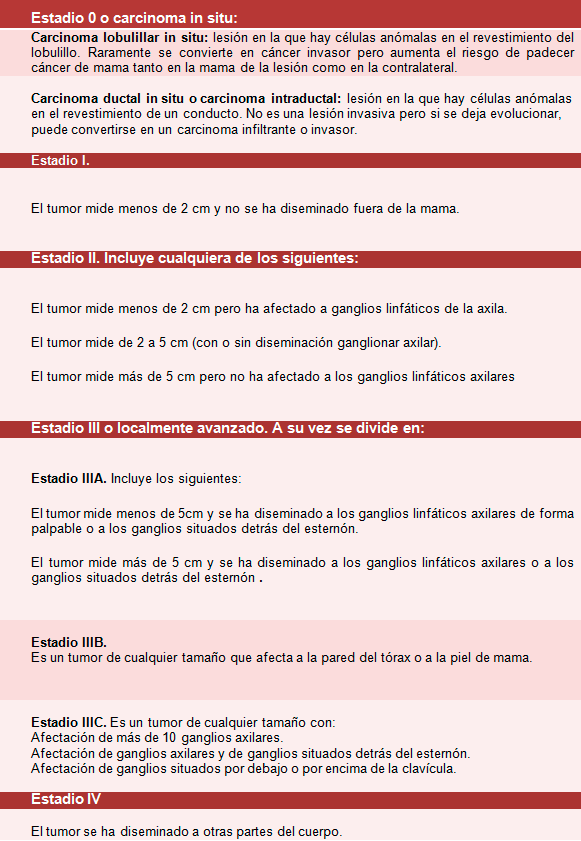
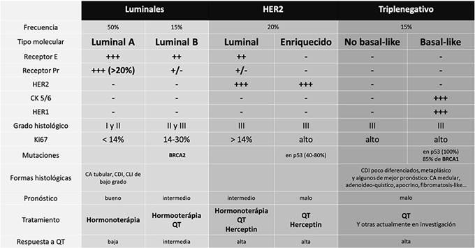

#GES N°8: Cáncer de Mama.
##Generalidades y Definición

El Cáncer de Mama es una neoplasia maligna que se origina en las células del tejido mamario, principalmente en los conductos (ductal) o lobulillos (lobulillar) encargados de la producción de leche. 

* Es el cáncer más diagnosticado y la principal causa de muerte por cáncer en mujeres a nivel mundial. 

* Aunque es mucho menos frecuente, también puede afectar a hombres.
 
* Su importancia radica en su alta incidencia y en el impacto que tiene en la vida de las pacientes y sus familias. 

Los tipos histológicos más comunes son el Carcinoma Ductal Infiltrante (~80%) y el Carcinoma Lobulillar Infiltrante (~10-15%).

##Garantías GES

**Acceso: ¿Quiénes tienen derecho?**

* Tienen derecho todas las personas que tengan un diagnóstico confirmado de cáncer y que requieran alivio del dolor y/o cuidados paliativos.

* La garantía cubre la asistencia integral al paciente y a su entorno familiar.

**Oportunidad: ¿Cuáles son los plazos máximos de espera?**

1. Diagnóstico→ Confirmación diagnóstica (mediante biopsia): Dentro de 45 días desde la sospecha.

2. Tratamiento: 

	* Tratamiento Primario (cirugía o neoadyuvancia): Inicio dentro de 30 días desde la etapificación completa.
	
	* Tratamientos Adyuvantes (QT, RT y/o Hormonoterapia): Inicio dentro de 20 días desde la indicación médica (post-cirugía o según defina el comité oncológico).
	
	* Reconstrucción mamaria (si aplica): La reconstrucción diferida tiene plazos específicos que se activan tras la indicación médica.
	
3. Seguimiento→ Primer control con especialista (post-tratamiento oncológico): Dentro de 90 días desde la indicación médica.

**Protección Financiera:**

* Beneficiarios FONASA A y B: Copago $0.

* Beneficiarios FONASA C y D: Copago $0.

* Beneficiarios ISAPRE: Copago del 20% del Arancel de Referencia GES.

##Fisiopatología

El desarrollo del cáncer de mama es un proceso multifactorial donde la proliferación celular descontrolada es impulsada por una combinación de factores genéticos, hormonales y ambientales.
 
* Influencia Hormonal: La exposición prolongada a estrógenos (endógenos o exógenos) es uno de los factores más importantes, ya que estimulan la división de las células epiteliales mamarias, aumentando la probabilidad de mutaciones.

* Factores Genéticos: Alrededor del 5-10% de los cánceres de mama son hereditarios, asociados a mutaciones en genes de alta penetrancia. Las más conocidas son las mutaciones en los genes BRCA1 y BRCA2, que aumentan drásticamente el riesgo de cáncer de mama y ovario.

##Factores de riesgo

**No Modificables:**

* Sexo Femenino.

* Edad avanzada→ Sobre todo después de los 50 años.

* Factores genéticos/hereditarios: Mutaciones en BRCA1/2 u otros genes.

* Antecedente personal de cáncer de mama.

* Menarquia Precoz (antes de los 12) y/o menopausia tardía (después de los 55)→ Mayor exposición de estrógenos.

* Densidad mamaria elevada en la mamografía.

**Modificables:**

* Nuliparidad o Primer embarazo de término después de los 30 años.

* No haber dado lactancia materna.

* Uso de TRH combinada (E+P) en la postmenopausia.

* Obesidad y sobrepeso.

* Consumo de Alcohol.

* Sedentarismo.

##Manifestaciones Clínicas

La presentación clínica más habitual es la detección de una masa o nódulo mamario.
 
**Síntomas y Signos Característicos:**
 
* Nódulo o masa mamaria indolora→ Es el signo más frecuente (>80% de los casos):

	* Generalmente de consistencia dura, bordes irregulares y poco móvil.
 
* Alteraciones en la piel de la mama: Retracción, "piel de naranja" (edema cutáneo).

* Cambios en el pezón: Retracción o inversión del pezón, secreción (especialmente si es sanguinolenta o unilateral).
 
* Aumento de volumen o endurecimiento de la axila (adenopatías).
 
* Dolor mamario (mastodinia) es un síntoma poco frecuente de cáncer.

##Diagnóstico

El diagnóstico se basa en la combinación de tres elementos clave:
 
1. Examen Clínico: Anamnesis y examen físico de las mamas y axilas.

2. Estudios de Imagen:

	* Mamografía: Es la herramienta de elección para el tamizaje en la población general (usualmente a partir de los 40-50 años) y para el diagnóstico. Puede detectar microcalcificaciones sospechosas, nódulos y distorsiones de la arquitectura.

	* Ecografía Mamaria: Es el complemento principal de la mamografía, especialmente en mamas densas. Es el método de imagen de elección en mujeres jóvenes (< 40 años) y embarazadas. Ayuda a diferenciar nódulos sólidos de quísticos.

	* RM Mamaria: Se reserva para situaciones específicas, como el tamizaje en pacientes de muy alto riesgo (ej. portadoras de BRCA) o para la evaluación de la extensión de la enfermedad.

3. Confirmación Diagnóstica (Gold Standard):
	
	* Biopsia: Es indispensable para confirmar el diagnóstico. 
		
		* La biopsia con aguja gruesa (Core) es el método de elección, ya que obtiene un cilindro de tejido que permite no solo el diagnóstico histológico, sino también la determinación de marcadores biológicos cruciales (receptores hormonales y HER2).

##Etapificación TNM (AJCC)

Describe la extensión anatómica de la enfermedad:

* T→ Tumor: Tamaño del Tumor Primario.

* N→ Nódulo: Compromiso de los ganglios linfáticos axilares o regionales.

* M→ Metástasis: Presencia de metástasis a distancia.

Esto define los Estadios Clínicos del 0 al IV, siendo el Estadio IV la enfermedad metastásica.

##Clasificación Molecular (Subtipos Intrínsecos)

Se basa en la expresión de receptores celulares y es crucial para guiar la terapia sistémica:

1. Luminal A→ Receptor de Estrógeno y/o Progesterona positivos  (RE+/RP+), HER2 negativo, Ki-67 bajo. 
	
	* Son los más frecuentes y de mejor pronóstico. 
	
	* Responden bien a la hormonoterapia. 
	
2. Luminal B→ RE+/RP+, HER2 negativo, Ki-67 alto, O RE+/RP+, HER2 positivo. 

	* Más agresivos que los Luminal A.
	
3. HER2 positivo (No Luminal)→ RE y RP negativos, HER2 sobreexpresado/amplificado.
 
	* Son tumores agresivos pero tienen como blanco específico las terapias anti-HER2.

4. Triple Negativo→ RE, RP y HER2 negativos: 

	* Es el subtipo más agresivo, de peor pronóstico y no se beneficia de hormonoterapia ni terapia anti-HER2. 
 
	* La QT es la base de su tratamiento sistémico.
	
##Tratamiento y Manejo

 El manejo del cáncer de mama es multidisciplinario y combina tratamientos locales y sistémicos.
 
 **Tratamiento Local→ Control en mama y axila:**
 
 1. Cirugía:
 
	* Cirugía Conservadora→ Extirpación del tumor con un margen de tejido sano (tumorectomía o cuadrantectomía), seguida casi siempre de RT.
	
	* Mastectomía→ Extirpación completa de la glándula mamaria.
	
2. Manejo de la Axila→ Se realiza una biopsia de ganglio centinela para evaluar el primer ganglio de drenaje.

	* Si es negativo→ Se evita el vaciamiento axilar completo.

3. RT→ Se utiliza post-cirugía conservadora para reducir el riesgo de recurrencia local, o post-mastectomía en tumores de alto riesgo.

**Tratamiento Sistémico:**

1. Terapia Hormonal→ Se usa en tumores Luminales (receptores hormonales presentes):

	* Se usan fármacos como el Tamoxifeno o los Inhibidores de la Aromatasa (Anastrozol, Letrozol).
	
2. QT→ Se reserva para tumores de alto riesgo, subtipos triple negativo y HER2 (+).

3. Terapia Dirigida (anti-HER2)→ Para tumores HER2 (+):

	* Fármacos como Trastuzumab y Pertuzumab.

4. Inmunoterapia→ Recientemente aprobada para algunos casos de cáncer de mama triple (-).

