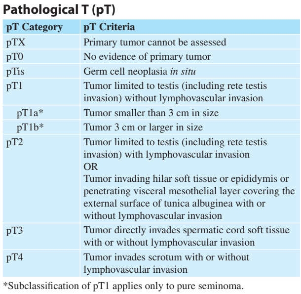
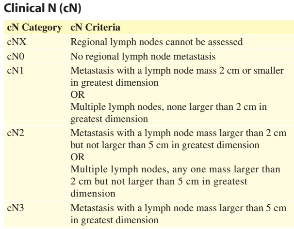
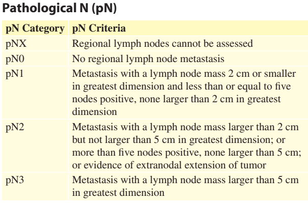
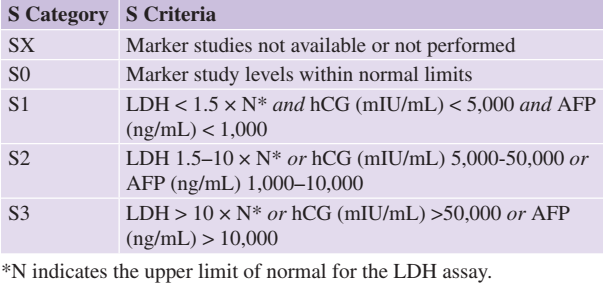

#GES N°16: Cáncer de Testículo en personas de 15 años y más.
##Generalidades y Definición

El Cáncer de Testículo es una neoplasia maligna que se origina en las células de uno o ambos testículos.

* Es el cáncer sólido más común en hombres jóvenes, con un peak de incidencia entre los 15 y 35 años.

* La mayoría (>95%) de estos tumores se originan en las células germinales, que son las células responsables de producir espermatozoides.

* La tasa de curación global supera el 95%, e incluso en enfermedad metastásica, la supervivencia a 5 años supera al 70-80%.

##Fisiopatología

Los Tumores de Célula Germinales (TCG) se desarrollan a partir de una lesión precursora microscópica llamada **Neoplasia Intratubular de Células Germinales (NITC)**, que es básicamente un "cáncer in situ".

1. Seminomas→ 50-60% de los TCG:

	* Estan compuestos por células germinales puras que se asemejan a las células germinales primordiales (indiferenciadas).
	
	* Estos tumores se caracterizan por crecer lentamente y por permanecer localizados solo en el testículo por más tiempo.
	
		* Su diseminación es predominantemente linfática y ordenada (retroperitoneo).
	
	* Son altamente sensibles a RT y QT.
	
	* Generalmente no elevan la AFP→ Pueden elevar la HCG en un 10-15% de los casos.
	
2. No Seminomas→ 40-50% de los TCG:

	* Representan una diferenciación más "caótica" de la célula germinal, por lo que son un grupo heterogéneo que incluye varios tipos celulares.
	
	* Tienden a ser más agresivos, crecer más rápido y tener una mayor capacidad de hacer metástasis más precozmente, tanto por vía linfática como hematógena.
	
	* Tipos Principales:
	
		* Carcinoma Embrionario→ Células muy indiferenciadas y agresivas, con alta tasa de crecimiento.
		
			* Hay elevación de AFP y HCG.
			
		* Tumor del Saco Vitelino (Yolk Sac)→ Es el tipo más común en niños.
		
			* En adultos, produce una elevación de AFP.
			
		* Coriocarcinoma→ Compuesto por células que imitan a la placenta, es muy agresivo y rápidamente se disemina hematógenamente (a pulmón/cerebro).
		
			* Produce niveles muy altos de HCG.
			
		* Teratoma→ Son células que se diferencian en tejidos maduros o inmaduros.
		
			* Son resistentes a las QT y RT.
			
			* Su presencia, especialmente en metástasis, obliga a la extracción quirúrgica (Linfadenectomía Retroperitoneal).
	
##Factores de Riesgo

* Criptorquidia→ Es el factor de riesgo más importante:

	* Un testículo que no descendió espontáneamente tiene un riesgo 3 a 10 veces mayor.

* Antecedente Personal→ Haber tenido Cáncer en el otro testículo:

	* Riesgo de 3-5% de desarrollar un segundo tumor contralateral).
	
* Antecedente Familiar (de 1°grado).

* Síndromes Genéticos→ Por ejemplo, el Klinefelter (XXY) se asocia a un mayor riesgo, principalmente a tumores mediastínicos.

* Etnia→ Es significativamente más frecuente en hombres caucásicos.

##Manifestaciones Clínicas

Suele ser el paciente quien descubre el tumor mediante el autoexamen testícular. 

1. La presentación más habitual es:

	* Nódulo o Masa testícular INDOLORA, dura, pétrea, irregular, que no se separa del testículo.

	* Aumento de volumen o cambio de consistencia de todo el testículo.

	* Sensación de pesadez en el escroto.

2. Presentación atípica:

	* Dolor agudo→ Por hemorragia o infarto intratumoral.
	
	* Ginecomastia→ Crecimiento mamario doloroso, causado por los altos niveles de HCG.
	
3. Síntomas de Metástasis:

	* Dolor lumbar o abdominal→ Síntoma tardío común: Ocurre por el crecimiento de los ganglios linfáticos en el retroperitoneo, que pueden comprimir el músculo psoas o nervios.
	
	* Tos, hemoptisis o disnea→ Metástasis pulmonar (diseminación hematógena).
	
	* Cefalea, convulsiones o síntomas neurológicos→ Más común en Coriocarcinoma, es rara la metástasis cerebral.
	
##Diagnóstico
	
1. Examen físico→ Palpación de la masa testicular.
	
2. Ecografía testicular doppler color→ Gold Standard frenta a la sospecha: Confirma si la masa es intratesticular y sólida o si es quística/extratesticular.

	* Garantía GES→ Realizar dentro de 15 días desde la sospecha.
	
3. Marcadores tumorales séricos (MTS)→ Se deben tomar **antes** de la cirugía (orquiectomía).

	* AFP→ Típicamente elevada en No Seminomas.
	
		* Un Seminoma Puro **NUNCA** eleva la AFP.
		
	* HCG→ Elevada en No seminomas (especialmente Coriocarcinoma) y, a veces, en seminomas puros (10-15%).
	
	* LDH→ Es un m,arcador inespecífico de carga tumoral y recambio celular.
	
	* Garantía GES→ Se deben tomar MTS dentro de 15 días desde la sospecha.
	
4. Estudio de Etapificación (Post-diagnóstico)→ Tras confirmado el cáncer (o post-orquiectomía), se realiza una TC de Tórax, Abdomen y Pelvis para buscar metástasis.

	* Garantía GES→ Realizar dentro de 30 días desde la confirmación.
	
##Etapificación

##Tratamiento y Manejo

1. Tratamiento primario→ Es diagnóstico y Terapéutico:

	* Orquiectomía radical por vía inguinal.
	
		* Garantía GES→ Realizar dentro de 30 días desde la confirmación.
	
2. Manejo Adyuvante→ Depende de la histología y la Etapa TNM+S:

	* Etapa I:
	
		* Seminoma: Vigilancia activa y realizar QT o RT solo si el paciente está muy comprometido.
		
		* No seminoma: Vigilancia Activa o 1-2 ciclos de QT (BEP) o linfadenectomía retroperitoneal (LRPD).
		
	* Etapa II:
	
		* Seminoma: RT (Si ganglios pequeños) o QT (BEP o EP).
		
		* No Seminoma: QT (BEP) 3-4 Ciclos y considerar LRPD si quedan masas residuales post-QT.
		
	* Etapa III:
	
		* Independiente de la Histología: QT (BEP).
	
	* Garantía GES: Iniciar QT/RT dentro de 30 días desde la indicación médica.