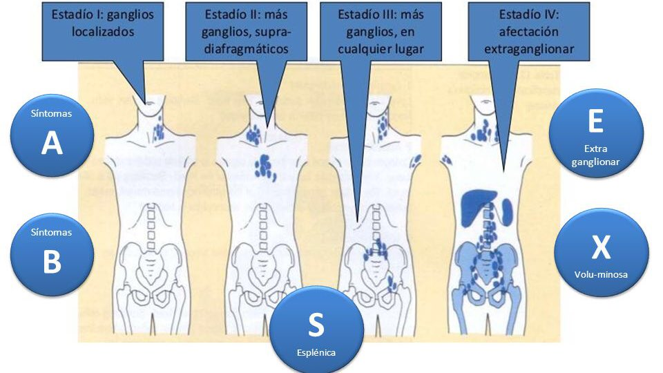

#GES N°17.2: Linfoma No Hodgkin (LNH) en personas de 15 años o más.
##Generalidades y Definición

El LNH es un término que engloba a un grupo grande y heterogéneo de neoplasias malignas que se originan en los linfocitos.

* Afecta principalmente a los Linfocitos B (>85%), Linfocitos T o, raramente, NK.

* A diferencia del LH, el LNH comprende múltiples subtipos con características biológicas, presentaciones clínicas, tratamiento y pronóstico muy diferentes.

* Es uno de los canceres hematológicos más comunes en el mundo y su incidencia aumenta con la edad, siendo más frecuente en >60 años.

##Fisiopatología

En el LNH ocurre una transformación maligna y la proliferación clonal de un linfocito en una etapa específica de su maduración.

* Este proceso es impulsado por la acumulación de alteraciones genéticas, como las translocaciones cromosómicas, que llevan a la desregulación de oncogenes o genes supresores de tumores.
	
	* Linfoma Folicular→ Translocación t(14;18): Que sobreexpresa el gen antiapoptótico BCL2.
	
	* Linfoma de Burkitt→ Translocación t(8;14): Que afecta al oncogén MYC.
	
##Factores de Riesgo

1. Inmunodeficiencias→ Es el factor de riesgo más importante:

	* Adquirida→ Infección por VIH/SIDA.
	
	* Iatrogénica→ Pacientes receptores de trasplantes de órganos sólidos.
	
	* Congénitas→ Síndrome de Wiskott-Aldrich, Ataxia-telangiectasia.
	
2. Enfermedades Autoinmunes→ Artritis reumatoide, LES y Síndrome de Sjogren.

3. Infecciones:

	* VEB→ Asociado a Linfoma de Burkitt, LNH en inmunodeprimidos y linfoma primario del SNC.
	
	* H. pylori→ Asociado a Linfoma MALT gástrico.
	
	* Virus de la Hepatitis C→ Aumenta el riesgo de algunos subtipos de LNH de LB.
	
	* Virus Linfotrópico T humano tipo 1 (HTLV-1)→ Causa linfoma/leucemia de LT del adultos.

4. Exposición a Químicos y Radiación→ Exposición a ciertos pesticidas, herbicidas y QT/RT previa.

5. Antecedente familiar de LNH.

##Manifestaciones clínicas

1. Linfadenopatía Periférica Indolora→ Crecimiento de ≥1 ganglios linfáticos en el cuello, axilas o ingle, generalmente no dolorosos, de consistencia firme y gomosa.

2. Síntomas B→ Presente en ~30% de los casos:

	* Fiebre inexplicada >38°C.
	
	* Sudoración Nocturna Profusa→ Tan profusa que obliga a cambiar la ropa de cama.
	
	* Pérdida de peso inexplicada >10% del peso corporal, en los últimos 6 meses.
	
3. Manifestaciones Extranodales→ El LNH puede originarse o diseminarse a casi cualquier órgano:

	* Tracto Gastrointestinal.
	
	* Piel.
	
	* Médula Ósea→ Citopenias.
	
	* SNC.
	
4. Fatiga y Malestar General.

##Diagnóstico

1. Anamnesis y Examen Físico.

2. Confirmación Diagnóstica:

	* Biopsia Excisional de un ganglio linfático.
	
	* Estudio Histopatológica, Inmunohistoquímica y Citogenética.
	
3. Estudios de Etapificación:

	* PET/CT→ Estudio de elección.
	
	* Biopsia de Médula Ósea→ Para evaluar la infiltración medular.
	
	* Análisis de Sangre→ Hemograma, Perfil Bioquímico con LDH.
	
##Clasificación y Etapificación

**Clasificación de la OMS→** Divide los LNH en neoplasias de LB y de LT, y según clínica:

1. Linfomas Indolentes (de bajo grado)→ Crecimiento lento, a menudo incurables pero con larga sobrevida.

2. Linfomas Agresivos (de alto grado)→ Crecimiento rápido, pero potencialmente curables con quimioinmunoterapia.

	* Linfoma Difuso de Células Grandes B (LDCGB), el subtipo más común.
	
**Sistema de Ann Arbor:**

##Tratamiento y Manejo

El tratamiento depende del subtipo histológico, el estadio y las características del paciente:

1. Linfoma Indolentes:

	* Estadios Avanzados Asintomáticos→ Vigilancia Activa: "Watch and Wait".
	
	* Estadios Avanzados Sintomáticos→ Inmunoterapia (Rituximab) combinada con QT.
	
2. Linfomas Agresivos:
	
	* El objeto es la curación.
	
	* Se usa Quimioinmunoterapia con el esquema R-CHOP (Rituximab, Ciclofosfamida, Doxorrubicina, Vincristina, Prednisona).
	
3. Otras Terapias:

	* Trasplante Autólogo de Progenitores Hematopoyéticos→ Reservado para pacientes con LNH agresivo en recaída.
	
	* Terapia con Células CAR-T→ Reservado para LDCGB en recaída/refractario.
	