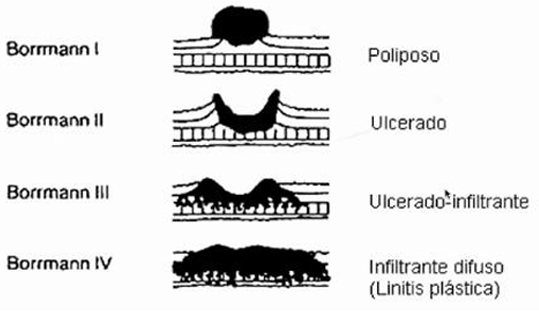

#GES N°27: Cáncer Gástrico.
##Generalidades y Definición

El cáncer gástrico (CG) corresponde generalmente a un adenocarcinoma (95%). Se distinguen 2 tipos histológicos principales:

1. CG Intestinal (90%)→ Se desarrolla en la mucosa con metaplasia intestinal:

	* Predomina en personas de mayor edad, sexo masculino y zonas de alto riesgo epidémico.
	
2. CG Difuso→ Se origina en la mucosa gástrica propiamente tal:

	* Predominio en jóvenes, con una proporción hombre/mujer similar y más frecuente en zonas de bajo riesgo endémico.
	
##Factores de Riesgo del Adenocarcinoma Intestinal

* H. Pylori→ Bacteria Carcinógena que se aloja en el estómago.

* Tabaquismo.

* Gastritis Atrófica→ Lesión Preneoplásica.

* Poliposis Gástrica.

* Sexo Masculino.

* Edad avanzada.

* Antecedentes familiares de CG.

* VEB.

* Factores Dietarios:

	* Factor Protector: Frutas y Hortalizas.
	
	* Factor de Riesgo: Alimentos altos en sal, nitratos y aminas aromáticas policíclicas, alimentos ricos en grasa y alta ingesta de carnes rojas.

* Obesidad.

* Alcoholismo.

* Otros→ Bajo nivel socioeconómico, Gastrectomía Previa y Úlcera Gástrica.

##Manifestaciones Clínicas

En estadios tempranos/incipientes, el CG es bastante asintomático y, cuando se manifiestan, son inespecíficos:

1. Pérdida de Peso.

2. Dolor Abdominal.

3. Anorexia.

4. Náuseas.

5. Disfagia.

6. Melena.

##Anatomía Patológica

1. CG Incipiente→ Infiltra mucosa y submucosa, hasta la capa muscular de la mucosa:

	* Cáncer Intramucoso→ Se asocia a la capa más superficial del estómago:
	
		* Riesgo de metástasis ganglionares del 3%.
		
		* Manejo→ Resecar las lesiones por vía endoscópica.
		
	* Cáncer Submucoso→ Riesgo de metástasis ganglionares entre 15-20%.
	
2. CG Avanzado→ Infiltra más allá de la muscularis mucosae:

	* Riesgo de metástasis ganglionares ≥40%.
	
	* Al ser lesiones tumorales bastante grandes y comprometer capas más profundas de la pared gástrica, eel tratamiento endoscópico no es una opción.
	
	* Clasificación Borrmann→ 4 estados:
	
		* Borrmann I→ Poliposo: Menos agresivo.
		
		* Borrmann II→ Ulcerada: Aún no hay infiltración.
		
		* Borrmann III→ Ulcerada-Infiltrante: Más riesgo de metástasis ganglionares y a distancia.
		
		* Borrmann IV→ Infiltrante Difusa: "Linitis Plástica", está comprometida gran parte de la pared gástrica con metástasis a distancia.
		
	
	
##Tratamiento y Manejo

**CG Incipiente→** Criterios de la Sociedad Japonesa de Endoscopia para definir los pacientes con CG incipiente candidatos a resección endoscópica.

1. Adenocarcinomas Bien Diferenciados e Intramucosas, sin infiltración linfovascular y de tamaño <3 cm de diámetro, independiente de la presencia de ulceración.

2. Adenocarcinomas bien diferenciados intramucosos, sin infiltración linfovascular y sin ulceración, independientemente del tamaño.

3. Carcinoma intramucoso indiferenciado sin infiltración linfovascular, sin úlcera y de tamaño <2 cm.  

4. Adenocarcinoma bien diferenciado con infiltración submucosa <500 m (sm1), sin invasión linfovascular y <3 cm de diámetro.  

**CG Avanzado:**

La extirpación completa del tumor y ganglios regionales representan la mejor oportunidad de supervivencia a largo plazo.

La exploración abdominal con intención curativa debe llevarse a cabo a menos que exista evidencia de enfermedad diseminada o existan contraindicaciones médicas para la Cx:
 
* Lesiones del estómago proximal (tercio superior)→ Realizar gastrectomía total.

* Lesiones gástricas distales (dos tercios inferiores)→ Realizar gastrectomía distal.
 
Independiente de la ubicación de las lesiones, en ambas se realiza una resección de ganglios regionales.
 
* Pacientes con lesiones grandes o infiltrante (Linitis plástica) pueden requerir gastrectomía total, independiente de la ubicación.
 
Otras medidas terapéuticas:
1. QT adyuvante→ Recomendada para cualquier estadio T con enfermedad N1 (incluyendo T1N1-Estadio IB) y para los pacientes con T3N0 (Etapa IIA) en adelante.

2. QT neoadyuvante/perioperatoria→ Pretende reducir un tumor localmente avanzado y mejorar las posibilidades de resección curativa