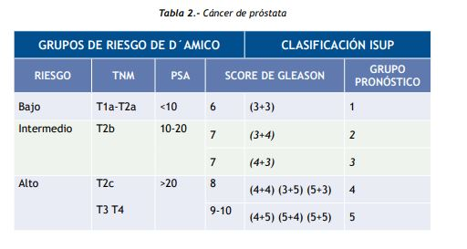

#GES N°28: Cáncer de Próstata.
##Generalidades y Definición

El cáncer de próstata (CaP) es una neoplasia maligna que se origina en las células epiteliales (glandulares) de la glándula prostática. Es el cáncer más frecuente en hombres (excluyendo el cáncer de piel) y, en Chile y gran parte del mundo occidental, representa la segunda o tercera causa de muerte por cáncer en la población masculina.

Su importancia como problema de salud pública radica en su alta prevalencia y en su historia natural extremadamente variable. Esta variabilidad presenta el mayor desafío clínico:

1. Enfermedad Indolente: Muchos tumores son de crecimiento lento (ej. Gleason 6), no amenazan la vida del paciente y pueden no requerir tratamiento activo, solo vigilancia.

2. Enfermedad Agresiva: Otros tumores son biológicamente agresivos, con alta capacidad de generar metástasis (principalmente óseas) y una mortalidad significativa si no se detectan y tratan a tiempo.

##Fisiopatología

El adenocarcinoma de próstata se origina mayoritariamente (70-80%) en la zona periférica de la glándula. Esta localización es clave por dos razones:

1. Es la zona palpable durante el Tacto Rectal.  

2. Está alejada de la uretra, por lo que no produce síntomas urinarios en etapas tempranas (a diferencia de la Hiperplasia Prostática Benigna que crece en la zona transicional, comprimiendo la uretra).

Una característica biológica clave de la mayoría de los CaP es su dependencia de los andrógenos (hormono-sensibilidad). La testosterona (producida en los testículos) es convertida en dihidrotestosterona (DHT) por la enzima 5-alfa-reductasa dentro de la próstata. La DHT es el andrógeno más potente y actúa como el principal "combustible" para el crecimiento tumoral al unirse a los receptores de andrógenos (AR). Esta dependencia es la base y el pilar del tratamiento hormonal (Terapia de Deprivación Androgénica).

##Factores de Riesgo

1. Edad: Es el factor de riesgo más importante e ineludible→ Es muy raro antes de los 40 años, pero su incidencia aumenta exponencialmente después de los 50 años, alcanzando su peak entre los 65 y 75 años.

2. Antecedentes Familiares→ El riesgo genético es significativo: 

	* Tener un familiar de primer grado (padre o hermano) con CaP duplica o triplica el riesgo. 
	
	* El riesgo es aún mayor si el familiar fue diagnosticado joven (<55 años) o si hay más de un familiar afectado.
	
3. Factores Genéticos→ Mutaciones en genes de reparación del ADN:

	* Las más importantes son BRCA2 (asociada a tumores de inicio más temprano y mucho más agresivos) y BRCA1. 
	
	* También se asocia al Síndrome de Lynch (genes mismatch repair). 
	
	* La identificación de estas mutaciones (ej. BRCA2) tiene implicaciones pronósticas y terapéuticas (ej. uso de inhibidores PARP). 

4. Origen Étnico→ Hombres con ascendencia afrocaribeña o afroamericanos tienen mayor incidencia, mayor riesgo de enfermedad agresiva y mayor mortalidad, lo que justifica iniciar el tamizaje más temprano (ej. 40-45 años). 

	* Las poblaciones asiáticas tienen un riesgo menor. 
	
5. Dieta→ El alto consumo de grasas saturadas de origen animal y bajo consumo de vegetales (como el licopeno en los tomates) podría estar asociado, aunque la evidencia es menos concluyente que para los factores anteriores. 

##Manifestaciones Clínicas

El CaP en etapa localizada (curable) es ASINTOMÁTICO. Esta es la razón fundamental para el tamizaje (screening) en hombres informados. La enfermedad solo da síntomas cuando está localmente avanzada o metastásica.

Cuando el tumor crece localmente e invade el cuello vesical o la uretra (etapa avanzada T3-T4):

* Síntomas Urinarios Obstructivos (LUTS)→ Dificultad para iniciar la micción, chorro débil, goteo post-miccional, sensación de vaciado incompleto: 

	* Estos síntomas son mucho más frecuentemente causados por la Hiperplasia Prostática Benigna (HPB).

* Hematosperma (sangre en el semen) o Hematuria (sangre en la orina), son infrecuentes pero sugieren enfermedad localmente avanzada.

**Síntomas de Enfermedad Avanzada (Metastásica):** 

* Dolor Óseo→ Es el síntoma más común de metástasis.

	* Típicamente es un dolor sordo, profundo, insidioso, en la columna lumbar, pelvis o caderas, que no cede con el reposo (difiere del dolor mecánico).

	* Las metástasis de CaP son típicamente osteoblásticas (formadoras de hueso).

* Anemia, baja de peso, fracturas patológicas (por fragilidad ósea) o compresión medular (una emergencia oncológica que requiere radioterapia y corticoides urgentes).

##Diagnóstico

El diagnóstico se basa en la sospecha (Tacto Rectal y/o APE) y la confirmación histológica (Biopsia).

1. Sospecha→ Screening:

	* Antígeno Prostático Específico (APE o PSA)→ Es una proteína (serin-proteasa) producida exclusivamente por la próstata para licuar el semen.

		* Es órgano-específico, pero no cáncer-específico.
		
		* El GES define sospecha con APE >4.0 ng/mL.
	* Tacto Rectal (TR)→ Permite palpar la zona periférica:
		
		* Se considera sospechoso si se palpa un nódulo duro (pétreo), induración, asimetría o pérdida de los bordes.

2. Confirmación Diagnóstica:

	* Biopsia Prostática Ecotomográfica→ Ante una sospecha fundada (APE elevado o TR alterado), se realiza una biopsia con una aguja guiada por ecografía transrectal (TRUS) o transperineal. 
	
		* Se toman múltiples muestras (12 o más).
		
		* Este es el único examen que confirma el cáncer y entrega el Grado de Gleason.
		
	* Garantía GES (Confirmación): 90 días desde la sospecha.
	
3. Etapificación→ Una vez confirmado el cáncer, se evalúa si está localizado o diseminado, según el grupo de riesgo (ver sección siguiente).

* Cintigrama Óseo (Bone Scan): Examen de medicina nuclear para buscar metástasis óseas (osteoblásticas)→ Se solicita en pacientes de riesgo intermedio o alto.  

* TAC de Abdomen y Pelvis: Para evaluar el tamaño de los ganglios linfáticos pélvicos y abdominales (N)→ Se solicita en pacientes de alto riesgo.
	
* Nuevas Imágenes→ No siempre cubiertas por GES, pero estándar en la práctica moderna:
	
	* RM multiparamétrica (RNMmp)→ Clave para la etapificación local (evaluar si el tumor rompió la cápsula - T3): 
			
		* También se usa antes de la biopsia para dirigirla a zonas sospechosas (Sistema PI-RADS), aumentando la detección de tumores agresivos.
	
	* PET-CT con PSMA→ Antígeno de Membrana Específico de Próstata: Es la imagen más sensible y específica, revolucionando la etapificación de alto riesgo y la detección de recaídas (recaída bioquímica). 

##Etapificación

El tratamiento depende de una estratificación de riesgo precisa que combina 3 pilares:

1. Grado de Agresividad (Histología):

	* Score de Gleason: Se observa la arquitectura del tumor y le asigna un valor del 1-5 y se suman los dos patrones más comunes.
	
		
		
	* Grado ISUP→ Es la sumatoria del Score de Gleason:
	
		
		
2. Etapa Clínica (TNM):

	
	
3. Grupos de Riesgo (D'Amico)→ Combinan APE, Gleason y Etapa T para definir el riesgo de progresión y guiar el tratamiento de la enfermedad localizada.

	
	
##Tratamiento y Manejo

**Enfermedad Localizada (Curativa):**

1. Vigilancia Activa→ Es el tratamiento de elección para pacientes de Bajo Riesgo (ISUP 1) y algunos de Riesgo Intermedio Favorable:

	* Consiste en un seguimiento estricto (APE seriado, TR, Resonancias y Biopsias de control) con intención curativa diferida.
	
	* El objetivo es evitar el sobretratamiento y sus secuelas (incontinencia, disfunción eréctil) en hombres con enfermedad indolente.

	* Solo se ofrece tratamiento activo (cirugía/radio) si la enfermedad progresa.

2. Prostatectomía Radical: Cirugía que extirpa la próstata y vesículas seminales (abierta, laparoscópica o robótica).

	* Es la opción estándar para pacientes con buena expectativa de vida (>10 años). 
	
	* Sus principales secuelas son la disfunción eréctil y la incontinencia urinaria.

3. Radioterapia Externa (RTE): Radiación de alta energía dirigida a la próstata.

	* Es equivalente a la cirugía en términos de curación para la mayoría de los casos→ Es no invasiva. 
	
	* Sus secuelas suelen ser proctitis (inflamación rectal) y cistitis (inflamación vesical). 
	
4. Braquiterapia: Implantación de "semillas" radioactivas dentro de la próstata. 

	* Una forma de radioterapia interna, muy efectiva para enfermedad de bajo riesgo. 
	
**Enfermedad Localmente Avanzada (T3-T4):**

* Generalmente se trata con Radioterapia Externa + Terapia de Deprivación Androgénica (TDA) (Hormonoterapia) por 2-3 años, o cirugía en casos seleccionados (seguida a menudo de radioterapia).

**Enfermedad Metastásica (Hormono-Sensible):**

* La enfermedad es incurable, el objetivo es paliativo y prolongar la vida. 

* El pilar del tratamiento es la TDA (Hormonoterapia), que busca bloquear la testosterona.

	* Castración Quirúrgica: Orquiectomía bilateral (extirpación de testículos). Es rápida, barata y 100% efectiva.

	* Castración Médica: Análogos LHRH (ej. Goserelina, Leuprolide), que "apagan" la señal del cerebro a los testículos.
	
* Intensificación→ Hoy, la TDA sola es un tratamiento subóptimo. Se debe "intensificar" desde el inicio, combinando la TDA con:

	* Nuevos agentes hormonales (Abiraterona, Enzalutamida, Apalutamida) O

	* Quimioterapia (Docetaxel)→ Esto ha demostrado duplicar la mediana de supervivencia. 
	
**Enfermedad Metastásica (Resistente a la Castración, CRPC):**

1. Ocurre cuando el tumor progresa (APE sube, nuevas metástasis) a pesar de niveles de testosterona muy bajos (castración)→ El tumor "aprendió" a crecer sin testosterona o a producir sus propios andrógenos.

2. El tratamiento incluye Quimioterapia (Docetaxel, Cabazitaxel), continuar con los nuevos agentes hormonales, terapias dirigidas (Inhibidores PARP como Olaparib para mutaciones BRCA) o Radiofármacos (Radium-223 para metástasis óseas sintomáticas). 

**Garantía GES (Tratamiento): 60 días desde confirmación (localizado), 30 días (avanzado), 10 días (TDA).**

