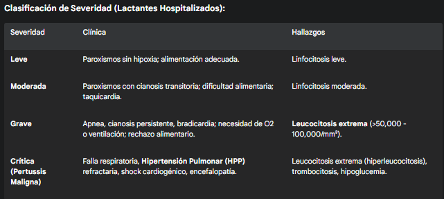

#Coqueluche (Tos Ferina)
##Generalidades y Definición

La coqueluche, también conocida como tos ferina o pertussis, es una enfermedad infecciosa respiratoria aguda altamente contagiosa, causada por la bacteria Gram negativa Bordetella pertussis. Es una enfermedad inmunoprevenible.

A pesar de la alta cobertura de vacunación, la coqueluche ha resurgido a nivel mundial en las últimas décadas, incluso en países con programas de inmunización robustos. Esto se debe a varios factores:

1. Disminución de la inmunidad: La inmunidad conferida tanto por la vacuna (especialmente la acelular, aP) como por la infección natural no es permanente y disminuye significativamente después de 5 a 10 años.

2. Mejora del diagnóstico: El uso generalizado de la Reacción en Cadena de la Polimerasa (PCR) ha aumentado la detección.

3. Adaptación bacteriana: Han surgido cepas de B. pertussis que carecen o tienen variaciones en los antígenos vacunales (ej. pertactina).

4. Reservorio en adolescentes y adultos: Estos grupos a menudo presentan enfermedad atípica o asintomática y actúan como la principal fuente de transmisión a lactantes no inmunizados o parcialmente inmunizados, que son el grupo de mayor riesgo de enfermedad grave y muerte.

##Fisiopatología

Bordetella pertussis es un cocobacilo Gram negativo estricto del ser humano. La transmisión ocurre por gotitas respiratorias de una persona infectada.

1. Adhesión (Fase catarral): La bacteria llega al tracto respiratorio y utiliza adhesinas clave (como la hemaglutinina filamentosa (FHA) y la pertactina (PRN)) para unirse específicamente al epitelio ciliar de la tráquea y los bronquios. `` La bacteria no invade el torrente sanguíneo; su patología es mediada por toxinas localizadas en las vías respiratorias.

2. Producción de Toxinas (Fase paroxística): Una vez adherida, B. pertussis produce un arsenal de toxinas:

	* Toxina Pertussis (TP): Es la toxina principal y define la enfermedad. Es una toxina A-B que ingresa a las células y realiza una ribosilación de ADP sobre las proteínas G inhibidoras (Gi). Esto bloquea la inhibición de la adenilato ciclasa, llevando a un aumento masivo e incontrolado de AMPc intracelular. Este aumento de AMPc causa:

		* Linfocitosis masiva: La TP impide que los linfocitos migren desde la sangre a los tejidos linfoides, causando una linfocitosis periférica extrema (a veces confundida con leucemia).

		* Aumento de secreciones: Provoca la secreción masiva de moco espeso y difícil de eliminar.

		* Sensibilización a la histamina e hipoglucemia (por aumento de secreción de insulina).

	* Toxina de Adenilato Ciclasa (TAC): Ingresa a las células fagocíticas (macrófagos, neutrófilos) y se convierte directamente en adenilato ciclasa, aumentando el AMPc y paralizando la fagocitosis y la quimiotaxis.

	* Citotoxina Traqueal (TCT): Un fragmento de peptidoglicano que destruye directamente las células epiteliales ciliadas (ciliostasis y extrusión celular), impidiendo el barrido mucociliar.

	* Dermonecrotoxina: Causa vasoconstricción local e isquemia.

3. Resultado: La combinación de la parálisis ciliar (por TCT) y la hipersecreción de moco espeso (por TP) obstruye las vías respiratorias. El paciente intenta eliminar este moco viscoso mediante una tos violenta e ineficaz, dando lugar a los paroxismos característicos. La hipoxia y el "gallo" inspiratorio son el resultado del intento desesperado de tomar aire a través de una glotis cerrada y vías aéreas obstruidas por moco. ``

##Factores de Riesgo

* Riesgo de Infección: Contacto cercano con una persona infectada (hogar, guarderías).

* Riesgo de Enfermedad Grave:

	* Edad: Lactantes < 6 meses (especialmente < 2-3 meses) que no han completado su esquema de vacunación primaria.

	* Ausencia de vacunación o esquema incompleto.

	* Inmunidad disminuida: Adolescentes y adultos (por tiempo desde la última dosis).

	* Embarazo: Particularmente en el tercer trimestre (riesgo de transmisión al neonato).

	* Comorbilidades: Enfermedad pulmonar crónica, cardiopatías, inmunosupresión.
	
##Clínica

La enfermedad clásica tiene una incubación de 7-10 días y progresa en tres fases:

1. Fase Catarral (1-2 semanas):

	* Indistinguible de un resfriado común: rinorrea leve, congestión, estornudos, febrícula, tos leve.

	* Es la fase de máxima contagiosidad.

2. Fase Paroxística (2-6 semanas, a veces > 10):

	* La tos empeora y se vuelve paroxística.

	* Paroxismo: Accesos de tos súbitos y violentos, con 5-15 golpes de tos consecutivos en una sola espiración.

	* "Gallo" inspiratorio: Estridor inspiratorio agudo al final del paroxismo, cuando el paciente intenta tomar aire a través de la glotis parcialmente cerrada.

	* Vómitos post-tusivos: Muy característicos, especialmente en niños.

	* Cianosis y Apnea: Comunes en lactantes durante los paroxismos, pueden ser la única manifestación en neonatos (tos ausente).

	* El paciente suele estar afebril y sentirse bien entre los paroxismos.

3. Fase de Convalecencia (Semanas a meses):

	* Los paroxismos disminuyen gradualmente en frecuencia e intensidad.

	* La tos puede persistir por meses (conocida como la "tos de los 100 días") y puede reaparecer con infecciones respiratorias virales posteriores.

**Presentación Atípica (Adolescentes y Adultos Vacunados):**

* Generalmente más leve.

* Tos persistente y prolongada (> 2 semanas) es el síntoma cardinal.

* Los paroxismos y el gallo inspiratorio suelen estar ausentes.

##Diagnóstico

La sospecha clínica es clave, especialmente ante una tos > 2 semanas o tos paroxística.

* Gold Standard: PCR (Reacción en Cadena de la Polimerasa)

	* Muestra: Aspirado o hisopado nasofaríngeo profundo (no orofaríngeo).

	* Momento: Máxima sensibilidad en las primeras 2-3 semanas de la tos (Fase catarral y paroxística temprana). Después de 4 semanas, la sensibilidad disminuye drásticamente.

	* Es rápida, específica y más sensible que el cultivo.

* Cultivo:

	* Muestra: Hisopado nasofaríngeo.
	
	* Medio: Requiere medios especiales (ej. Regan-Lowe o Bordet-Gengou).

	* Sensibilidad: Baja y disminuye rápidamente después de la semana 2. Es lento (3-7 días).

	* Ventaja: Permite estudios de sensibilidad antibiótica y tipificación de cepas (epidemiología). Es el estándar de oro para la especificidad (100%).

* Serología (IgG anti-TP):

	* Uso: Útil en fases tardías de la enfermedad (> 3-4 semanas de tos), cuando la PCR y el cultivo son negativos.

	* Interpretación: Un aumento significativo en los títulos de IgG anti-Toxina Pertussis (anti-TP) entre sueros pareados (fase aguda y convaleciente) o un título único muy elevado es diagnóstico.

	* Limitación: Difícil de interpretar en personas recientemente vacunadas.

* Laboratorio General (Hallazgos Sugerentes):

	* Linfocitosis absoluta extrema (> 10,000 linfocitos/mm³, pudiendo llegar a > 50,000) con leucocitosis.

	* Patognomónico en lactantes: La linfocitosis es causada por la Toxina Pertussis. Su ausencia no descarta la enfermedad, pero su presencia es altamente sugestiva.
	

##Tratamiento y Manejo

**Manejo Inicial (Soporte)**

El manejo es primariamente de soporte, especialmente en lactantes, que requieren hospitalización.

* Hospitalización: Indicada en todos los lactantes < 3-6 meses y en cualquier paciente con paroxismos severos, cianosis, apnea, dificultad respiratoria o deshidratación.

* Monitorización: Cardiorrespiratoria continua (apnea, bradicardia).

* Soporte Respiratorio:

	* Oxígeno suplementario para mantener SatO2 > 92%.

	* Aspiración suave de secreciones (la aspiración profunda puede desencadenar paroxismos).

	* Ventilación mecánica si hay falla respiratoria o apnea recurrente.

* Hidratación y Nutrición: SNG o fluidos IV si no tolera la vía oral por los vómitos o la tos. Alimentación fraccionada (pequeñas tomas frecuentes).

* Aislamiento: Aislamiento respiratorio por gotitas durante 5 días después de iniciar antibióticos (o 21 días desde el inicio de la tos paroxística si no recibe tto).

Evitar: Antitusivos, sedantes y mucolíticos (son ineficaces y pueden ser perjudiciales).

**Manejo Farmacológico (Antibióticos)**

* Objetivo:

	* Si se da en Fase Catarral (temprana): Puede acortar la duración y severidad de la enfermedad.

	* Si se da en Fase Paroxística (tardía): No acorta la enfermedad (el daño ciliar ya está hecho), pero es crucial para erradicar la bacteria y disminuir la transmisibilidad.

* Tratamiento de Elección (Macrólidos):

**Manejo de Pertussis Maligna (Crítica)

* Manejo en UCI Pediátrica.

* Ventilación de alta frecuencia, óxido nítrico inhalado (para HPP).

* Exanguinotransfusión o Leucoféresis: Se han utilizado como terapias de rescate para reducir la hiperleucocitosis y la carga de toxina pertussis, con resultados variables.

**Quimioprofilaxis Post-Exposición**

* Se debe administrar profilaxis antibiótica (mismas pautas que el tratamiento) a todos los contactos cercanos (domiciliarios, guarderías, personal de salud expuesto sin EPP), independientemente de su estado de vacunación.

##Seguimiento

* Prevención (Clave):

	* Vacunación Infantil (DTaP/Hexavalente): Esquema primario (ej. 2, 4, 6 meses) y refuerzos (ej. 18 meses, 4-6 años).

	* Refuerzo Adolescente/Adulto (dTpa): Un refuerzo de vacuna acelular (dTpa) es crucial para reducir el reservorio.

	* Vacunación de la Embarazada ("Estrategia Capullo"): Pilar fundamental actual. Administrar una dosis de dTpa en CADA embarazo, idealmente entre las semanas 27 y 36. Esto genera altos niveles de anticuerpos maternos que se transfieren pasivamente al feto (IgG), protegiendo al neonato en sus primeros meses de vida, antes de que pueda recibir sus propias vacunas.

##Pronóstico

* Excelente en niños mayores, adolescentes y adultos, aunque la tos puede ser muy mórbida y prolongada.

* Reservado en lactantes < 6 meses. La mortalidad se concentra en este grupo.

* La Pertussis Maligna (con HPP e hiperleucocitosis) tiene una mortalidad > 70%.

* Complicaciones:

	* Lactantes: Apnea, neumonía (secundaria por S. pneumoniae o S. aureus), convulsiones (por hipoxia o encefalopatía), HPP, muerte.

	* Niños/Adultos: Vómitos, fracturas costales (por la tos), neumotórax, síncope tusígeno, incontinencia urinaria, hernias.

##Citas

1. Centers for Disease Control and Prevention (CDC). (2024). Pertussis (Whooping Cough). https://www.cdc.gov/pertussis/ (Actualizaciones sobre diagnóstico, tratamiento y prevención).

2. Gabutti, G., et al. (2022). Pertussis: A review of disease and vaccination. Vaccines, 10(2), 268.

3. Yeung, K. H. T., et al. (2017). Pertussis: beyond the cough. Journal of Infection, 74(S1), S140-S146. (Revisión de fisiopatología y manifestaciones).

4. American Academy of Pediatrics (AAP). (2021). Pertussis. In: Red Book: 2021–2024 Report of the Committee on Infectious Diseases.

5. World Health Organization (WHO). (2019). Pertussis vaccines: WHO position paper – August 2015 (Actualizado 2019). Weekly Epidemiological Record, 90(35), 433-460.
