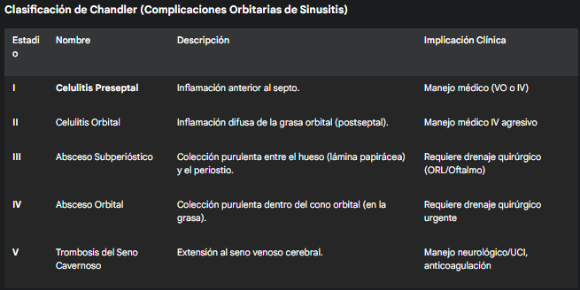

#Celulitis Periorbitaria (Preseptal) en Pediatría
##Generalidades y Definición 

La Celulitis Periorbitaria, también conocida como Celulitis Preseptal, es una infección aguda de los tejidos blandos del párpado y la piel circundante que se encuentran anteriores al septo orbitario.

Es fundamental y de máxima importancia clínica diferenciarla de la Celulitis Orbital (Postseptal), una emergencia médica que implica la infección de los contenidos orbitarios (grasa y músculos) posteriores al septo. El septo orbitario es una fina lámina fibrosa que se extiende desde el periostio del reborde orbitario (superior e inferior) hasta las placas tarsales de los párpados. Actúa como una barrera anatómica crítica, impidiendo que las infecciones superficiales de la piel (preseptales) penetren en la órbita estéril (postseptal).

Mientras que la celulitis periorbitaria es muy común en pediatría, se maneja frecuentemente de forma ambulatoria y suele tener un curso benigno con tratamiento antibiótico, la celulitis orbital es rara, grave y debe ser manejada de forma intrahospitalaria y agresiva. La celulitis orbital puede conducir a complicaciones devastadoras por la inflamación y compresión dentro del cono orbitario, incluyendo la pérdida de visión (por neuritis o compresión de la arteria oftálmica), trombosis del seno cavernoso (por diseminación venosa retrógrada), absceso cerebral y muerte. El objetivo primario en la evaluación de un "ojo rojo hinchado" en pediatría es descartar esta última.

##Fisiopatología

La infección se establece por mecanismos distintos que definen la enfermedad:

1. Diseminación Contigua (Más común para Preseptal): Es la causa principal en pediatría. Resulta de la inoculación directa o la extensión de una infección adyacente externa al septo.

	* Trauma local: La causa más frecuente. Laceraciones, abrasiones, o picaduras de insecto que se sobreinfectan, comúnmente por rascado con manos colonizadas.

	* Infecciones locales: Extensión desde un hordeolum (orzuelo, infección de una glándula de Zeis o Moll), chalazión (inflamación de glándula de Meibomio), dacriocistitis (infección del saco lagrimal, que es anatómicamente anterior al septo) o impétigo facial.

2. Diseminación Hematógena: Menos común hoy en día. Bacteriemia que siembra el tejido periorbitario, que es altamente vascularizado. Era la causa principal de la celulitis periorbitaria "violácea" clásica en la era pre-vacunal por Hib.

Distinción Clave (Fisiopatología de la Celulitis Orbital): A diferencia de la preseptal (que proviene de la piel), la celulitis orbital (postseptal) proviene en >90% de los casos de la extensión de una sinusitis, en particular la sinusitis etmoidal aguda.

* La lámina papirácea, pared medial de la órbita que la separa de los senos etmoidales, es extremadamente fina en niños ("como papel") y dehiscente, permitiendo el paso directo de la infección.

* Además, el sistema venoso oftálmico (venas oftálmicas superior e inferior) carece de válvulas y drena tanto la cara ("triángulo del peligro") como los senos paranasales hacia el seno cavernoso. Esto permite la diseminación retrógrada de émbolos sépticos.

##Microbiología

Ha cambiado drásticamente con la vacunación universal:

* Era Pre-Vacunal (Hib): El agente causal predominante era Haemophilus influenzae tipo b. Causaba una enfermedad sistémica (bacteriemia) con siembra periorbitaria, resultando en una celulitis de tinte violáceo característica.

* Era Post-Vacunal (Actual): Con la vacunación rutinaria contra Hib (y Neumococo, PCV13), la etiología es predominantemente cutánea:

	* Staphylococcus aureus: El agente más común, especialmente en casos post-traumáticos. La prevalencia de S. aureus resistente a la Meticilina (MRSA-CA) debe considerarse, ya que impacta la elección del antibiótico.

	* Streptococcus pyogenes (Grupo A): También muy común, asociado a trauma, impétigo o varicela sobreinfectada.

	* En casos asociados a sinusitis (que aumentan el riesgo de progresión a orbital): La flora es respiratoria: Streptococcus pneumoniae, Moraxella catarrhalis, H. influenzae no tipificable y anaerobios (en sinusitis crónica).

##Factores de Riesgo

* Trauma facial o palpebral (cortes, rasguños, picaduras de insecto).

* Infecciones palpebrales activas (orzuelo, blefaritis, dacriocistitis).

* Varicela (lesiones superinfectadas).

* Rinosinusitis aguda: El factor de riesgo principal para progresión a enfermedad orbital.

* Inmunización incompleta (especialmente Hib, PCV13).

* Edad: Más común en niños pequeños (< 5 años), que tienen mayor frecuencia de traumas menores e infecciones cutáneas.

##Clínica y Diagnóstico

El pilar del diagnóstico es clínico y se centra obsesivamente en diferenciar la enfermedad preseptal de la postseptal.

**Clínica de Celulitis Periorbitaria (Preseptal)**

* El paciente presenta signos inflamatorios confinados al párpado y la piel anterior al reborde orbitario. El "globo ocular" en sí mismo está tranquilo.

	* Edema palpebral (hinchazón), que puede ser tenso y levemente brillante, y en ocasiones tan severo que impide la apertura ocular espontánea.

	* Eritema (enrojecimiento) y calor local.

	* Dolor a la palpación del párpado.

	* Puede haber fiebre (generalmente de bajo grado) y leucocitosis.

**Hallazgos Negativos Clave (lo que la define como Preseptal):**

* Agudeza visual NORMAL (se puede probar en niños mayores con cartas o en pre-verbales con la capacidad de "fijar y seguir" un objeto).

* Movilidad ocular COMPLETA y, crucialmente, INDOLORA.

* NO hay dolor con los movimientos oculares pasivos o activos.

* NO hay proptosis (exoftalmos o "ojo saltón"). El ojo no está "empujado" hacia adelante.

* NO hay defecto pupilar aferente (la respuesta pupilar a la luz es normal).

* Quemosis (edema conjuntival) mínima o ausente.

**Diagnóstico Diferencial (Signos de Alarma de Celulitis Orbital)**

* La presencia de CUALQUIERA de los siguientes signos sugiere fuertemente enfermedad Postseptal y requiere manejo de emergencia intrahospitalario e imagenología.

	* Proptosis: Desplazamiento anterior del globo ocular. Es el resultado del edema y la inflamación detrás del ojo (en la grasa orbital) que empuja el globo hacia adelante.

	* Oftalmoplejía: Restricción de la movilidad ocular. Ocurre porque los músculos extraoculares (rectos, oblicuos) están inflamados (miositis) o atrapados por un absceso.

	* Dolor con los movimientos oculares: Signo cardinal. Indica inflamación de los músculos extraoculares.

	* Disminución de la agudeza visual: Hallazgo ominoso. Sugiere compresión o neuritis del nervio óptico.

	* Defecto pupilar aferente: Signo de neuropatía óptica, una emergencia oftalmológica.

	* Quemosis severa (edema gelatinoso de la conjuntiva).

	* Fiebre alta y apariencia tóxica (sugiere bacteriemia o complicación del SNC).

**Proceso Diagnóstico**

1. Evaluación Clínica: Es el paso más importante. Se debe forzar (gentilmente, con gasas o retractores palpebrales si es necesario) la apertura palpebral para evaluar la visión, las pupilas y la motilidad ocular en todas las direcciones de la mirada. Si el edema es tan severo que impide la evaluación, se debe proceder a imagen.

2. Laboratorio: En pacientes hospitalizados o con apariencia tóxica.

	* Hemograma (leucocitosis con desviación izquierda), PCR/VSG elevadas (inespecífico).

	* Hemocultivos (baja rentabilidad en preseptal pura, pero indicados si hay fiebre alta, apariencia tóxica o edad < 1 año).

	* Cultivo de secreción (si hay drenaje purulento de una herida o punto de inoculación).

3. Imagenología (Gold Standard para diferenciar):

	* Indicaciones: Sospecha de celulitis orbital (cualquier signo de alarma), incapacidad para evaluar el ojo por edema masivo, pacientes < 1 año (examen clínico poco fiable), falta de mejoría tras 24-48h de antibióticos IV, deterioro clínico.

	* Modalidad: Tomografía Computarizada (TC) de Órbita y Senos Paranasales con Contraste IV. Es superior a la RM en la detección de erosión ósea y abscesos subperiósticos.

	* Hallazgos (Preseptal): Inflamación y edema de tejidos blandos anteriores al septo orbitario. Los planos grasos retrobulbares (detrás del ojo) están limpios. Músculos extraoculares y nervio óptico de apariencia normal.

	* Hallazgos (Postseptal): Muestra infiltración y "grasa sucia" (estriación) de la grasa orbital, edema de músculos, abscesos (subperiósticos u orbitales) y opacificación de los senos paranasales (etmoidales).

##Clasificación

La clasificación principal es la binaria (Preseptal vs. Postseptal).

Cuando existe compromiso postseptal (derivado de una sinusitis), se utiliza la Clasificación de Chandler para definir la severidad y guiar el manejo quirúrgico. La celulitis preseptal corresponde al Estadio I de esta clasificación, pero clínicamente se maneja como una entidad separada.

##Tratamiento y Manejo

La decisión clave es si el paciente requiere manejo ambulatorio (VO) u hospitalario (IV).

**Criterios de Hospitalización**

* Edad < 1 año (alto riesgo de bacteriemia por S. pneumoniae y examen clínico poco fiable).

* Apariencia tóxica, fiebre alta persistente o sepsis.

* Incapacidad de realizar un examen ocular completo (ej. edema masivo que impide abrir el ojo). Se debe asumir orbital hasta que se demuestre lo contrario con TC.

* Cualquier signo de alarma de celulitis orbital (PROPTOSIS, DOLOR AL MOVIMIENTO, OFTALMOPLEJÍA, ↓AV, DPA).

* Fracaso del tratamiento ambulatorio tras 24-48 horas (sugiere organismo resistente o patología postseptal).

* Preocupación por el cumplimiento terapéutico o seguimiento cercano.

* Inmunosupresión.

* Signos radiológicos de sinusitis (implica mayor riesgo de progresión).

**Manejo Ambulatorio (VO)**

Reservado para niños > 1 año, afebriles o con fiebre baja, clínicamente estables, con celulitis preseptal inequívoca (examen ocular 100% normal) y seguimiento asegurado en 24h.

* Objetivo: Cobertura para S. aureus (incluyendo MRSA-CA) y S. pyogenes.

* Opciones (Monoterapia):

	* Clindamicina (excelente cobertura para Gram+ aerobios y anaerobios, y la mayoría de MRSA-CA).

* Opciones (Terapia Combinada para MRSA + Strep):

	* Amoxicilina-Ácido Clavulánico (cubre Strep y MSSA) + Trimetoprim-Sulfametoxazol (TMP-SMX) (cubre la mayoría de MRSA).

Nota: TMP-SMX solo no es adecuado (mala cobertura de S. pyogenes). Amoxicilina-Clavulánico solo es adecuado si el riesgo de MRSA en la comunidad es muy bajo.

**Manejo Hospitalario (IV)**

Para pacientes que cumplen criterios de hospitalización.

1. Antibióticos IV:

* Terapia Estándar (Sospecha de MRSA/S. pyogenes, sin sinusitis):

	* Vancomicina O Clindamicina (para cobertura Gram+ y MRSA).

* Terapia de Amplio Espectro (Si hay sinusitis, sospecha de orbital, o < 1 año):

	* Vancomicina (cubre MRSA/Strep/Pneumo) + Ceftriaxona (cubre Pneumo resistente, M. catarrhalis, H. influenzae).

	* Ampicilina-Sulbactam o Piperacilina-Tazobactam son alternativas que añaden cobertura anaeróbica (buena para sinusitis crónica o abscesos).

2. Evaluación y Soporte:

* Analgésicos (Ibuprofeno/Paracetamol).

* Compresas tibias (pueden ayudar a reducir el edema y mejorar el confort).

* Interconsulta Urgente con Oftalmología (mandatorio en todo paciente hospitalizado) y Otorrinolaringología (si hay sinusitis o sospecha de absceso).

**Manejo Quirúrgico**

* No está indicado para la celulitis preseptal.

* Es reservado para las complicaciones de la celulitis orbital (Estadios III-V de Chandler), como el drenaje de abscesos (a menudo por vía endoscópica endonasal).

##Seguimiento

* Ambulatorio: Reevaluación clínica mandatoria en 24 horas. Se debe instruir a los padres sobre los signos de alarma (proptosis, dolor ocular, cambios visuales, fiebre persistente, vómitos) y consultar de inmediato si aparecen.

* Hospitalario: Monitoreo seriado (cada 4-6 horas) de la agudeza visual, motilidad ocular, reflejos pupilares y proptosis por parte de enfermería y oftalmología. Si hay mejoría clínica clara (disminución del edema, afebril) tras 24-48h de tto IV, se puede considerar el cambio a VO (terapia de "switch") para completar 7-10 días totales.

##Pronóstico

* Celulitis Periorbitaria (Preseptal): Excelente. Con antibióticos adecuados, la resolución es completa y rápida (mejoría visible en 24-48h) sin secuelas funcionales ni estéticas.

* Celulitis Orbital (Postseptal) no tratada: Pobre. El riesgo de complicaciones (pérdida visual permanente, trombosis del seno cavernoso, meningitis, absceso cerebral) es alto. Esto subraya la importancia crítica del diagnóstico diferencial temprano y el manejo agresivo.

##Citas

1. American Academy of Pediatrics (AAP). (2021). Periorbital and Orbital Cellulitis. In: Red Book: 2021–2024 Report of the Committee on Infectious Diseases.

2. Wald, E. R. (2023). Periorbital and orbital cellulitis in children. UpToDate. (Revisado en 2023/2024).

3. Tse, J. D., et al. (2022). Pediatric Orbital Cellulitis. Pediatrics in Review, 43(11), 606-615.

4. Chaudhry, I. A., et al. (2021). Orbital cellulitis in children: a 20-year review of management and outcomes. Eye, 35(5), 1438-1445.
