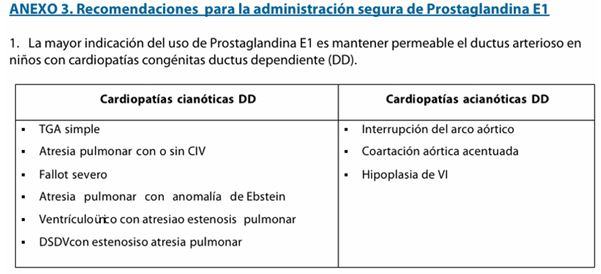

#GES N°2: Cardiopatías Congénitas Operables en <15 años.
##Generalidades y Definición 
Las Cardiopatías Congénitas (CC) son un grupo de malformaciones en la estructura del corazón o de los grandes vasos sanguíneos que están presentes desde el nacimiento. 

* Constituyen al tipo más frecuente de malformaciones congénitas, afectando aprox. a 8 de c/1.000 RNV.

* Tienen un amplio espectro clínico que abarca desde defectos simples y asintomáticos (que pasan desapercibidos) hasta malformaciones complejas que amenazan la vida del RN y requieren intervención quirúrgica urgente.

##Garantías AUGE

**Acceso: ¿Quiénes tienen derecho?**

* Todo beneficiario menor de 15 años con sospecha de CC operable tendrá acceso a la confirmación diagnóstica.

* Todo beneficiario menor de 15 años con confirmación diagnóstica de CC operable tendrá acceso a tratamiento quirúrgico y/o reintervenciones, incluso si la reintervención ocurre después de los 15 años.

* Se incluye también el acceso a recambio de marcapasos (si corresponde).

* Ojo!→ Se excluye al trasplante cardíaco.

**Oportunidad: ¿Cuáles son los plazos máximos de espera?**

Varían según la edad del paciente al momento de la sospecha, reflejando así la urgencia de cada etapa:

1. Diagnóstico (Confirmación diagnósitca desde la sospecha):

	* Prenatal→ Desde las 20 semanas de gestación: Dentro de 30 días.
	
	* Recién Nacido (RN)→ 0 a 7 días de vida: Dentro de 48hrs.
	
	* Lactante→ Desde los 8 días de vida hasta los 2 años: Dentro de 21 días.
	
	* Infante→ Desde los 2 años hasta menores de 15 años: Dentro de 180 días.
	
2. Tratamiento (Desde la Confirmación Diagnóstica):

	* CC Grave Operable: Ingreso a hospital con capacidad de resolución quirúrgica dentro de 48hrs (desde la estabilización del paciente).
	
	* Otras CC Operables: Según indicación médica, sin plazo fijo estipulado.
	
3. Seguimiento→ Primer Control con especialista (post-cirugía): Dentro del primer año desde el alta quirúrgica.

**Protección Financiera:**

* Beneficiarios FONASA A y B: Copago $0.
	
* Beneficiarios FONASA C y D: Copago $0.
	
* Beneficiarios ISAPRE: Copago del 20% del arancel de referencia GES.
	
##Fisiopatología

La mayoría de las CC son el resultado de un error en el complejo proceso de embriogénesis cardíaca, que ocurre entre la tercera y octava semana de gestación. La etiología es multifactorial en la mayoría de los casos, involucrando una interacción entre una predisposición genética y factores ambientales.

* Errores en el desarrollo: Pueden ocurrir fallas en la septación (división) de las cámaras cardíacas (ej. Comunicación Interventricular), en la formación de las válvulas (ej. Estenosis Aórtica) o en la rotación y división de los grandes vasos (ej. Transposición de Grandes Arterias).
	
##Factores de Riesgo

La causa exacta no se identifica en >80% de los casos, pero se han reconocido los siguientes factores:

1. **Factores Genéticos y Cromosómicos:**

	* Aneuploidías→ Trisomía 21: Es el factor más relevante y se asocia a defectos del canal atrioventricular.
	
	* Síndromes de microdeleción→ El síndrome de DiGeorge (deleción 22q11) que se asocia a defectos troncoconales como la Tetralogía de Fallot.
	
	* Otros síndromes→ Síndrome de Turner, Síndrome de Marfan.
	
	* Antecedentes familiares→ El riesgo de tener un hijo con una CC aumenta si un progenitar o un hermano la padece.
	
2. **Factores Maternos/Ambientales:**

	* Infecciones durante el primer trimestre→ Rubéola: Se asocia a DAP y Estenosis Pulmonar.
	
	* Enfermedades Crónicas mal controlados→ DM Pregestacional, LES.
	
	* Exposición a teratógenos→ Alcohol (Síndrome alcohólico fetal), algunos fármacos antiepilépticos (litio, ácido valproíco), Isotretinoína.
	
	* Edad materna avanzada.
	
##Clasificación

Las CC se clasifican fisiopatológicamente según la presencia/ausencia de cianosis y el estado del flujo pulmonar.

1. Cardiopatías Acianóticas:

	* Con Flujo Pulmonar Aumentado→ Shunt I-D: La sangre oxigenada del lado izquierdo pasa al derecho, aumentado así el flujo hacia los pulmones.
		
		* CIV, CIA, DAP.
		
	* Con Flujo Pulmonar normal (Obstructivas): Obstrucción de la salida de sangre desde los ventrículos.
	
		* Coartación Aórtica, Estenosis Aórtica, Estenosis Pulmonar.

2. Cardiopatías Cianóticas

	* Con Flujo Pulmonar Disminuido: La sangre no oxigenada pasa a la circulación sistémica y hay una obstrucción al flujo pulmonar.
		
		* Tetralogía de Fallot: Es la CC cianótica más frecuente después del primer año de vida.
		
	* Con Flujo Pulmonar Aumentado: Las circulaciones Pulmonar y sistémica están mezcladas o en paralelo.
		
		* Transposición de Grandes Arterias (TGA): Es la CC cianótica más frecuente en el RN.
		
		* Tronco Arterioso.

##Manifestaciones Clínicas

La presentación clínica depende del tipo de malformación y de su severidad hemodinámica. Los 2 grandes síndromes de presentación son la insuficiencia cardíaca congestiva (ICC) y la cianosis.

1. **Síntomas y Signos Característicos**:

	* Soplo Cardíaco: Es el hallazgo más frecuente en la exploración física neonatal o en los controles pediátricos.
	
	* ICC→ Típica de Shunt I-D:
		
		* Taquipnea, Dificultad para alimentarse.
		
		* Bajo incremento ponderal.
		
		* Taquicardia, Hepatomegalia.
		
	* Cianosis: Presente en Shunt D-I.
		* Puede ser central y persistente, la cual no mejora con la administración de O2.
		
	* Pulsos débiles o ausentes: Especialmente en EEII (Sugerente de Coartación Aórtica).
	
##Diagnóstico 

1. **Diagnóstico Prenatal:**→ La ecocardiografía fetal permite detecta muchas CC graves durante el embarazo, lo que permite planificar el parto en un centro de alta complejidad.

2. **Anamnesis y Examen Físico Postnatal:**→ La sospecha clínica se basa en los síntomas mencionados.

3. **Exámenes Complementarios:**

	* RxTo: Evalúa el tamaño cardiaco y el flujo vascular pulmonar.
	
	* Electrocardiograma (ECG): Detecta arritmias y signos de sobrecarga de cavidades.

4. **Confirmación Diagnóstica:**→ Ecocardiograma Doppler Color: Permite una visualización anatómica y funcional detallada del corazón y los grandes vasos, confirmando el diagnóstico y evaluando su severidad.
	
##Tratamiento y Manejo

El Manejo de las CC es multidisciplinario y depende del tipo de CC:

1. Manejo médico:

	* Estabilización del Neonato: En CC "ductus dependientes", se administra una infusión continua de Prostaglandina E1 para evitar el cierre del ductus.

		 
	
	* Manejo de ICC: Se usa furosemida, IECAs y, en algunos casos, digoxina.
	
	* Profilaxis de Endocarditis Infecciosa: Se indica en situaciones específicas, previo a procedimientos dentales o quirúrgicos.
	
2. Manejo Intervencionista (Cateterismo Cardiaco):

	* Procedimientos minimamente invasivos que pueden ser curativos, dependiendo del defecto.
	
		* Ej.: Cierre de CIA y DAP con dispositivos, valvuloplastía con balón para estenosis valvulares, angioplastía con stent para coartación aórtica.
		
3. Manejo Quirúrgico:

	* Es el tratamiento definitivo para la mayoría de las CC moderadas a severas.
	
	* Cirugía Correctiva: Se repara el defecto en una sola intervención.
	
	* Cirugía Paliativa: Procedimientos transitorios para mejorar la oxigenación o el flujo sanguíneo en pacientes muy complejos, como preparación para una corrección futura.
	
##Algoritmos

